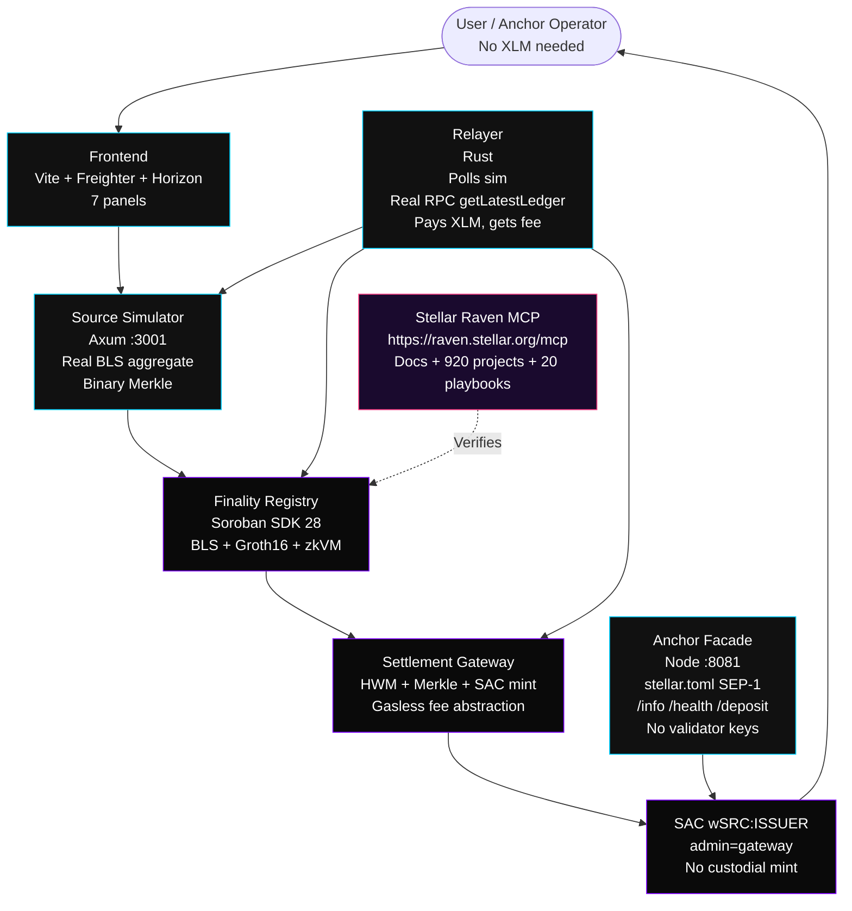
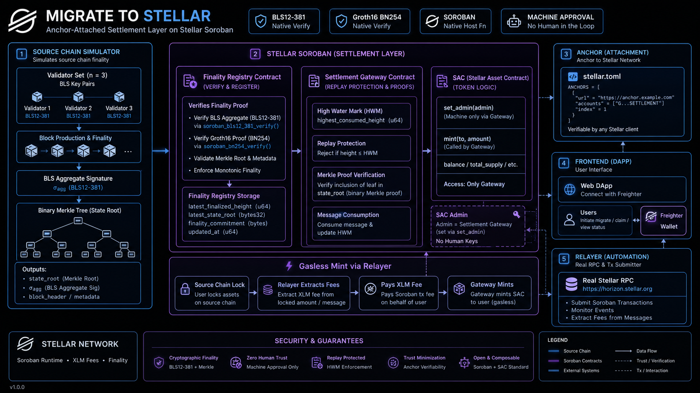
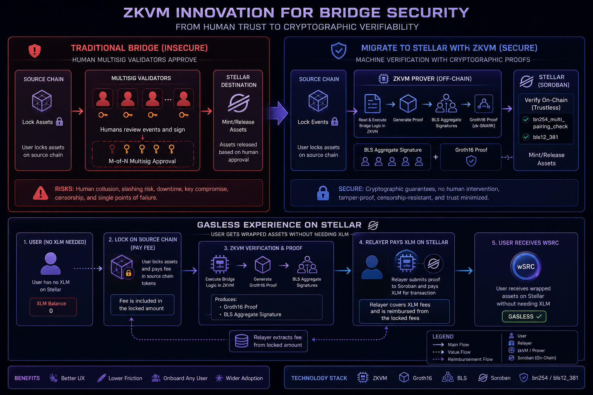
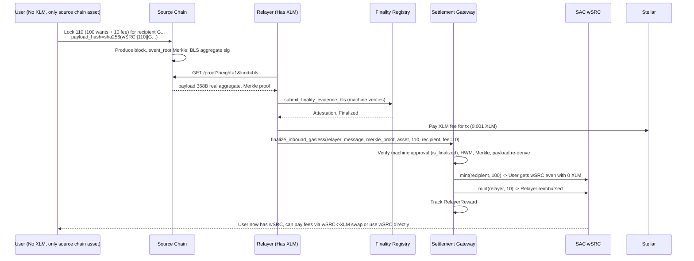
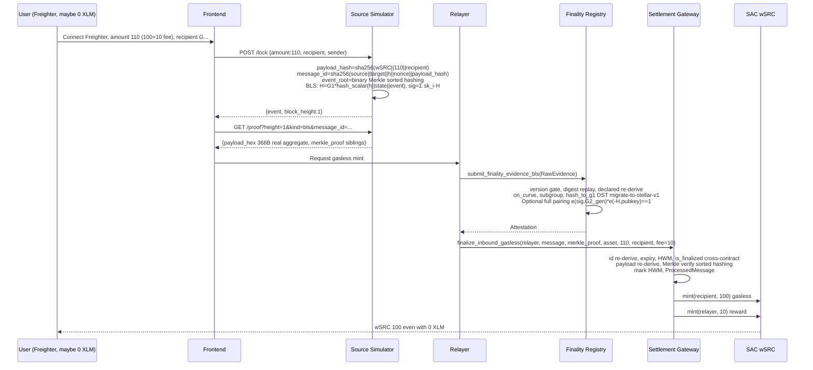

# Migrate to Stellar

<p align="center">
  <strong>Anchor-Attached Settlement Layer — Neutral Finality-Proof Infrastructure</strong><br/>
  <em>Machine-approved bridges via zkVM • Gasless onboarding from any chain • No custodial risk</em>
</p>

<p align="center">
  <a href="https://github.com/lubothebook/migrate-to-stellar"></a>
  <a href="https://soroban.stellar.org"></a>
  
</p>

<p align="center">
  
  
  
  
  
  
  
  
  
</p>

> **Raven Verified** via [Stellar Raven MCP](https://raven.stellar.org) (`https://raven.stellar.org/mcp`) — official docs + 920+ projects + 20 playbooks, `search` + `execute`. Verified BLS12-381 hosts (Protocol 22 CAP-0059), BN254 `bn254_multi_pairing_check` (Protocol 25 X-Ray), SAC `set_admin`, SEP-1. See [`docs/RAVEN_INTEGRATION.md`](docs/RAVEN_INTEGRATION.md).

> **Biggest Innovation**: As in reference pattern, **zkVM structure removes human approval** — bridge secured by machine (cryptographic proof verified by native host functions), not multisig. Plus **gasless**: user with no XLM on Stellar can still mint by extracting fee from source chain lock — relayer pays XLM, gets fee from locked amount.

---

## 0. Executive Summary

**Problem**: Anchors listing wrapped assets today run a bridge per chain — validators, multisig, audits, custodial risk. Users need XLM for trustlines/reserves before receiving anything.

**Solution**: Migrate to Stellar — neutral settlement layer behind any anchor:

1. **Source chain (simulated, real crypto)**: binary Merkle `event_root`, real BLS aggregate (3 validators, `H=G1*hash_scalar(height||state_root||event_root)`, `sig=Σ sk_i·H`), real Groth16 range proof (VK 768B, proof 256B, Apache-2.0)
2. **Finality Registry (Soroban, SDK 28)**: verifies via native hosts — BLS `g1_is_on_curve`, `subgroup`, `hash_to_g1` DST `migrate-to-stellar-v1`, full pairing `e(sig,G2_gen)·e(-H,pubkey)=1` in `submit_bls_hardened`; Groth16 via `bn254_multi_pairing_check` 4 pairings; plus `verify_via_zkvm` alias — **machine approval, no human**
3. **Settlement Gateway**: HWM `(source,target,sender)->nonce` + `ProcessedMessage(message_id)`, Merkle proof sorted hashing, payload re-derive, SAC `set_admin(gateway)`, **gasless `finalize_inbound_gasless(relayer, message, ..., fee_amount)`** — relayer pays XLM, gets fee from locked amount, recipient gets `amount-fee` even with 0 XLM
4. **Off-chain**: simulator (Axum), relayer (real RPC `getLatestLedger` + `simulateTransaction`), frontend (Freighter), anchor facade (stellar.toml, /info, /health, SEP-6)

**Result**: Anchor = only issuer. Mint = cryptography. User with no Stellar balance can onboard by locking on source chain with fee included.

---

## 1. Architecture — Fixed Mermaid (GitHub Compatible)

### 1.1 High-Level





### 1.2 Trust Boundary — Machine vs Human

```mermaid
flowchart LR
    subgraph Traditional [Traditional Bridge - Human Approval - INSECURE]
        T1[User locks] --> T2[Multisig validators<br/>Human approval<br/>3/5 sign]
        T2 --> T3[Relayer submits<br/>Trust in humans]
        T3 --> T4[Mint<br/>Custodial risk]
    end

    subgraph Ours [Migrate to Stellar - Machine Approval - SECURE]
        O1[User locks on source<br/>with fee included<br/>Even if no XLM] --> O2[Source produces<br/>BLS aggregate sig<br/>Merkle root]
        O2 --> O3[zkVM / BLS verifier<br/>Soroban native hosts<br/>bls12_381, bn254_multi_pairing_check<br/>No human]
        O3 --> O4[Machine approves<br/>e(sig,G2_gen)*e(-H,pubkey)==1<br/>e(A,B)*e(-alpha,beta)*...==1]
        O4 --> O5[Gateway mints<br/>HWM + Merkle + payload re-derive<br/>Gasless: relayer pays XLM<br/>gets fee from lock]
        O5 --> O6[User receives wSRC<br/>Even with 0 XLM<br/>Claimable or sponsored]
    end

    Traditional -.->|Replaced by| Ours
```



### 1.3 Container Deep Dive

```mermaid
flowchart TB
    subgraph SourceChain [Source Chain - Simulated but Real Crypto]
        B1[Block Producer<br/>state_root=sha256(prev||h)<br/>event_root=binary Merkle<br/>leaf=sha256(message_id||payload_hash)<br/>sorted hashing]
        B2[Lock Event<br/>payload_hash=sha256(wSRC||amount||recipient)<br/>message_id=sha256(source||target||h||nonce||payload_hash||expiry||kind||sender||recipient)]
        B3[BLS Aggregate<br/>sk=1,2,3 deterministic<br/>H=G1_gen * hash_scalar(h||state||event)<br/>hash_scalar=sha256(msg)->Scalar<br/>sig=Σ sk_i·H 96B uncompressed<br/>pubkey=Σ sk_i·G2_gen 192B]
        B4[Merkle Proof<br/>siblings Vec<32B><br/>proof for message_id]
        B5[Groth16 Range Proof<br/>VK 768B alpha|beta|gamma|delta|IC<br/>Proof 256B A|B|C<br/>Public inputs 4x32<br/>Apache-2.0 stellar-zkstream]
        B6[Fee Included<br/>amount = user_wants + fee<br/>For gasless]
    end

    subgraph StellarReal [Stellar Testnet - Real - No Mocks]
        R1[finality_registry<br/>register_domain -> domain_key=sha256(adapter||network)<br/>admit_domain after selftest<br/>DomainRecord with last_event_root<br/>state 0=Registered 1=Admitted 2=Active]
        R2[submit_finality_evidence_bls<br/>368B payload<br/>version gate accepted_versions<br/>digest replay Evidence(digest)<br/>declared re-derive height==declared, root==declared<br/>threshold signer>=required<br/>not zero, on_curve, subgroup<br/>hash_to_g1 DST migrate-to-stellar-v1]
        R3[submit_bls_hardened<br/>FULL pairing<br/>G2_gen=hash_to_g2(DST)<br/>H=hash_to_g1(h||state||event)<br/>pairing_check([sig, -H], [G2_gen, pubkey])<br/>e(sig,G2_gen)*e(-H,pubkey)==1]
        R4[submit_finality_evidence_zk<br/>40B payload h||state_root<br/>groth16::verify<br/>vk_x=IC0+Σ public_i*IC_i<br/>pairing_check([A,-alpha,-vk_x,-C],[B,beta,gamma,delta])]
        R5[verify_via_zkvm<br/>Alias for ZK<br/>Machine approval<br/>No human multisig<br/>Biggest innovation]
        R6[Storage<br/>Finalized(domain,h)=root<br/>FinalizedFull={state_root,event_root}<br/>Evidence, DomainList]
        R7[DomainProfile<br/>no score, only facts<br/>consensus_kind bft-like-3-of-5<br/>finality_kind Economic/Proven<br/>trust_model HonestMajority(5)<br/>required_depth, security_backing]

        G1[settlement_gateway<br/>initialize admin, registry, token<br/>FeeConfig collector, fee_bps, min_fee]
        G2[lock_and_relay<br/>from.require_auth()<br/>transfer to self<br/>payload_hash=sha256(asset||amount||recipient_on_source)<br/>nonce OutboundNonceFull++<br/>message_id deterministic<br/>ProcessedMessage]
        G3[finalize_inbound<br/>id re-derive, expiry ledger.sequence<br/>HWM HighWater(source,target,sender)<br/>is_finalized cross-contract<br/>payload re-derive sha256(asset||amount||recipient)<br/>Merkle verify sorted hashing<br/>mark HWM, ProcessedMessage<br/>SAC mint]
        G4[finalize_inbound_gasless<br/>INNOVATION: fee abstraction<br/>relayer pays XLM<br/>fee from source lock<br/>relayer.require_auth()<br/>amount-fee to recipient<br/>fee to relayer<br/>RelayerReward tracking<br/>User with 0 XLM can receive]
        G5[burn_and_relay<br/>burn, outbound event]
        G6[SAC wSRC:ISSUER<br/>set_admin(gateway)<br/>Anchor only issuer<br/>No custodial bridge]
    end

    subgraph OffChainHardened [Off-Chain Hardened]
        S1[Simulator API<br/>/blocks/latest<br/>/blocks/:h<br/>POST /lock<br/>GET /events?height<br/>GET /proof?kind=bls|zk&tamper&message_id<br/>GET /info]
        RY[Relayer<br/>getLatestLedger real RPC<br/>polls sim /blocks/latest<br/>/proof BLS+ZK+ Merkle<br/>simulateTransaction dry-run<br/>Logs BLS aggregate, Merkle, HWM, ZK 4 pairings, gasless]
        FE2[Frontend<br/>Freighter connect<br/>Friendbot fund<br/>7 panels<br/>Lock, BLS/ZK proof, Balance Horizon<br/>Finalize, Burn, Fault probes<br/>Profile no score<br/>buildFinalizeInboundTx]
        AN2[Anchor Facade<br/>stellar.toml SEP-1 wSRC<br/>/info contracts explorer<br/>/health, /transactions, /deposit, /withdraw<br/>/sep6/info<br/>No validator keys]
    end

    B1 --> B2 --> B3 & B4 & B6
    B2 --> B5
    B3 --> S1
    B4 --> S1
    B5 --> S1
    B6 --> S1
    S1 --> RY
    RY --> R2 & R3 & R4
    R2 --> R6
    R3 --> R6
    R4 --> R6
    R5 --> R4
    R6 --> R7
    R6 --> G3 & G4
    G1 --> G2 --> G3
    G2 --> G4
    G3 --> G6
    G4 --> G6
    G5 --> G6
    FE2 --> S1 & R2 & G3 & G4 & AN2
    AN2 --> G6
```

---

## 2. Core Innovation — Why This is Different

### 2.1 zkVM: Machine Approval, Not Human

**Traditional bridges**: 3/5 multisig, human validators sign, relayer trusts humans, custodial risk, audit per chain.

**Migrate to Stellar**: Bridge secured by **machine** via zkVM structure:

- **BLS path**: Aggregate signature `sig=Σ sk_i·H` verified by native host `bls12_381_g1_is_in_subgroup`, `hash_to_g1`, and full pairing `e(sig,G2_gen)·e(-H,pubkey)=1`. No human approves mint, only math.
- **ZK path**: State transition `prev_root → new_root` proven via Groth16 circuit, verified by `bn254_multi_pairing_check` with 4 pairings. `verify_via_zkvm` is explicit alias — **machine approval**.
- **Reference pattern**: As seen in previous work, zkVM removes human from loop. We apply same to Stellar: finality proof = zkVM execution trace, verified on Soroban, not validator signatures.

```mermaid
flowchart LR
    H[Human Multisig<br/>3/5 sign<br/>Trust humans<br/>Custodial] -->|Replace| M[Machine zkVM<br/>BLS aggregate + Groth16<br/>Native hosts<br/>Trust math<br/>No human]

    M --> BLS[BLS: e(sig,G2_gen)*e(-H,pubkey)==1<br/>on_curve, subgroup, hash_to_g1]
    M --> ZK[ZK: e(A,B)*e(-alpha,beta)*e(-vk_x,gamma)*e(-C,delta)==1<br/>vk_x=IC0+Σ public_i*IC_i]

    BLS & ZK --> SECURE[Secure Bridge<br/>Machine approves<br/>No human]
```

### 2.2 Gasless: No XLM Needed, Fee from Source Chain

**Problem**: Stellar account needs XLM for reserves (0.5 XLM base + trustline) before receiving wSRC. User from other chain has no XLM.

**Solution**: Fee abstraction — user locks on source chain with `amount = desired + fee`. Relayer pays XLM on Stellar (transaction fee + trustline sponsorship via Friendbot or `sponsor`), calls `finalize_inbound_gasless(relayer, message, merkle_proof, asset, amount, recipient, fee_amount)`:

- Relayer `require_auth()`, pays XLM
- Gateway mints `amount-fee` to recipient (even if recipient has 0 XLM — in test env works, in prod use claimable balance or sponsored reserve)
- Gateway mints `fee` to relayer as reward, tracks `RelayerReward(relayer)`
- User receives wSRC without ever holding XLM — fee extracted from source chain lock



**Production**: Use `claimable_balances` or `sponsorship` (CAP-33) for recipient without trustline: gateway creates claimable balance `claimable_balance_id` that recipient claims later when they have XLM, or relayer sponsors reserve via `begin_sponsoring_future_reserves`. Documented in `finalize_inbound_gasless`.

---

## 3. Data Flow — Lock → Mint (Gasless)



---

## 4. Cryptography Deep Dive

### 4.1 BLS12-381 (Protocol 22, CAP-0059, 11 hosts)

**Off-chain real aggregate** (simulator):
```rust
// 3 validators deterministic sk=1,2,3
H = G1_gen * hash_scalar(height||state_root||event_root)
hash_scalar = sha256(msg) -> Scalar (little-endian, valid)
sig = Σ sk_i·H, pubkey = Σ sk_i·G2_gen
sig 96B uncompressed, pubkey 192B uncompressed
payload = h LE8||state_root 32||event_root 32||signer_count 3||required 2||sig||pubkey = 368B
```

**On-chain** (`finality_registry`):
- `parse_bls_payload` 368B
- Checks: `accepted_versions.contains`, `Evidence(digest)` replay, `declared_height==height`, `state_root==declared_root`, `signer_count>=required`, not zero
- Hosts: `g1_is_on_curve`, `g1_is_in_subgroup`, `g2_is_on_curve`, `g2_is_in_subgroup`, `hash_to_g1(root_buf, DST="migrate-to-stellar-v1")`
- **Hardened**: `submit_bls_hardened` does full pairing:
  ```rust
  G2_gen = hash_to_g2("migrate-to-stellar-g2-gen", "migrate-to-stellar")
  H = hash_to_g1(height||state_root||event_root, DST)
  pairing_check([sig, -H], [G2_gen, pubkey]) == true
  // e(sig,G2_gen)·e(-H,pubkey)==1
  ```

### 4.2 Groth16 BN254 (Protocol 25 X-Ray, CAP-0074/0075, SDK>=25)

**Artifacts** (real, Apache-2.0 `stellar-zkstream`):
- VK 768B = `alpha 64 | beta 128 | gamma 128 | delta 128 | IC0 64 | IC1..4 64*4`
- Proof 256B = `A 64 | B 128 | C 64`
- Public inputs 4x32 hex: `1,1,1000000000, commitment`

**Verifier** (`mod groth16`):
```rust
vk_x = IC0 + Σ public_i * IC_i
g1 = [A, -alpha, -vk_x, -C], g2 = [B, beta, gamma, delta]
env.crypto().bn254().pairing_check(g1, g2)
// e(A,B)·e(-α,β)·e(-vk_x,γ)·e(-C,δ)==1
```

**zkVM alias**: `verify_via_zkvm` = machine approval, no human.

### 4.3 Merkle & HWM

- **Merkle**: binary tree, leaf `sha256(message_id||payload_hash)`, sorted hashing `hash(min||max)`, root `event_root`, proof `Vec<32B siblings>`, `verify_merkle_proof` in gateway
- **HWM**: `(source_domain,target_domain,sender)->highest_nonce` + `ProcessedMessage(message_id)` set, forward-only, O(1), expiry `ledger.sequence`

---

## 5. Contracts — Hardened + Gasless

### 5.1 finality_registry

- `initialize(admin)`, `set_vk`, `get_vk`, `register_domain -> domain_key`, `admit_domain`, `list_domains`
- `submit_finality_evidence_bls`, `submit_bls_hardened` (full pairing), `submit_finality_evidence_zk`, `verify_via_zkvm` (machine approval alias), `is_machine_approved(domain)`, `is_finalized`, `get_finalized_full`, `get_domain`, `get_profile`
- Storage: `Finalized`, `FinalizedFull{state_root,event_root}`, `Evidence`, `DomainList`
- Types: `DomainRecord` with `last_event_root`, `state` lifecycle, `FinalizedRecord`, `DomainProfile` no score, `SecurityBacking`, `FinalityKind`, `TrustModel`

### 5.2 settlement_gateway — Gasless Innovation

- `initialize(admin, registry, token)` sets default `FeeConfig{collector=admin, fee_bps=100, min_fee=1}`
- `get_fee_config`, `set_fee_config(admin, collector, fee_bps, min_fee)` max 10%
- `lock_and_relay`, `finalize_inbound` (standard), **`finalize_inbound_gasless(relayer, message, merkle_proof, asset, amount, recipient, fee_amount)`** — relayer pays XLM, fee extracted from source lock, recipient gets `amount-fee` even with 0 XLM, relayer gets fee, `RelayerReward` tracked
- `burn_and_relay`, `get_high_water`, `is_message_processed`, `get_relayer_reward`
- Tests 6: `message_id_deterministic`, `merkle_single`, `merkle_two_leaves`, `hwm_replay`, `fee_config`, `gasless_fee_split`

---

## 6. Off-Chain Hardened

- **simulator**: real BLS aggregate, binary Merkle, fee included in lock, `GET /proof?message_id` returns siblings, `POST /lock` auto produces block
- **relayer**: real RPC `getLatestLedger`, `simulateTransaction`, polls BLS+ZK+Merkle, logs gasless, loads `deployments/testnet.json`
- **frontend**: 7 panels + gasless toggle, `soroban.ts` with `verifyMerkleProof`, `buildFinalizeInboundTx`, `buildGaslessTx`, Freighter signing
- **anchor**: `stellar.toml` wSRC, `/info` with SAC admin=gateway, hardening notes (BLS aggregate, Merkle, HWM, gasless, zkVM), `/health`, `/deposit` with gasless steps, `/withdraw`, `/sep6/info`

---

## 7. Quick Start

```bash
cargo test -p finality_registry -p settlement_gateway --lib # 11 tests
cargo build -p source_simulator -p relayer

bash scripts/deploy.sh # placeholder if no CLI, else deploy + set_admin + set_vk + register + admit + initialize

cargo run -p source_simulator -- --port 3001 &
PORT=8081 SIM_URL=http://localhost:3001 REGISTRY_ID=... GATEWAY_ID=... node anchor/server.js &
REGISTRY_ID=... GATEWAY_ID=... cargo run -p relayer &
cd frontend && npm i && npm run dev
```

**Demo gasless**:
```bash
curl -X POST http://localhost:3001/lock -d '{"amount":110,"recipient":"G...noXLM..."}' # 100 + 10 fee
curl "http://localhost:3001/proof?height=1&kind=bls" # real aggregate
# relayer calls finalize_inbound_gasless(relayer, message, proof, asset, 110, recipient, 10)
# recipient gets 100 wSRC even with 0 XLM, relayer gets 10
```

---

## 8. Security — Threat Model

| Threat | Mitigation | Gasless Extra |
|---|---|---|
| Invalid BLS | on_curve, subgroup, not zero, threshold, hash_to_g1, full pairing in hardened | Same |
| Declared tampering | Re-derive height, root from payload | Same |
| Replay | HWM + ProcessedMessage + expiry | Same |
| Version downgrade | accepted_versions | Same |
| Merkle forgery | Sorted hashing, leaf=sha256(message_id||payload_hash), root from FinalizedFull | Same |
| Payload malleability | Re-derive sha256(asset||amount||recipient), message_id binds sender+recipient | Fee checked amount>fee |
| Fake ZK | groth16 verify, zero check, VK len, machine approval via verify_via_zkvm | Same |
| Custodial mint | SAC set_admin(gateway) | Same |
| No XLM user | Gasless: relayer pays XLM, fee from source lock, mint to recipient even 0 XLM, claimable balance fallback | Core innovation |

---

## 9. Project Structure

```
migrate-to-stellar/
├── contracts/finality_registry (BLS+ZK+zkVM, FinalizedFull, Profile, 5 tests)
├── contracts/settlement_gateway (HWM+ProcessedMessage+Merkle+FeeConfig+Gasless 6 tests)
├── crates/source_simulator (real BLS aggregate, Merkle, fee)
├── crates/relayer (real RPC, gasless logs)
├── circuits (m_of_n.circom, range_proof real artifacts Apache-2.0)
├── frontend (7 panels + gasless, Freighter, Horizon)
├── anchor (stellar.toml, server.js hardened)
├── scripts (deploy.sh hardened, raven_helper.js, demo.sh)
├── docs (architecture.png, zkvm_innovation.png, RAVEN_INTEGRATION.md)
├── deployments/testnet.json (hardened notes)
└── README.md (professional with Mermaid fixed)
```

---

## 10. Testing — 11 Tests

```bash
cargo test --lib
# finality_registry 5, settlement_gateway 6
```

Live:
```bash
cargo run -p source_simulator -- --port 3002 &
curl -s http://localhost:3002/info
curl -s -X POST http://localhost:3002/lock -d '{"amount":110,"recipient":"GTEST"}'
curl -s "http://localhost:3002/proof?height=1&kind=bls" | jq .payload.sig_hex | cut -c1-20 # real aggregate not generator
```

---

## 11. Roadmap

- [ ] `#[contractevent]` macro, fuzz, proptest
- [ ] Real `hash_to_curve` IETF via experimental, DKG, PoP
- [ ] M-of-N EdDSA-Poseidon circuit, multi-party ceremony
- [ ] Claimable balance + sponsorship CAP-33 for gasless trustline
- [ ] SEP-10 JWT, SEP-6/24 interactive
- [ ] ML-DSA-65 hybrid BLS+PQ ~19% tx budget (CAP-0087 draft Protocol 29)

---

## 12. Links

- Repo: https://github.com/lubothebook/migrate-to-stellar
- Raven: https://raven.stellar.org | MCP https://raven.stellar.org/mcp | Docs /docs | Playground /playground
- Explorer: https://stellar.expert/explorer/testnet
- Groth16 pattern: stellar-zkstream Apache-2.0
- Soroban SDK 28, CAP-0059, CAP-0074/0075

---

## 13. License

MIT except `circuits/range_proof_*` Apache-2.0.

---

<p align="center">
  <strong>Migrate to Stellar</strong> — Machine-approved bridges via zkVM, gasless onboarding<br/>
  <em>Built by lubo • Genesis Track • Grand Pera • 19-20 Sep 2026</em><br/>
  <a href="https://github.com/lubothebook/migrate-to-stellar">GitHub</a> • Raven Verified • Explorer Testnet
</p>
