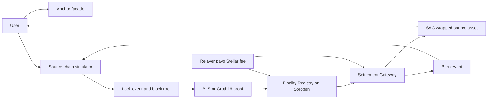

# Lumen Gate

**Anchor-attached settlement infrastructure for neutral, machine-verified source-chain finality.**

Lumen Gate is being built for the [Rise In x Stellar Pro Hackathon](https://www.risein.com/programs/stellar-pro-hackathon), Genesis track. The product puts a neutral finality-proof layer behind a Stellar anchor: the anchor keeps issuer, reserve and customer responsibilities, while Soroban contracts verify source-chain evidence and control the mint/burn settlement path.

> **Important status note:** this repository is an implementation snapshot and work plan. The checked-in deployment manifest still contains placeholders, and this snapshot must not be described as a completed production bridge until the real testnet receipts, contract IDs and end-to-end negative probes are added.

## Product thesis

An anchor that does not want to operate a separate bridge per source chain should be able to:

1. register a source domain and its finality policy;
2. accept a BLS or Groth16 proof through a relayer;
3. have Soroban verify the proof with native cryptographic host functions;
4. mint or release the anchor's wrapped asset only after verification;
5. burn the asset and emit a reverse message without keeping validator keys in the anchor.

The source chain is intentionally simulated for the hackathon. The Stellar side is not simulated: the target is a real Soroban Testnet deployment, real Soroban RPC/Horizon calls and explorer-verifiable transactions.

## Demo story



The live demonstration must show:

- source lock with the relayer fee included;
- a BLS proof and a Groth16 proof as two security backings for the same envelope;
- on-chain finality verification before mint;
- HWM replay rejection;
- burn and source-side unlock in the reverse direction;
- a fresh recipient with no XLM, if and only if the testnet flow proves it.

## Repository architecture

| Component | Role | Location |
| --- | --- | --- |
| Finality Registry | Domain registry, evidence parsing, BLS and Groth16 verification, finalized roots | `contracts/finality_registry` |
| Settlement Gateway | Lock, mint, burn, message IDs, Merkle checks, fee abstraction and nonce HWM | `contracts/settlement_gateway` |
| Source simulator | Deterministic blocks, lock events, Merkle roots and proof fixtures | `crates/source_simulator` |
| Relayer | Source event polling and real Soroban transaction submission | `crates/relayer` |
| Frontend | Freighter-facing demo and fault probes | `frontend` |
| Anchor facade | SEP-1 metadata, health/info endpoints and integration surface | `anchor` |
| Circuits and fixtures | Small source-finality circuit workbench and Groth16 artifacts | `circuits` |

### Anchor positioning

Lumen Gate is not the anchor's issuer and does not replace the anchor's reserve or compliance operations. The anchor remains the issuer and publishes asset metadata. The gateway receives SAC authority so that the anchor's operational key is not the mint decision-maker. The mint decision comes from the registry's cryptographic result.

The current demo asset code is the neutral `wSRC`. It describes a wrapped source asset and is not the name of an external chain.

### Domain adapter model

Each source domain is identified by:

```text
 domain_key = sha256(adapter_id || network)
```

Evidence carries an adapter ID, version, network, opaque payload, declared height, declared root and submitter. The contract re-derives height and root from the payload. There is no `assume valid` branch: malformed payloads, version failures, root mismatches, invalid curve points, bad proofs, duplicate evidence and replayed messages must return an error.

### Message envelope and replay protection

A cross-domain message contains the source and target domains, source height, event index, nonce, sender, recipient, payload hash, message kind and expiry. Its ID is derived from those fields.

Inbound processing uses one high-water mark per `(source_domain, target_domain, sender)`:

```text
highest_processed_nonce
```

A nonce at or below the mark is rejected and only a higher nonce advances the mark. A separate message-ID record is retained as an additional idempotency guard.

## Cryptographic paths

### BLS12-381

The intended live path is a real aggregate BLS verification using Soroban native curve, subgroup and pairing hosts. The demo validator set may be a deterministic 3-of-5 test fixture, but it is not a production validator set.

The domain record must bind the expected aggregate public key and quorum. The payload must not be allowed to choose its own trusted key. The canonical domain separation string for a new deployment is:

```text
lumen-gate-finality-v1
```

The full pairing path, not an on-curve-only shortcut, is the security claim shown to judges.

### Groth16 / BN254

The ZK path uses a small purpose-built circuit rather than porting a large source-chain VM. The proof must bind its public inputs to the finalized height, state root and message commitment. Soroban's native BN254 multi-pairing check is the on-chain verifier.

The checked-in circuit and fixtures are a starting point, not proof that a dynamic source root is already verified. Before submission, the circuit, VK, proof generator and Soroban public-input encoding must be tested together, including wrong-VK, modified-proof and root-mismatch rejection.

## Anchor integration

The facade exposes the minimum integration surface:

- `/.well-known/stellar.toml` for asset metadata;
- `/health` for service health and configured contract IDs;
- `/info` for the domain profile, proof paths and current deployment;
- `/transactions?id=...` for demo transaction lookup;
- explicit deposit/withdraw information only when the endpoint is actually
  implemented.

An anchor must not be described as operating source-chain validators. It only configures the asset and settlement relationship.

## Implementation status

### Present in this snapshot

- Soroban contract skeletons for the registry and gateway;
- raw evidence, domain profile, attestation and message envelope types;
- HWM and Merkle helper code;
- BLS and BN254 host-call verifier patterns;
- source simulator, relayer, frontend and anchor facade scaffolding;
- admin-renounce and fault-probe test fixtures;
- the permanent plan in [`DIRECTIVE.md`](DIRECTIVE.md).

### Required before a truthful submission claim

- deploy the registry, gateway and SAC to Stellar Testnet;
- record contract IDs, explorer links and setup transaction hashes;
- close the admin authorization gaps and prove admin renounce;
- bind BLS verification to the registered domain key and align the signer with
  the exact on-chain hash-to-curve scheme;
- replace the static ZK example with a root-bound finality statement;
- make the relayer sign, submit and confirm real transactions;
- implement source unlock and reverse-flow event consumption;
- prove the zero-XLM recipient path with a fresh testnet keypair, or remove the
  claim;
- run the full test, build, preview and negative-probe matrix.

## Local development

### Requirements

- Rust toolchain and Cargo;
- Soroban CLI compatible with the selected SDK;
- Node.js and npm/pnpm;
- Circom and snarkjs for circuit work;
- Freighter for the browser demo;
- a funded Testnet relayer account for real submissions.

### Contracts and tests

```bash
cargo fmt --check
cargo test --workspace

cd contracts/finality_registry
stellar contract build
cd ../settlement_gateway
stellar contract build
```

### Source simulator

```bash
cargo run -p source_simulator -- --port 3001
```

Useful endpoints:

```text
GET  /info
GET  /blocks/latest
POST /lock
GET  /events?height=<height>
GET  /proof?height=<height>&kind=bls
GET  /proof?height=<height>&kind=zk
```

### Relayer

```bash
RPC_URL=https://soroban-testnet.stellar.org \
REGISTRY_ID=<real-contract-id> \
GATEWAY_ID=<real-contract-id> \
cargo run -p relayer -- --sim-url http://localhost:3001 --rpc "$RPC_URL"
```

The relayer must fail loudly when the deployment manifest still contains a placeholder. A dry-run log is not a successful bridge transaction.

### Frontend and anchor facade

```bash
cd frontend
npm install
npm run dev

cd ../anchor
npm install
PORT=8081 SIM_URL=http://localhost:3001 npm start
```

Browser code must use a relative/proxied simulator URL or a configured public URL. The user's browser is not the sandbox, so a browser request to its own `localhost` is not a valid deployed demo path.

## Security and scope statement

This is a hackathon system, not an audit-grade bridge. The following are deliberate scope reductions:

- the source chain and its consensus are simulated;
- validator keys are deterministic test fixtures;
- trusted setup may be a short test ceremony;
- post-quantum signatures, slashing, bonds, validator rotation and fraud proofs
  are future work;
- the relayer may be operationally centralized, but it must not be the
  cryptographic authority for minting;
- anchor reserves and compliance remain off-chain;
- Testnet assets have no production value.

Admin bootstrap is a specific threat: before `renounce_admin`, a compromised
admin could change the verification configuration. Deployment must show the
setup transactions and the final renounce transaction. After renounce, changing
verification policy requires a new contract and an explicit migration.

## Genesis framing

The project applies a known domain-adapter/finality-attestation pattern to
Stellar-specific primitives, written as a new Soroban implementation for the
hackathon. That framing is intentional and transparent. The submission should
lead with the working Testnet evidence rather than with unverified ecosystem
badges or unsupported security adjectives.

## License

The repository code is MIT unless a file states otherwise. Imported circuit
artifacts must retain their upstream license and attribution.
