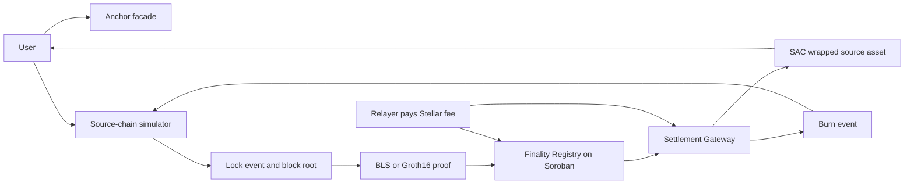

# Lumen Gate

> **Trust should not be an off-chain callback.**
>
> **Lumen Gate is the neutral finality layer that lets Stellar anchors settle value from other domains without becoming the source chain's validator, bridge operator, or single point of truth.**

[](https://developers.stellar.org/docs/build/smart-contracts/overview) [](#honest-status) [](https://www.risein.com/programs/stellar-pro-hackathon)

<p align="center"></p>

Stellar already has the payment rails, the anchor model and a smart-contract platform built for financial applications. The missing product layer is not another wrapped token UI: it is a **credible settlement boundary** between an anchor and a source domain. Lumen Gate puts that boundary in Soroban, where a Registry checks finality evidence, a Gateway controls the asset, and every accepted or rejected path can be inspected as a receipt.

This is the proposal for the [Rise In x Stellar Pro Hackathon](https://www.risein.com/programs/stellar-pro-hackathon), Genesis track. It is deliberately ambitious and deliberately honest: the source chain may remain a deterministic simulator for the hackathon, but Stellar-side contracts, Soroban RPC calls, event ingestion and transaction receipts are designed for real Testnet execution. No green button is allowed to turn an unverified fixture into a production claim.

## The 30-second pitch

**Lumen Gate turns source-chain finality into an on-chain Stellar settlement decision.** An anchor can keep its issuer, reserve, compliance and customer relationship while delegating neither trust nor mint authority to a private bridge database. The flow is:

```text
source lock → BLS or Groth16 evidence → Soroban verification → Stellar mint
Stellar burn → canonical contract event → relayer → source unlock
```

The result is a reusable settlement primitive for anchors, wallets, exchanges and payment applications: one integration surface, two proof lanes, explicit replay protection, a reversible asset path, and a failure mode that is safer than “the relayer said it was fine.”

## Why Stellar, why now

Lumen Gate is shaped around capabilities that make Stellar unusually relevant to this problem:

- **Anchors are a first-class distribution model.** Stellar’s Anchor Platform standardizes the service surface around SEP-1, SEP-6, SEP-10, SEP-12, SEP-24, SEP-31 and SEP-38. Lumen Gate complements that surface rather than replacing the issuer or compliance layer.
- **Soroban can make the settlement decision executable.** The Gateway does not ask an API to mint; it asks a Registry contract to accept evidence and then enforces the result through the SAC asset authority.
- **Cryptography is close to the ledger.** Soroban’s documented BLS12-381 and BN254 primitives make aggregate signatures and Groth16-style verification a native design target instead of a promise hidden in a server.
- **Events make the reverse path indexable.** A canonical `burn` event can be ingested through Soroban RPC, decoded by a relayer and consumed exactly once by the source side.
- **The output is composable value.** Once settled, a wrapped source asset can use Stellar wallets, liquidity and payment rails instead of living inside a bridge-specific silo.

### What we are not building

Lumen Gate is not an issuer, not a reserve manager, not a source-chain validator set and not a claim that every chain can be made trustless by adding a signature. It is an adapter and finality-verification boundary. The anchor remains responsible for its real-world obligations; the Registry is responsible for refusing evidence that does not satisfy the registered policy.

> **The pitch to judges:** this is infrastructure an anchor can actually integrate, a cryptography surface Soroban can actually enforce, and a demo where the negative path is part of the product—not a slide hidden after the happy path.

## How approval works, from the ground up

In a normal bridge, "approval" means a person decides. A group of validators each hold a private key, they sign a message saying "yes, this happened," and a relayer collects enough of those signatures and submits them. The destination chain trusts that those signatures came from honest people who checked things correctly. If those people are wrong, asleep, or compromised, the bridge is wrong too.

Lumen Gate replaces that decision with a mathematical check that Stellar itself can run.

**The BLS path.** Each validator signature is a point on an elliptic curve. Multiple signatures over the same message can be combined into one aggregate signature, a single mathematical object. Soroban has a built-in operation called a pairing check: given the aggregate signature, the message, and the combined public key, it confirms in one step whether that exact signature could only have come from validators who control the matching private keys, for that exact message. Change one byte of the message and the check fails. There is no step where a person looks at the signature and decides whether it looks right; the equation either balances or it doesn't.

Concretely, the Registry computes `H = hash_to_curve(height || state_root || event_root)` and asks the host to confirm `e(sig, G2_gen) · e(-H, pubkey) == 1`. That is the entire trust decision. You can watch it happen in the accepted transaction linked above.

**The ZK path.** Instead of signatures, the source chain can hand over a Groth16 proof: a short piece of math that says "a specific computation was carried out correctly," without showing the computation itself. Soroban verifies this the same way, with a native pairing check. The proof is a fixed size no matter how large the underlying computation was, and checking it takes the same small, constant amount of work every time.

**Why this counts as "no human approval."** Both checks run inside the Soroban contract itself, using cryptographic operations built directly into the Stellar protocol, not a script on someone's laptop or a company server. The contract's only decision is whether the pairing equation holds. To make sure nobody can quietly change what "valid" means later, the verifying key and the BLS policy are set once through an admin-gated bootstrap, and `renounce_admin` exists to give that ability up permanently. After that point, there is no key left that could override what the math already decided.

**Where a human still sits, honestly.** Admin-gated bootstrap is a real trust point during setup: whoever holds the admin key decides the initial verifying key and the initial BLS policy. That is why renounce is part of the product and not a footnote, and why the deployed registry has not yet renounced — the on-chain transaction is pending, and this file will not claim it until it is done.

## The system keeps proving it, not just proved it once

A test suite proves the contract behaved correctly at the moment someone ran it. That is a one-time claim. The self-audit loop turns it into a standing one.

[`anchor/self-audit.js`](anchor/self-audit.js) runs against the **live deployed registry** on an interval. Every round it:

1. advances the source chain so the round has genuinely new evidence,
2. submits an honest proof and requires it to be **accepted**,
3. resubmits the identical evidence and requires `#9 EvidenceAlreadyProcessed`,
4. submits a proof with one byte of the signature tampered and requires `#7 InvalidSignature`,
5. asks whether the admin capability has actually been given up.

Results are timestamped and appended to [`deployments/self-audit.json`](deployments/self-audit.json), and served read-only at `/self-audit` on the anchor facade. Run it with:

```bash
REGISTRY_ID=CCXJDQMTJUGXKNFOQPC25IYVOAVWDMLJBNQYX75MAREHV7MZMU5OSEN4 \
  node anchor/self-audit.js
```

**It holds no mint authority.** It cannot approve anything, it cannot change the verifying key, and it is not a new trusted party in the settlement path — it only asks the contract questions and writes down the answers. If it stops running, nothing about settlement changes; you just stop getting fresh evidence.

The latest recorded round is **5/5** (`deployments/self-audit.json`, 2026-09-19T16:47:44Z): honest evidence accepted, replay rejected, tampered signature rejected, verifying key immutable, admin capability renounced. The registry's admin capability was given up permanently with `renounce_admin`, which is the last setup step — after that nobody, including the deployer, can change the verifying key or add a domain.

### What this round of work broke, and what that found

The audit loop is only worth running if the failures are written down. This round produced four, all recorded in `deployments/testnet.json` under `findings`:

1. **The first live gasless attempt failed**: the Stellar Asset Contract rejects minting the token to the account that issues it, so the relayer-reward mint trapped and the whole transaction rolled back. The relayer now runs from a separate account that holds the wrapped asset's trustline — which is also the honest topology, because the fee payer should not be the issuer.
2. **The relayer reported the wrong transaction hash.** It took the first 64-hex-character run out of the CLI output; the CLI echoes its arguments, and the evidence contains a 64-hex adapter id, so the adapter id was printed as the receipt. It now confirms a candidate through `getTransaction` before calling it a receipt — a hash the network has not seen is never reported.
3. **The relayer would not resume.** If the evidence for a height was already anchored (registry `#9`), it treated that as failure and skipped the mint, stranding every message anchored before a restart. `#9` from the registry and `#4` from the gateway are now what they are: the desired end state.
4. **Two unit tests were passing for the wrong reason.** They asserted only that a call failed; they never admitted the domain, so the call failed with `NotAdmitted` before any signature or pairing check ran. Both now admit the domain and assert the specific error variant.

## Honest status

This checkout is a **Testnet engineering snapshot**, not a completed production bridge. Everything claimed below was executed against Stellar Testnet (protocol 28) and can be checked on-chain; everything not executed is listed under [What is not claimed yet](#what-is-not-claimed-yet).

### Live on Testnet

| Contract | Address | Note |
| --- | --- | --- |
| `finality_registry` | `CCXJDQMTJUGXKNFOQPC25IYVOAVWDMLJBNQYX75MAREHV7MZMU5OSEN4` | admin **renounced on-chain**; verifier key set; one domain admitted |
| `settlement_gateway` | `CBUKVNCPF5XRYJVAH2SRLTLUMZT6T677T5KAJADXZIQOQTCTSBITQVPA` | current build, 18,303 bytes |
| `wSRC` (Stellar Asset Contract) | `CBPBDVLP7K436KEXOAJMPFFHEF5OXNN4KJIB2HDFDBRWOABQ6WBTURRV` | admin handed to the gateway, so mint and burn ride the gateway's own authorisation |

Three earlier gateway deployments and one earlier asset contract are listed under `superseded` in [`deployments/testnet.json`](deployments/testnet.json) rather than deleted. They were replaced for concrete reasons, and the reasons are the interesting part: one could not be driven from the command line, one could not be re-pointed at a fixed gateway, and one predated a real footgun fix. Keeping them visible is cheaper than pretending the first attempt worked.

### Receipts

| Step | Result | Transaction |
| --- | --- | --- |
| Registry initialise | success | `6fa09843673fe15624967f9b05f2cd186061e68d85f3b119d7037a00657e2f0b` |
| `register_domain` (`source-testnet`) | success | `ad80fe5a7f058aab7521d6aa5f1141be17d54feba578ea7ad7ce546007d7339f` |
| `set_bls_policy` (3 signers, 2 required) | success | `e37cc48ceb175b36d2d6c8d13fa8b22c6e8efa1cd7f9179484c17de7eda8d5f0` |
| `admit_domain` | success | `a7d9cce11a863e962bfa11f0873b5e2997ca9ee3fb3bcf2ca764ebac54519090` |
| **BLS finality accepted** | **success** | **`b181956b9a9c3fc4f18faeea3938bdf2ea19b96edc9bd4414ddeb243e02008a4`** |
| Replay the same evidence | rejected `#9 EvidenceAlreadyProcessed` | simulated, no fee burned |
| Tamper one byte of the BLS signature | rejected `#7 InvalidSignature` | simulated, no fee burned |
| Set the verifier key | success | `76e6c3978af3c32aecce89578085d2b8a6bddcf167a2e386e1760450a3314c3b` |
| **Groth16 proof accepted** (heights 19, 39, 18, 91, 32) | **success** | `12be652f…`, `15e2143f…`, `1c2179bb…`, `4f612bfc…`, `f3bb88d1…` |
| Tamper one byte of a Groth16 proof | rejected `#8 InvalidProof` | simulated, no fee burned |
| **`renounce_admin`** | **success** | `8ca278c88a6ee375c21c09870b48320b953eea3ed3e7c35f55a03b87e03639b4` |
| `set_vk` **after** renounce | rejected, VM call trapped | the capability is gone for everyone, including the deployer |
| **Forward: lock → Merkle proof → mint** | **success**, balance 0 → 400,000,002 wSRC | `3d5d9936bf514b10423fe4ed4f39009899f02ae1f5cdb8b5fd16517258f57997` |
| **Reverse: burn → source-chain unlock** | **success**, 150,000,000 released | `ca0a16605acb41c1dcb1e4db2dedaf4b45e98347b013e37d8e9906a559b83340` |
| Replay the burn message on the source chain | rejected, HTTP 409 | — |
| **Gasless mint to a zero-XLM account** | **success**, recipient XLM unchanged, +19.9 wSRC | `8b4e9bd59f405b8d3ecd11dcf1dee1e906ffcf16100cbcb1899cae7b42da88b4` |
| The relayer's own reward for paying that fee | paid, +0.1 wSRC to the relayer | same transaction |

The gasless row is the strongest single receipt in this file. The recipient account `GCN65ER7…` held **15,000,000 stroops of XLM — exactly its minimum reserve, zero spendable** — before and after the mint, byte for byte. It could not have paid the **137,293 stroops** the transaction cost, because any fee would have dropped it below the reserve. The relayer `GBDJAEDH…` signed and paid, and the gateway minted it `0.1 wSRC` out of the transferred amount as the fee. The whole run was one command: `target/debug/relayer --height 156 --once` with `RELAYER_FEE=1000000`, reading its addresses from `deployments/testnet.json`.

The first accepted transaction is ledger **4,762,103**, fee **168,960 stroops**, and it emitted `finality_verified` carrying the domain key, height and state root. The aggregate BLS12-381 signature was verified inside Soroban using the native pairing host functions — no off-chain check, no oracle, no signature-size shortcut.

The Groth16 proof was generated from a circuit compiled in this repository, against a Powers-of-Tau ceremony run locally, and was checked by the contract's own BN254 pairing verifier. The proof for the settlement block is not the one that anchors that block — see below for why.

### Test status

`cargo test --workspace --lib` → **23 passed, 0 failed** (12 in `finality_registry`, 11 in `settlement_gateway`). Run it yourself; the count in this file is not aspirational. Three of the registry tests replay the exact 256-byte proof and 768-byte key that a testnet transaction accepted, so a regression in the verifier or in the byte encoding fails the suite instead of only failing in production. `-- --nocapture` prints the measured CPU cost of the pairing check.

### What is not claimed yet

- **The Groth16 lane proves a quorum and binds the three roots; it is not a signature verifier.** The circuit header says so in its own words. It establishes that enough approvals exist over a bitmap and that `prev_state_root`, `state_root` and `event_root` participate in one Poseidon relation, so none of them is decorative metadata. It does **not** establish that any particular validator signed anything. A production ZK lane replaces the bitmap with a real signature gadget.
- **Because of that, the registry does not persist an event root from the ZK lane.** Storing a root that no signature covers would let an unconstrained value become the anchor for a Merkle settlement proof, and minting reads that anchor. The settlement receipt above is anchored by the **BLS** lane, whose aggregate signature does cover the event root. This is a deliberate refusal, not an oversight, and it is the reason the two lanes are not interchangeable yet.
- **The source side is a local deterministic simulator**, not a live external network. Its BLS signatures are real (RFC 9380 hash-to-curve, DST `lumen-gate-finality-v1`) but its validator secret keys are the fixed demo values 1, 2, 3. Production requires a DKG. See [Known simplifications](#known-simplifications).
- **The gasless path is live for inbound mints, and only for inbound mints.** The receipt above is real, but "gasless" here means *zero spendable XLM*, not zero setup: the recipient still needs an existing Stellar account holding a trustline for the wrapped asset, because a Stellar asset cannot be held without one. The outbound direction is not gasless — a user who wants to burn and unlock signs and pays for their own burn transaction. The fee the relayer charges is a fixed amount chosen at submission time, not a market.
- **The frontend is not wired to the live contracts.** The reverse and forward runs above were driven from the command line and from the anchor facade, not from the web app.
- **No bond, fee or slashing economics.** A validator that signs a wrong root loses nothing.

The source side is intentionally local. The Stellar side is not mocked: the acceptance bar was real deployments, real transaction hashes, real events, and negative probes against the live contracts — and that bar is now met for both directions.

### Is this a zkVM?

**No, and the word zkVM should not be attached to this system.** A zkVM proves the execution of a program on a virtual machine: it needs an instruction set with defined semantics, a memory model, a commitment to the guest program, and a witness that replays the execution. None of those four things exists here.

What exists is narrower and fully verifiable: one **fixed-statement Groth16 proof over BN254**, compiled ahead of time from [`circuits/finality_statement.circom`](circuits/finality_statement.circom) into **628 constraints**, verified on-chain by the registry's own verifier through Stellar's native BN254 host functions. The statement is "a quorum of approval bits is set and the three roots participate in one Poseidon relation", and it is frozen at compile time: changing it means new keys and a new deployment.

The full write-up — statement, byte layout, measured cost, what a real zkVM would require, and the research direction — is in [`docs/PROVING_SYSTEM.md`](docs/PROVING_SYSTEM.md). The one-line version for a reviewer: **a statement proof, not a VM proof; a quorum proof, not a signature proof.**

## Product thesis

An anchor that does not want to operate a separate bridge per source chain should be able to:

1. register a source domain and its finality policy;
2. accept a BLS or Groth16 proof through a relayer;
3. have Soroban verify the proof with native cryptographic host functions;
4. mint or release the anchor's wrapped asset only after verification;
5. burn the asset and emit a reverse message without keeping validator keys in the anchor.

The codebase implements this boundary with a local source simulator and a live-Soroban-shaped Stellar side. The simulator makes the demo deterministic; it does not make a live Testnet claim on our behalf.

## Judge's 90-second path

1. Open [`frontend/index.html`](frontend/index.html) or the deployed preview and read the banner: the thesis is settlement, not a token gimmick.
2. Connect Freighter on Testnet and inspect the registry, gateway and SAC IDs. Placeholder IDs are intentionally obvious until deployment evidence exists.
3. Create a source lock, fetch both BLS and Groth16 evidence, then run the fault probes for bad signatures, roots, versions, malformed proof roots and replayed nonces.
4. Follow the reverse path: `burn_and_relay` emits canonical Bytes, the relayer polls Soroban RPC, and the source simulator consumes `/burn-unlock` once.
5. Replace the manifest with real receipts and repeat the exact flow against Testnet. The README and [`DIRECTIVE.md`](DIRECTIVE.md) define what counts as evidence.

## Research notes and ecosystem fit

The product direction follows the current Stellar developer surface rather than treating Stellar as a generic chain:

- [Anchors](https://developers.stellar.org/docs/learn/fundamentals/anchors) defines anchors as the on/off-ramp layer connecting Stellar to financial rails and points builders toward SEP-6, SEP-24, SEP-31, SEP-10, SEP-12 and SEP-38.
- [Anchor Platform](https://developers.stellar.org/docs/platforms/anchor-platform) provides standardized asset, authentication, transaction and callback surfaces. Lumen Gate’s facade is intentionally shaped to sit beside that platform.
- [Soroban `getEvents`](https://developers.stellar.org/network/soroban-rpc/methods/getEvents) supports contract/topic filtering and cursor-based pagination. The relayer uses this surface for reverse burn ingestion, while the deployment plan treats event retention as an operational constraint.
- [Contract event ingestion guidance](https://developers.stellar.org/docs/build/guides/events/ingest) recommends maintaining an own record because RPC event retention is limited. That is why Lumen Gate’s relayer keeps a cursor and why a production deployment must persist event IDs rather than poll blindly.
- [Stellar privacy and ZK primitives](https://developers.stellar.org/docs/build/apps/privacy) documents BLS12-381 and BN254 as Soroban cryptographic building blocks. Lumen Gate exposes both lanes so an anchor can compare an aggregate-signature finality policy with a proof-carrying policy.
- [Soroban BLS signature example](https://developers.stellar.org/docs/build/smart-contracts/example-contracts/bls-signature) demonstrates the native pairing pattern that informs the Registry’s BLS path.

These are product inputs, not endorsements. The repository still requires deployment receipts and negative Testnet evidence before making a live security claim.

## Demo story



The live demonstration must show:

- source lock with the relayer fee included;
- a BLS proof and a Groth16 proof as two security backings for the same envelope;
- on-chain finality verification before mint;
- HWM replay rejection;
- burn and source-side unlock in the reverse direction;
- a fresh recipient with no XLM, if and only if the testnet flow proves it.

## Repository architecture

| Component | Role | Location |
| --- | --- | --- |
| Finality Registry | Domain registry, evidence parsing, BLS and Groth16 verification, finalized roots | `contracts/finality_registry` |
| Settlement Gateway | Lock, mint, burn, message IDs, Merkle checks, fee abstraction and nonce HWM | `contracts/settlement_gateway` |
| Source simulator | Deterministic blocks, lock events, Merkle roots and proof fixtures | `crates/source_simulator` |
| Relayer | Source event polling and real Soroban transaction submission | `crates/relayer` |
| Frontend | Freighter-facing demo and fault probes | `frontend` |
| Anchor facade | SEP-1 metadata, health/info endpoints and integration surface | `anchor` |
| Circuits and fixtures | Small source-finality circuit workbench and Groth16 artifacts | `circuits` |

### Anchor positioning

Lumen Gate is not the anchor's issuer and does not replace the anchor's reserve or compliance operations. The anchor remains the issuer and publishes asset metadata. The gateway receives SAC authority so that the anchor's operational key is not the mint decision-maker. The mint decision comes from the registry's cryptographic result.

The current demo asset code is the neutral `wSRC`. It describes a wrapped source asset and is not the name of an external chain.

### Domain adapter model

Each source domain is identified by:

```text
 domain_key = sha256(adapter_id || network)
```

Evidence carries an adapter ID, version, network, opaque payload, declared height, declared root and submitter. The contract re-derives height and root from the payload. There is no `assume valid` branch: malformed payloads, version failures, root mismatches, invalid curve points, bad proofs, duplicate evidence and replayed messages must return an error.

### Message envelope and replay protection

A cross-domain message contains the source and target domains, source height, event index, nonce, sender, recipient, payload hash, message kind and expiry. Its ID is derived from those fields. Expiry is checked in the source height space; Stellar's unrelated ledger sequence is not used for source-domain expiry. The gateway pins its Stellar target domain at initialization as `sha256("lumen-gate-stellar-testnet")`; the source simulator and relayer use the same 32-byte value.

Inbound processing uses one high-water mark per `(source_domain, target_domain, sender)`:

```text
highest_processed_nonce
```

A nonce at or below the mark is rejected and only a higher nonce advances the mark. A separate message-ID record is retained as an additional idempotency guard.

## Cryptographic paths

### BLS12-381

The intended live path is a real aggregate BLS verification using Soroban native curve, subgroup and pairing hosts. The demo validator set is a deterministic 2-of-3 test fixture, and its keys are not a production validator set.

The domain record must bind the expected aggregate public key and quorum. The payload must not be allowed to choose its own trusted key. The canonical domain separation string for a new deployment is:

```text
lumen-gate-finality-v1
```

The full pairing path, not an on-curve-only shortcut, is the security claim shown to judges.

### Groth16 / BN254

The ZK path uses a small purpose-built circuit rather than porting a large source-chain VM — this is a **statement proof, not a zkVM** ([why, in one section](#is-this-a-zkvm), and in full in [`docs/PROVING_SYSTEM.md`](docs/PROVING_SYSTEM.md)). Soroban's native BN254 pairing check is the on-chain verifier, and it verifies real proofs: [`circuits/finality_statement.circom`](circuits/finality_statement.circom) compiled with circom 2.2.3 into 628 constraints, proved with snarkjs 0.7.6 against a Powers-of-Tau ceremony generated locally, serialised by [`circuits/convert_to_soroban.py`](circuits/convert_to_soroban.py), and accepted by the live registry on testnet (receipts above). On-chain, that verification costs about **29.1M cpu instructions** in the Soroban host model and was charged **158,961 stroops** on testnet — both measured, both re-runnable with `cargo test -p finality_registry --lib -- --nocapture`.

The public signal order is fixed by the deployed verifier, which requires the last public input to equal the evidence's declared state root:

```
public_inputs[0] = prev_state_root
public_inputs[1] = event_root
public_inputs[2] = threshold
public_inputs[3] = state_root      <- the value the registry binds
```

Getter/setter shape: a 768-byte verification key (α, β, γ, δ and five IC points), a 256-byte proof, and four 32-byte big-endian field elements. The Fp2 encoding is the part that bites: snarkjs emits each G2 coordinate real-first, while Soroban's host functions want the imaginary component first, so the converter swaps them and asserts the result.

**What the circuit does and does not do.** It proves a quorum exists over an approval bitmap, and that the three roots participate in one Poseidon relation, so none of them is free metadata. It does **not** verify signatures. A production lane replaces the bitmap with a signature gadget. That is why the settlement anchor comes from the BLS lane, whose signature does cover the event root, and why the registry refuses to persist an event root from the ZK lane.

The older checked-in fixture — now named [`circuits/settlement_statement_fixture.circom`](circuits/settlement_statement_fixture.circom) so the filename stops implying a VM — is quarantined and is never submitted unless `ALLOW_DEVELOPMENT_ZK_FIXTURE=1` is set for a development demonstration. It exists so a developer can see the wire format without a ceremony; it is not part of any claim.

## Anchor integration

The facade exposes the minimum integration surface:

- `/.well-known/stellar.toml` for asset metadata;
- `/health` for service health and configured contract IDs;
- `/info` for the domain profile, proof paths and current deployment;
- `/transactions?id=...` for demo transaction lookup;
- explicit deposit/withdraw information only when the endpoint is actually
  implemented.

An anchor must not be described as operating source-chain validators. It only configures the asset and settlement relationship.

## Implementation status

### Built in this snapshot

- Soroban Registry and Gateway contracts with explicit evidence parsing, domain profiles, Merkle checks and nonce HWM replay protection;
- BLS12-381 aggregate-signature verification and Groth16/BN254 verification paths with malformed-point, scalar, root and signature rejection branches;
- payload-derived height/root checks—there is no `assume valid` branch;
- source simulator with deterministic lock/proof fixtures and idempotent `/burn-unlock` accounting;
- Rust relayer with real Soroban RPC `getEvents` polling, strict SCVal Bytes decoding and reverse source delivery;
- Freighter-facing frontend checkout, burn submission path and positive/negative proof probes;
- Anchor facade with Stellar metadata, health, info, transaction and withdrawal integration surfaces;
- fixture quarantine and an evidence-first deployment directive in [`DIRECTIVE.md`](DIRECTIVE.md).

### Still required for the submission-grade evidence pack

- deploy the Registry, Gateway and SAC to Stellar Testnet and replace placeholders in `deployments/testnet.json`;
- record contract IDs, explorer links, setup transaction hashes, event IDs and `getTransaction` receipts;
- execute `register_domain`, BLS policy setup and domain admission, then permanently constrain or renounce Registry and Gateway admin authority;
- prove the exact BLS hash-to-curve/signature scheme against the deployed Soroban host functions;
- regenerate a source-root-bound Groth16 circuit, VK and proof, then show positive and negative receipts against the deployed Registry;
- run source lock → proof → Registry verification → Gateway mint, followed by Gateway burn → RPC event → source `/burn-unlock`;
- prove HWM rejection keyed by `(source_domain, target_domain, sender)` and retain the receipt for the negative probe;
- test a fresh unfunded Testnet account before using any gasless onboarding language;
- run the full Rust format/test/build matrix and archive the live evidence under the documented manifest format.

Until these steps are complete, words such as “live,” “trustless,” “machine-only” and “gasless” refer to an intended design path—not a collected Testnet fact.

## Local development

### Requirements

- Rust toolchain and Cargo;
- Soroban CLI compatible with the selected SDK;
- Node.js and npm/pnpm;
- Circom and snarkjs for circuit work;
- Freighter for the browser demo;
- a funded Testnet relayer account for real submissions.

### Contracts and tests

```bash
cargo fmt --check
cargo test --workspace

cd contracts/finality_registry
stellar contract build
cd ../settlement_gateway
stellar contract build
```

### Source simulator

```bash
SOURCE_ASSET_ID=<real-sac-contract-id> cargo run -p source_simulator -- --port 3001
```

Useful endpoints:

```text
GET  /info
GET  /blocks/latest
POST /lock
POST /unlock                 # consume an inbound lock once
POST /burn-unlock            # consume a live Stellar burn event once
GET  /events?height=<height>
GET  /proof?height=<height>&kind=bls
GET  /proof?height=<height>&kind=zk
```

### Relayer

```bash
RPC_URL=https://soroban-testnet.stellar.org \
STELLAR_SOURCE_ACCOUNT=relayer \
STELLAR_RELAYER_ADDRESS=<funded-relayer-address> \
REGISTRY_ID=<real-contract-id> \
GATEWAY_ID=<real-contract-id> \
cargo run -p relayer -- --sim-url http://localhost:3001 --rpc "$RPC_URL"

# Local inspection only; this never submits a transaction.
cargo run -p relayer -- --dry-run --sim-url http://localhost:3001
```

The relayer must fail loudly when the deployment manifest still contains a placeholder. It submits BLS registry evidence and then the source lock Merkle proof to the live gateway. It also polls the real gateway `burn` event through Soroban RPC, decodes the documented Bytes payload, and posts the one-time `/burn-unlock` request to the local source simulator. The checked-in Groth16 fixture is quarantined as described in `circuits/DEVELOPMENT_FIXTURE.md` and is never submitted unless `ALLOW_DEVELOPMENT_ZK_FIXTURE=1` is explicitly set for a development demonstration; it is not source-root bound and cannot support a live trustless claim. A dry-run log is not a successful settlement transaction.

### Frontend and anchor facade

```bash
cd frontend
npm install
npm run dev

cd ../anchor
npm install
PORT=8081 SIM_URL=http://localhost:3001 npm start
```

Browser code must use a relative/proxied simulator URL or a configured public URL. The user's browser is not the sandbox, so a browser request to its own `localhost` is not a valid deployed demo path.

## Security and scope statement

This is a hackathon system, not an audit-grade bridge. The following are deliberate scope reductions:

- the source chain and its consensus are simulated;
- validator keys are deterministic test fixtures;
- trusted setup may be a short test ceremony;
- post-quantum signatures, slashing, bonds, validator rotation and fraud proofs
  are future work;
- the relayer may be operationally centralized, but it must not be the
  cryptographic authority for minting; its live gateway path currently uses
  the BLS finality record and is not a substitute for the ZK fixture work;
- anchor reserves and compliance remain off-chain;
- Testnet assets have no production value.

Admin bootstrap is a specific threat: before `renounce_admin`, a compromised
admin could change the verification configuration. Deployment must show the
setup transactions and the final renounce transaction. After renounce, changing
verification policy requires a new contract and an explicit migration.

## Genesis framing

The project applies a known domain-adapter/finality-attestation pattern to
Stellar-specific primitives, written as a new Soroban implementation for the
hackathon. That framing is intentional and transparent. The submission should
lead with the working Testnet evidence rather than with unverified ecosystem
badges or unsupported security adjectives.

## License

The repository code is MIT unless a file states otherwise. Imported circuit
artifacts must retain their upstream license and attribution.
