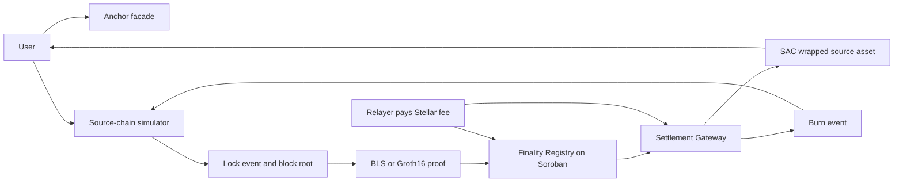

# Lumen Gate

> **Trust should not be an off-chain callback.**
>
> **Lumen Gate is the neutral finality layer that lets Stellar anchors settle value from other domains without becoming the source chain's validator, bridge operator, or single point of truth.**

[](https://developers.stellar.org/docs/build/smart-contracts/overview) [](#honest-status) [](https://www.risein.com/programs/stellar-pro-hackathon)

<p align="center"></p>

Stellar already has the payment rails, the anchor model and a smart-contract platform built for financial applications. The missing product layer is not another wrapped token UI: it is a **credible settlement boundary** between an anchor and a source domain. Lumen Gate puts that boundary in Soroban, where a Registry checks finality evidence, a Gateway controls the asset, and every accepted or rejected path can be inspected as a receipt.

This is the proposal for the [Rise In x Stellar Pro Hackathon](https://www.risein.com/programs/stellar-pro-hackathon), Genesis track. It is deliberately ambitious and deliberately honest: the source chain may remain a deterministic simulator for the hackathon, but Stellar-side contracts, Soroban RPC calls, event ingestion and transaction receipts are designed for real Testnet execution. No green button is allowed to turn an unverified fixture into a production claim.

## The 30-second pitch

**Lumen Gate turns source-chain finality into an on-chain Stellar settlement decision.** An anchor can keep its issuer, reserve, compliance and customer relationship while delegating neither trust nor mint authority to a private bridge database. The flow is:

```text
source lock → BLS or Groth16 evidence → Soroban verification → Stellar mint
Stellar burn → canonical contract event → relayer → source unlock
```

The result is a reusable settlement primitive for anchors, wallets, exchanges and payment applications: one integration surface, two proof lanes, explicit replay protection, a reversible asset path, and a failure mode that is safer than “the relayer said it was fine.”

## Why Stellar, why now

Lumen Gate is shaped around capabilities that make Stellar unusually relevant to this problem:

- **Anchors are a first-class distribution model.** Stellar’s Anchor Platform standardizes the service surface around SEP-1, SEP-6, SEP-10, SEP-12, SEP-24, SEP-31 and SEP-38. Lumen Gate complements that surface rather than replacing the issuer or compliance layer.
- **Soroban can make the settlement decision executable.** The Gateway does not ask an API to mint; it asks a Registry contract to accept evidence and then enforces the result through the SAC asset authority.
- **Cryptography is close to the ledger.** Soroban’s documented BLS12-381 and BN254 primitives make aggregate signatures and Groth16-style verification a native design target instead of a promise hidden in a server.
- **Events make the reverse path indexable.** A canonical `burn` event can be ingested through Soroban RPC, decoded by a relayer and consumed exactly once by the source side.
- **The output is composable value.** Once settled, a wrapped source asset can use Stellar wallets, liquidity and payment rails instead of living inside a bridge-specific silo.

### What we are not building

Lumen Gate is not an issuer, not a reserve manager, not a source-chain validator set and not a claim that every chain can be made trustless by adding a signature. It is an adapter and finality-verification boundary. The anchor remains responsible for its real-world obligations; the Registry is responsible for refusing evidence that does not satisfy the registered policy.

> **The pitch to judges:** this is infrastructure an anchor can actually integrate, a cryptography surface Soroban can actually enforce, and a demo where the negative path is part of the product—not a slide hidden after the happy path.

## Honest status

This checkout is a **Testnet engineering snapshot**, not a completed production bridge. `deployments/testnet.json` still contains placeholders. The browser and relayer paths are written for live Soroban RPC and Freighter submission, but no deployment, contract IDs, receipt set or fresh-unfunded-account gasless result is claimed until those artifacts are collected and linked. The checked-in Groth16 material is explicitly quarantined as development-only. See [`circuits/DEVELOPMENT_FIXTURE.md`](circuits/DEVELOPMENT_FIXTURE.md).

The source side is intentionally local. The Stellar side is not intended to be mocked: the acceptance bar is a real registry/gateway/SAC deployment, real transaction hashes, real events, a reverse `/burn-unlock` receipt and negative probes against the deployed contracts.

## Product thesis

An anchor that does not want to operate a separate bridge per source chain should be able to:

1. register a source domain and its finality policy;
2. accept a BLS or Groth16 proof through a relayer;
3. have Soroban verify the proof with native cryptographic host functions;
4. mint or release the anchor's wrapped asset only after verification;
5. burn the asset and emit a reverse message without keeping validator keys in the anchor.

The codebase implements this boundary with a local source simulator and a live-Soroban-shaped Stellar side. The simulator makes the demo deterministic; it does not make a live Testnet claim on our behalf.

## Judge's 90-second path

1. Open [`frontend/index.html`](frontend/index.html) or the deployed preview and read the banner: the thesis is settlement, not a token gimmick.
2. Connect Freighter on Testnet and inspect the registry, gateway and SAC IDs. Placeholder IDs are intentionally obvious until deployment evidence exists.
3. Create a source lock, fetch both BLS and Groth16 evidence, then run the fault probes for bad signatures, roots, versions, malformed proof roots and replayed nonces.
4. Follow the reverse path: `burn_and_relay` emits canonical Bytes, the relayer polls Soroban RPC, and the source simulator consumes `/burn-unlock` once.
5. Replace the manifest with real receipts and repeat the exact flow against Testnet. The README and [`DIRECTIVE.md`](DIRECTIVE.md) define what counts as evidence.

## Research notes and ecosystem fit

The product direction follows the current Stellar developer surface rather than treating Stellar as a generic chain:

- [Anchors](https://developers.stellar.org/docs/learn/fundamentals/anchors) defines anchors as the on/off-ramp layer connecting Stellar to financial rails and points builders toward SEP-6, SEP-24, SEP-31, SEP-10, SEP-12 and SEP-38.
- [Anchor Platform](https://developers.stellar.org/docs/platforms/anchor-platform) provides standardized asset, authentication, transaction and callback surfaces. Lumen Gate’s facade is intentionally shaped to sit beside that platform.
- [Soroban `getEvents`](https://developers.stellar.org/network/soroban-rpc/methods/getEvents) supports contract/topic filtering and cursor-based pagination. The relayer uses this surface for reverse burn ingestion, while the deployment plan treats event retention as an operational constraint.
- [Contract event ingestion guidance](https://developers.stellar.org/docs/build/guides/events/ingest) recommends maintaining an own record because RPC event retention is limited. That is why Lumen Gate’s relayer keeps a cursor and why a production deployment must persist event IDs rather than poll blindly.
- [Stellar privacy and ZK primitives](https://developers.stellar.org/docs/build/apps/privacy) documents BLS12-381 and BN254 as Soroban cryptographic building blocks. Lumen Gate exposes both lanes so an anchor can compare an aggregate-signature finality policy with a proof-carrying policy.
- [Soroban BLS signature example](https://developers.stellar.org/docs/build/smart-contracts/example-contracts/bls-signature) demonstrates the native pairing pattern that informs the Registry’s BLS path.

These are product inputs, not endorsements. The repository still requires deployment receipts and negative Testnet evidence before making a live security claim.

## Demo story



The live demonstration must show:

- source lock with the relayer fee included;
- a BLS proof and a Groth16 proof as two security backings for the same envelope;
- on-chain finality verification before mint;
- HWM replay rejection;
- burn and source-side unlock in the reverse direction;
- a fresh recipient with no XLM, if and only if the testnet flow proves it.

## Repository architecture

| Component | Role | Location |
| --- | --- | --- |
| Finality Registry | Domain registry, evidence parsing, BLS and Groth16 verification, finalized roots | `contracts/finality_registry` |
| Settlement Gateway | Lock, mint, burn, message IDs, Merkle checks, fee abstraction and nonce HWM | `contracts/settlement_gateway` |
| Source simulator | Deterministic blocks, lock events, Merkle roots and proof fixtures | `crates/source_simulator` |
| Relayer | Source event polling and real Soroban transaction submission | `crates/relayer` |
| Frontend | Freighter-facing demo and fault probes | `frontend` |
| Anchor facade | SEP-1 metadata, health/info endpoints and integration surface | `anchor` |
| Circuits and fixtures | Small source-finality circuit workbench and Groth16 artifacts | `circuits` |

### Anchor positioning

Lumen Gate is not the anchor's issuer and does not replace the anchor's reserve or compliance operations. The anchor remains the issuer and publishes asset metadata. The gateway receives SAC authority so that the anchor's operational key is not the mint decision-maker. The mint decision comes from the registry's cryptographic result.

The current demo asset code is the neutral `wSRC`. It describes a wrapped source asset and is not the name of an external chain.

### Domain adapter model

Each source domain is identified by:

```text
 domain_key = sha256(adapter_id || network)
```

Evidence carries an adapter ID, version, network, opaque payload, declared height, declared root and submitter. The contract re-derives height and root from the payload. There is no `assume valid` branch: malformed payloads, version failures, root mismatches, invalid curve points, bad proofs, duplicate evidence and replayed messages must return an error.

### Message envelope and replay protection

A cross-domain message contains the source and target domains, source height, event index, nonce, sender, recipient, payload hash, message kind and expiry. Its ID is derived from those fields. Expiry is checked in the source height space; Stellar's unrelated ledger sequence is not used for source-domain expiry. The gateway pins its Stellar target domain at initialization as `sha256("lumen-gate-stellar-testnet")`; the source simulator and relayer use the same 32-byte value.

Inbound processing uses one high-water mark per `(source_domain, target_domain, sender)`:

```text
highest_processed_nonce
```

A nonce at or below the mark is rejected and only a higher nonce advances the mark. A separate message-ID record is retained as an additional idempotency guard.

## Cryptographic paths

### BLS12-381

The intended live path is a real aggregate BLS verification using Soroban native curve, subgroup and pairing hosts. The demo validator set is a deterministic 2-of-3 test fixture, and its keys are not a production validator set.

The domain record must bind the expected aggregate public key and quorum. The payload must not be allowed to choose its own trusted key. The canonical domain separation string for a new deployment is:

```text
lumen-gate-finality-v1
```

The full pairing path, not an on-curve-only shortcut, is the security claim shown to judges.

### Groth16 / BN254

The ZK path uses a small purpose-built circuit rather than porting a large source-chain VM. The proof must bind its public inputs to the finalized height, state root and message commitment. Soroban's native BN254 multi-pairing check is the on-chain verifier.

The checked-in circuit and fixtures are a starting point, not proof that a dynamic source root is already verified. Before submission, the circuit, VK, proof generator and Soroban public-input encoding must be tested together, including wrong-VK, modified-proof and root-mismatch rejection.

## Anchor integration

The facade exposes the minimum integration surface:

- `/.well-known/stellar.toml` for asset metadata;
- `/health` for service health and configured contract IDs;
- `/info` for the domain profile, proof paths and current deployment;
- `/transactions?id=...` for demo transaction lookup;
- explicit deposit/withdraw information only when the endpoint is actually
  implemented.

An anchor must not be described as operating source-chain validators. It only configures the asset and settlement relationship.

## Implementation status

### Built in this snapshot

- Soroban Registry and Gateway contracts with explicit evidence parsing, domain profiles, Merkle checks and nonce HWM replay protection;
- BLS12-381 aggregate-signature verification and Groth16/BN254 verification paths with malformed-point, scalar, root and signature rejection branches;
- payload-derived height/root checks—there is no `assume valid` branch;
- source simulator with deterministic lock/proof fixtures and idempotent `/burn-unlock` accounting;
- Rust relayer with real Soroban RPC `getEvents` polling, strict SCVal Bytes decoding and reverse source delivery;
- Freighter-facing frontend checkout, burn submission path and positive/negative proof probes;
- Anchor facade with Stellar metadata, health, info, transaction and withdrawal integration surfaces;
- fixture quarantine and an evidence-first deployment directive in [`DIRECTIVE.md`](DIRECTIVE.md).

### Still required for the submission-grade evidence pack

- deploy the Registry, Gateway and SAC to Stellar Testnet and replace placeholders in `deployments/testnet.json`;
- record contract IDs, explorer links, setup transaction hashes, event IDs and `getTransaction` receipts;
- execute `register_domain`, BLS policy setup and domain admission, then permanently constrain or renounce Registry and Gateway admin authority;
- prove the exact BLS hash-to-curve/signature scheme against the deployed Soroban host functions;
- regenerate a source-root-bound Groth16 circuit, VK and proof, then show positive and negative receipts against the deployed Registry;
- run source lock → proof → Registry verification → Gateway mint, followed by Gateway burn → RPC event → source `/burn-unlock`;
- prove HWM rejection keyed by `(source_domain, target_domain, sender)` and retain the receipt for the negative probe;
- test a fresh unfunded Testnet account before using any gasless onboarding language;
- run the full Rust format/test/build matrix and archive the live evidence under the documented manifest format.

Until these steps are complete, words such as “live,” “trustless,” “machine-only” and “gasless” refer to an intended design path—not a collected Testnet fact.

## Local development

### Requirements

- Rust toolchain and Cargo;
- Soroban CLI compatible with the selected SDK;
- Node.js and npm/pnpm;
- Circom and snarkjs for circuit work;
- Freighter for the browser demo;
- a funded Testnet relayer account for real submissions.

### Contracts and tests

```bash
cargo fmt --check
cargo test --workspace

cd contracts/finality_registry
stellar contract build
cd ../settlement_gateway
stellar contract build
```

### Source simulator

```bash
SOURCE_ASSET_ID=<real-sac-contract-id> cargo run -p source_simulator -- --port 3001
```

Useful endpoints:

```text
GET  /info
GET  /blocks/latest
POST /lock
POST /unlock                 # consume an inbound lock once
POST /burn-unlock            # consume a live Stellar burn event once
GET  /events?height=<height>
GET  /proof?height=<height>&kind=bls
GET  /proof?height=<height>&kind=zk
```

### Relayer

```bash
RPC_URL=https://soroban-testnet.stellar.org \
STELLAR_SOURCE_ACCOUNT=relayer \
STELLAR_RELAYER_ADDRESS=<funded-relayer-address> \
REGISTRY_ID=<real-contract-id> \
GATEWAY_ID=<real-contract-id> \
cargo run -p relayer -- --sim-url http://localhost:3001 --rpc "$RPC_URL"

# Local inspection only; this never submits a transaction.
cargo run -p relayer -- --dry-run --sim-url http://localhost:3001
```

The relayer must fail loudly when the deployment manifest still contains a placeholder. It submits BLS registry evidence and then the source lock Merkle proof to the live gateway. It also polls the real gateway `burn` event through Soroban RPC, decodes the documented Bytes payload, and posts the one-time `/burn-unlock` request to the local source simulator. The checked-in Groth16 fixture is quarantined as described in `circuits/DEVELOPMENT_FIXTURE.md` and is never submitted unless `ALLOW_DEVELOPMENT_ZK_FIXTURE=1` is explicitly set for a development demonstration; it is not source-root bound and cannot support a live trustless claim. A dry-run log is not a successful settlement transaction.

### Frontend and anchor facade

```bash
cd frontend
npm install
npm run dev

cd ../anchor
npm install
PORT=8081 SIM_URL=http://localhost:3001 npm start
```

Browser code must use a relative/proxied simulator URL or a configured public URL. The user's browser is not the sandbox, so a browser request to its own `localhost` is not a valid deployed demo path.

## Security and scope statement

This is a hackathon system, not an audit-grade bridge. The following are deliberate scope reductions:

- the source chain and its consensus are simulated;
- validator keys are deterministic test fixtures;
- trusted setup may be a short test ceremony;
- post-quantum signatures, slashing, bonds, validator rotation and fraud proofs
  are future work;
- the relayer may be operationally centralized, but it must not be the
  cryptographic authority for minting; its live gateway path currently uses
  the BLS finality record and is not a substitute for the ZK fixture work;
- anchor reserves and compliance remain off-chain;
- Testnet assets have no production value.

Admin bootstrap is a specific threat: before `renounce_admin`, a compromised
admin could change the verification configuration. Deployment must show the
setup transactions and the final renounce transaction. After renounce, changing
verification policy requires a new contract and an explicit migration.

## Genesis framing

The project applies a known domain-adapter/finality-attestation pattern to
Stellar-specific primitives, written as a new Soroban implementation for the
hackathon. That framing is intentional and transparent. The submission should
lead with the working Testnet evidence rather than with unverified ecosystem
badges or unsupported security adjectives.

## License

The repository code is MIT unless a file states otherwise. Imported circuit
artifacts must retain their upstream license and attribution.
