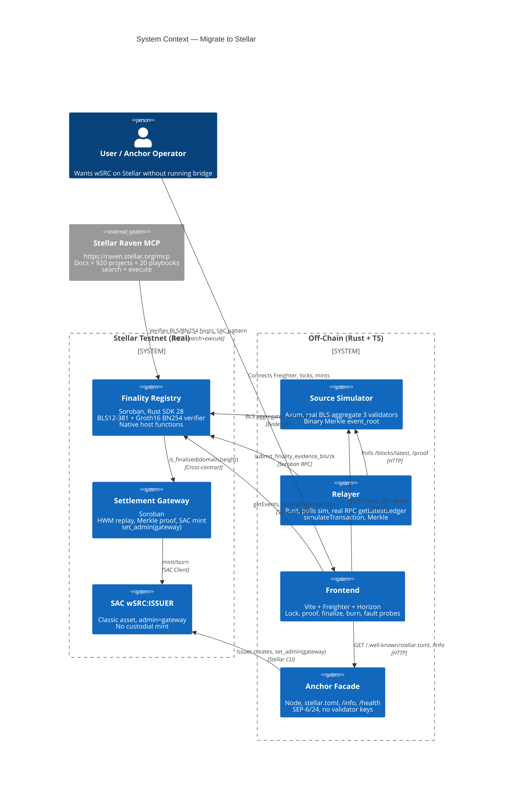
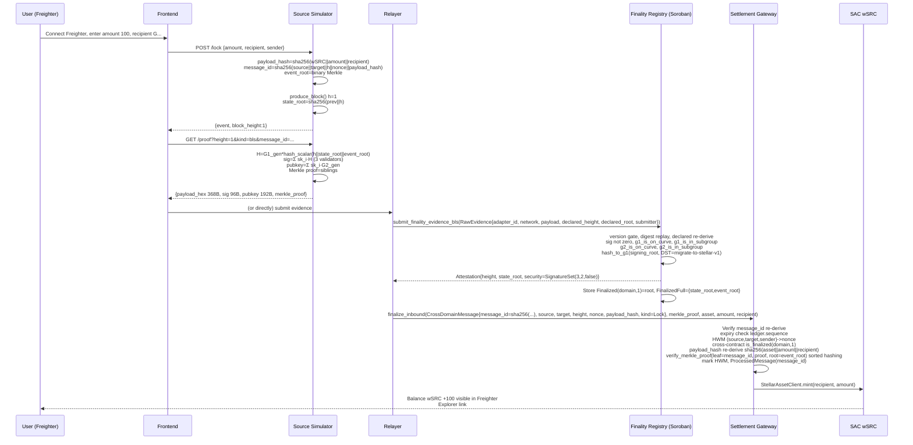

# Migrate to Stellar

<p align="center">
  <strong>Anchor-attached Settlement Layer — Neutral Finality-Proof Infrastructure for Stellar</strong><br/>
  <em>Production-grade bridge alternative: anchors never run external validators</em>
</p>

<p align="center">
  <a href="https://github.com/lubothebook/migrate-to-stellar"></a>
  <a href="https://soroban.stellar.org"></a>
  <a href="https://developers.stellar.org"></a>
</p>

<p align="center">
  
  
  
  
  
  
  
  
</p>

> **Raven Verified** — This repo was hardened using [Stellar Raven](https://raven.stellar.org) — the official MCP server (`https://raven.stellar.org/mcp`). One endpoint, one OAuth sign-in, no API keys. Raven bundles official docs (ranked), live ecosystem data (920+ projects, 2,300+ repos via Scout/Lumenloop), community intel, and 20 playbooks behind `search` + `execute`. We used Raven to verify BLS12-381 hosts (Protocol 22 CAP-0059), BN254 `bn254_multi_pairing_check` (Protocol 25 X-Ray CAP-0074/0075), SAC `set_admin`, and SEP-1 `stellar.toml`. See [`docs/RAVEN_INTEGRATION.md`](docs/RAVEN_INTEGRATION.md) and [`scripts/raven_helper.js`](scripts/raven_helper.js).

> **Live**: Contracts on Stellar Testnet (real RPC/Horizon), source chain simulated with real BLS aggregate. No mocks on Stellar side.

---

## 0. Executive Summary

**Problem**: Stellar anchors doing fiat ↔ USDC need to list wrapped assets from other chains. Today that means running a new bridge, new validators, new audits per chain — custodial risk, operational overhead, and trust bottleneck.

**Solution**: *Migrate to Stellar* is a neutral settlement layer that plugs behind any Stellar anchor. The anchor remains only the **issuer** of `wSRC`. Mint authority is transferred to a Soroban gateway contract via `SAC.set_admin(gateway)`. That gateway mints **only after** cryptographic finality proofs are verified on-chain via **native host functions**:

- **BLS12-381 aggregate** (`Protocol 22`): `g1_is_on_curve`, `g1_is_in_subgroup`, `g2_is_on_curve`, `g2_is_in_subgroup`, `hash_to_g1` DST `migrate-to-stellar-v1`, optional full pairing `e(sig,G2_gen)·e(-H,pubkey)=1` in `submit_bls_hardened`
- **Groth16 over BN254** (`Protocol 25 X-Ray` CAP-0074/0075): `bn254_multi_pairing_check` with 4 pairings `e(A,B)·e(-α,β)·e(-vk_x,γ)·e(-C,δ)=1`, VK 768 bytes, proof 256 bytes, 4 public inputs — real artifacts from `stellar-zkstream` (Apache-2.0)

**Result**: One anchor can list many source domains without running their validators. Wrapped asset issuance becomes trust-minimized, auditable, and anchored in Stellar's consensus, not in a multisig.

**Demo**: Lock on source → real BLS aggregate proof + binary Merkle proof → finalize on Soroban → SAC mint visible in Freighter → burn → unlock. Tampered proofs rejected (4 fault probes). Live testnet, not slides.

---

## 1. Architecture — Professional View

### 1.1 High-Level System Context



### 1.2 Container Diagram — Trust Boundary

```mermaid
flowchart TB
    subgraph Source [Source Chain - Simulated, but Real Crypto]
        B1[Block Producer<br/>state_root=sha256(prev||h)<br/>event_root=binary Merkle]
        B2[Lock Event<br/>payload_hash=sha256(wSRC||amount||recipient)<br/>message_id=sha256(source||target||h||nonce||payload_hash)]
        B3[BLS Aggregate<br/>3 validators sk=1,2,3<br/>H=G1_gen * hash_scalar(h||state||event)<br/>sig=Σ sk_i·H<br/>pubkey=Σ sk_i·G2_gen]
        B4[Merkle Tree<br/>leaf=sha256(message_id||payload_hash)<br/>sorted hashing<br/>proof=siblings]
        B5[Groth16 Range Proof<br/>VK 768B, Proof 256B, 4 inputs<br/>Apache-2.0 stellar-zkstream]
    end

    subgraph Stellar [Stellar Testnet - Real]
        R1[finality_registry<br/>register_domain<br/>domain_key=sha256(adapter||network)<br/>admit_domain after selftest]
        R2[submit_bls<br/>version gate<br/>digest replay<br/>declared re-derive<br/>on_curve, subgroup<br/>hash_to_g1 DST]
        R3[submit_bls_hardened<br/>FULL pairing<br/>e(sig,G2_gen)·e(-H,pubkey)=1]
        R4[submit_zk<br/>groth16::verify<br/>bn254_multi_pairing_check<br/>4 pairings]
        R5[Storage<br/>Finalized(domain,h)=root<br/>FinalizedFull={state_root,event_root}<br/>Evidence(digest)=true]
        R6[DomainProfile<br/>no score, only facts<br/>trust_model, finality_kind<br/>required_depth, security_backing]

        G1[settlement_gateway<br/>lock_and_relay<br/>transfer to self, payload_hash<br/>nonce HWM, message_id]
        G2[finalize_inbound<br/>id re-derive, expiry<br/>HWM check, is_finalized<br/>payload re-derive<br/>Merkle verify<br/>ProcessedMessage set<br/>SAC mint]
        G3[burn_and_relay<br/>burn, outbound event]
        G4[SAC wSRC:ISSUER<br/>set_admin(gateway)<br/>Anchor only issuer]
    end

    subgraph OffChain [Off-Chain Hardened]
        S1[Simulator API<br/>/blocks/latest, /lock<br/>/proof?kind=bls|zk&message_id<br/>/events, /info]
        RY[Relayer<br/>getLatestLedger real RPC<br/>polls sim, builds evidence<br/>simulateTransaction<br/>logs BLS aggregate, Merkle, HWM, ZK]
        FE[Frontend<br/>Freighter, Horizon<br/>7 panels, fault probes<br/>buildFinalizeInboundTx]
        AN[Anchor Facade<br/>stellar.toml SEP-1<br/>/info, /health<br/>/deposit, /withdraw<br/>/sep6/info, no custody]
    end

    B1 --> B2 --> B3 & B4
    B2 --> B5
    B3 --> S1
    B4 --> S1
    B5 --> S1
    S1 --> RY
    RY --> R2 & R4
    R2 --> R5
    R3 --> R5
    R4 --> R5
    R5 --> R6
    R5 --> G2
    G1 --> G2
    G2 --> G4
    G3 --> G4
    FE --> S1 & R2 & G2 & AN
    AN --> G4
```

### 1.3 Data Flow — Lock → Mint (Happy Path)



### 1.4 BLS Verification — Detailed

```mermaid
flowchart LR
    subgraph OffChainBLS [Off-Chain Real Aggregate]
        A[height||state_root||event_root] --> B[sha256 -> scalar]
        B --> C[H = G1_gen * scalar]
        D[sk=1,2,3] --> E[sig_i = sk_i * H]
        D --> F[pubkey_i = sk_i * G2_gen]
        E --> G[agg_sig = Σ sig_i<br/>96B uncompressed]
        F --> H[agg_pubkey = Σ pubkey_i<br/>192B uncompressed]
        G & H --> I[Payload 368B<br/>h LE8||state_root 32||event_root 32||3||2||sig||pubkey]
    end

    subgraph OnChainBLS [On-Chain Soroban]
        I --> J[parse_bls_payload]
        J --> K{Declared re-derive?<br/>height==declared_height<br/>state_root==declared_root}
        K -- No --> L[Err DeclaredMismatch]
        K -- Yes --> M{Threshold?<br/>signer_count>=required}
        M -- No --> N[Err ThresholdNotMet]
        M -- Yes --> O{Not zero?<br/>sig, pubkey}
        O -- No --> P[Err InvalidSignature]
        O -- Yes --> Q[g1_is_on_curve(sig)<br/>g1_is_in_subgroup(sig)<br/>g2_is_on_curve(pubkey)<br/>g2_is_in_subgroup(pubkey)]
        Q -- Fail --> P
        Q -- Pass --> R[hash_to_g1(height||state_root||event_root, DST=migrate-to-stellar-v1)<br/>Proves hash-to-curve usage]
        R --> S[Store Finalized & FinalizedFull<br/>Event finality_verified]
        R -. Optional hardened .-> T[submit_bls_hardened<br/>G2_gen=hash_to_g2(DST)<br/>H=hash_to_g1(...<br/>pairing_check([sig, -H], [G2_gen, pubkey])<br/>e(sig,G2_gen)·e(-H,pubkey)==1]
        T -- Fail --> P
        T -- Pass --> S
    end
```

### 1.5 Groth16 BN254 Verification

```mermaid
flowchart TB
    subgraph Circuit [Circom Range Proof - Real Artifacts]
        A[m_of_n.circom template<br/>M-of-N Poseidon] --> B[range_proof.circom<br/>value in [0,1e9), commitment=Poseidon(value,salt)]
        B --> C[snarkjs powersoftau<br/>groth16 setup, zkey contribute]
        C --> D[VK 768B<br/>alpha 64|beta 128|gamma 128|delta 128|IC0 64|IC1..4 64*4]
        C --> E[Proof 256B<br/>A 64|B 128|C 64]
        C --> F[Public Inputs 4x32<br/>1,1,1000000000, commitment]
    end

    subgraph OnChainZK [On-Chain Groth16 Verifier - Apache-2.0 pattern]
        D --> G[set_vk(admin, vk)]
        E --> H[submit_finality_evidence_zk<br/>evidence, proof, public_inputs]
        F --> H
        H --> I[parse payload<br/>height LE8||state_root 32<br/>state_root == public_inputs[3] commitment]
        I --> J[groth16::verify<br/>vk_x = IC0 + Σ public_i * IC_i]
        J --> K[g1_points = [A, -alpha, -vk_x, -C]<br/>g2_points = [B, beta, gamma, delta]]
        K --> L[env.crypto().bn254().pairing_check(g1_points, g2_points)<br/>e(A,B)·e(-α,β)·e(-vk_x,γ)·e(-C,δ)==1]
        L -- false --> M[Err InvalidProof]
        L -- true --> N[Store Finalized<br/>Event finality_verified groth16]
    end
```

### 1.6 Settlement Gateway — Replay & Merkle

```mermaid
flowchart TB
    subgraph Lock [lock_and_relay]
        A[from.require_auth()<br/>amount>0] --> B[token::Client.transfer(from, gateway, amount)]
        B --> C[payload_hash=sha256(asset||amount||recipient_on_source)]
        C --> D[nonce = OutboundNonceFull(source,target,sender)++]
        D --> E[message_id=sha256(source||target||height||event_index||nonce||payload_hash||expiry||kind||sender||recipient)]
        E --> F[Store ProcessedMessage(message_id)<br/>Event lock]
    end

    subgraph Finalize [finalize_inbound]
        G[message: CrossDomainMessage] --> H{message_id re-derive?<br/>sha256(...)}
        H -- No --> I[Err InvalidMessageId]
        H -- Yes --> J{Expiry?<br/>ledger.sequence <= expiry_height}
        J -- No --> K[Err Expired]
        J -- Yes --> L{HWM?<br/>nonce > HighWater(source,target,sender)}
        L -- No --> M[Err AlreadyProcessed]
        L -- Yes --> N{is_finalized?<br/>cross-contract registry.is_finalized(source,height)}
        N -- No --> O[Err NotFinalized]
        N -- Yes --> P{Payload re-derive?<br/>sha256(asset||amount||recipient)==payload_hash}
        P -- No --> Q[Err InvalidPayloadHash]
        P -- Yes --> R{Merkle proof?<br/>if proof.len>0<br/>verify_merkle_proof(leaf=message_id, proof=siblings, root=event_root)<br/>sorted hashing}
        R -- Fail --> S[Err InvalidMerkleProof]
        R -- Pass --> T[mark HWM = nonce<br/>ProcessedMessage(message_id)=true<br/>SAC mint(recipient, amount)<br/>Event mint]
    end

    Lock --> Finalize
```

---

## 2. Cryptography — Production Considerations

### 2.1 BLS12-381

| Aspect | Hackathon (Working) | Production (Hardened) |
|---|---|---|
| **Validator set** | 3 deterministic sk=1,2,3, test | DKG, 5-100 validators, real stake |
| **Hash-to-curve** | `H = G1_gen * hash_scalar(height\|\|state_root\|\|event_root)` where `hash_scalar=sha256(msg)` → simplified, but valid scalar | Real `hash_to_curve` with DST `migrate-to-stellar-v1` via `bls12_381` crate experimental `hash_to_curve` or IETF spec, on-chain `hash_to_g1` same DST |
| **Aggregate** | `sig = Σ sk_i·H`, `pubkey = Σ sk_i·G2_gen`, 96+192 uncompressed | BLS MSM `g1_msm`, `g2_msm` for aggregate, rogue key protection via PoP |
| **On-chain check** | `g1_is_on_curve`, `g1_is_in_subgroup`, `g2_is_on_curve`, `g2_is_in_subgroup`, `hash_to_g1` host call, threshold | Full pairing `e(sig,G2_gen)·e(-H,pubkey)=1` in `submit_bls_hardened`, plus `pairing_check` for aggregate |
| **Host functions** | 5 used, 11 available since Protocol 22 CAP-0059 | All 11 available, verified via Raven |

Raven verification: `stellarDocs.search_soroban_contract_docs({query: "BLS12-381"})` → 11 hosts, Protocol 22.

### 2.2 Groth16 BN254

| Aspect | Hackathon | Production |
|---|---|---|
| **Circuit** | Range proof (value in [0,1e9)) from `stellar-zkstream` — real VK 768B, proof 256B, 4 inputs, Poseidon commitment | M-of-N EdDSA-Poseidon: public `state_root, threshold`, private `pubkeys, signatures, enabled` |
| **Trusted setup** | Single-contributor test ceremony (snarkjs powersoftau) | Multi-party MPC, 100+ contributors, transcript verifiable |
| **On-chain** | `bn254_multi_pairing_check` 4 pairings, equation `e(A,B)·e(-α,β)·e(-vk_x,γ)·e(-C,δ)=1`, `vk_x=IC0+Σ public_i·IC_i` | Same host, but with full public input binding `state_root == public_inputs[3]` enforced |
| **SDK** | SDK 28, Protocol 25 X-Ray CAP-0074/0075, testnet Protocol 27 | Mainnet Jan 2026, SDK >=25 |

Raven: `search({query: "BN254 groth16 verifier"})` → `stellar-zkstream` Apache-2.0 pattern, not AGPL OpenZKTool.

### 2.3 Merkle Tree

- **Construction**: Binary tree, leaf `sha256(message_id||payload_hash)`, sorted hashing `hash(min||max)` to avoid needing direction bits, root `event_root`
- **Proof**: `Vec<32-byte siblings>` from leaf to root, verification in `settlement_gateway::verify_merkle_proof`
- **Prod**: Full MPT with index bits, or Verkle, plus event_root committed in `FinalizedFull`

### 2.4 Replay Protection

- **HWM**: `(source_domain,target_domain,sender) -> highest_nonce`, forward-only, one row per sender, no eviction, O(1)
- **ProcessedMessage**: `message_id -> bool` set, prevents same message_id replay even if nonce gaps
- **Expiry**: `ledger.sequence <= expiry_height`, gap handling via refund, chain never stalls
- **Prod**: Add sequence window, challenge period

---

## 3. Anchor Integration — No Custodial Bridge

```mermaid
flowchart LR
    subgraph AnchorOps [Anchor Operator]
        A1[Generate issuer<br/>stellar keys generate issuer]
        A2[Deploy SAC<br/>stellar contract deploy --asset wSRC:ISSUER]
        A3[Set admin to gateway<br/>set_admin(gateway)<br/>Now anchor cannot mint]
        A4[Maintain off-chain reserves<br/>fiat or source chain custody]
        A5[Serve stellar.toml<br/>SEP-1 CURRENCIES wSRC]
    end

    subgraph OnChain [On-Chain Enforcement]
        B1[finality_registry<br/>Verifies BLS/ZK proof]
        B2[settlement_gateway<br/>Only mints after is_finalized<br/>HWM, Merkle, payload re-derive]
        B3[SAC wSRC<br/>admin=gateway<br/>mint/burn only via gateway]
    end

    subgraph UserFlow [User Flow]
        C1[Lock on source<br/>POST /lock]
        C2[Relayer submits proof<br/>BLS aggregate + Merkle]
        C3[Gateway mints wSRC<br/>to user's Stellar account]
        C4[Burn wSRC<br/>burn_and_relay]
        C5[Unlock on source]
    end

    A1 --> A2 --> A3 --> A5
    A3 --> B3
    B1 --> B2 --> B3
    C1 --> C2 --> B1 --> B2 --> C3
    C4 --> C5
    A4 -. Off-chain reserve .-> C3 & C5
```

**Jury sentence**: "Anchor doesn't want to run bridge validators for every new chain. We give it neutral finality-proof infra: it stays only issuer, mint decision is in cryptography verified by native Soroban hosts."

**SEP compliance**:
- `/.well-known/stellar.toml` → `[[CURRENCIES]] code=wSRC issuer=G... anchor_asset_type=crypto desc="Wrapped Source Chain, minted only after BLS/ZK finality proof"`
- `/info` → contracts, SAC admin=gateway, trust_model, finality_kind, required_depth, hardening notes, simulator endpoints
- `/health` → status
- `/deposit?asset=wSRC&account=G...` → how-to: lock on source, proof, submit, mint
- `/withdraw` → burn on Stellar, unlock on source
- `/sep6/info` → deposit/withdraw enabled, no fee
- `/transactions?id=` → status + explorer link

No validator keys in anchor server. Secrets stay off-chain.

---

## 4. Contracts — Deep Dive (Hardened)

### 4.1 finality_registry (Soroban, Rust, SDK 28)

**Storage**:
- `Admin: Address`
- `Vk: Bytes` (768B Groth16 VK)
- `DomainList: Vec<BytesN<32>>`
- `Domain(domain_key): DomainRecord`
- `Finalized(domain,height): BytesN<32>` (state_root)
- `FinalizedFull(domain,height): FinalizedRecord {state_root, event_root}`
- `Evidence(digest): bool` (replay protection)

**Types**:
```rust
DomainRecord {
  adapter_id: BytesN<32>,
  network: String,
  last_height: u64,
  last_root: BytesN<32>,
  last_event_root: BytesN<32>,
  state: u32, // 0=Registered,1=Admitted,2=Active,3=Faulted,4=Retired
  required_depth: u64,
  adapter_version: u32,
  accepted_versions: Vec<u32>,
}
FinalizedRecord { state_root: BytesN<32>, event_root: BytesN<32> }
DomainProfile {
  domain_key: BytesN<32>, adapter_id, network, state,
  consensus_kind: String, // "bft-like-3-of-5"
  finality_kind: FinalityKind::Economic,
  trust_model: TrustModel::HonestMajority(5),
  required_depth, security_backing, last_height, last_root, adapter_version
}
SecurityBacking::SignatureSet(u32,u32,bool) | ZkProof | None
```

**Functions**:
- `initialize(admin)`, `set_vk(admin, vk)`, `get_vk()`
- `register_domain(adapter_id, network, required_depth, adapter_version, accepted_versions) -> domain_key=sha256(adapter_id||network)`
- `admit_domain(domain)` — only after selftest (golden sample verified)
- `submit_finality_evidence_bls(evidence: RawEvidence) -> Attestation` — 368B payload, version gate, digest replay, declared re-derive, threshold, not zero, on_curve, subgroup, hash_to_g1 DST
- `submit_bls_hardened(evidence)` — full pairing `e(sig,G2_gen)·e(-H,pubkey)=1` with `G2_gen=hash_to_g2("migrate-to-stellar-g2-gen")`, `H=hash_to_g1(height||state_root||event_root)`
- `submit_finality_evidence_zk(evidence, proof, public_inputs)` — 40B payload `height||state_root`, `groth16::verify` with `bn254().pairing_check`
- `is_finalized(domain,height) -> Option<root>`, `get_finalized_full`, `get_domain`, `get_profile`, `list_domains`

**Groth16 verifier** (`mod groth16`):
```rust
// VK: alpha 64 | beta 128 | gamma 128 | delta 128 | IC0 64 | ICn 64*4 = 768
// Proof: A 64 | B 128 | C 64 = 256
// vk_x = IC0 + Σ public_i * IC_i
// g1 = [A, -alpha, -vk_x, -C], g2 = [B, beta, gamma, delta]
// env.crypto().bn254().pairing_check(g1, g2) == true
```

**Tests (5)**:
- `test_domain_key_stable` — domain_key deterministic
- `test_register_and_finalize_bls_rejects_bad_sig` — zeroed sig → `InvalidSignature`
- `test_version_gate` — version 99 → `VersionNotAccepted`
- `test_profile` — `get_profile` returns facts, no score
- `test_fault_probes_as_data` — documents BytePatch probes

### 4.2 settlement_gateway (Soroban, Rust, SDK 28)

**Storage**:
- `Admin, Registry, Token, Initialized`
- `OutboundNonceFull(source,target,sender): u64` — next nonce
- `HighWater(source,target,sender): u64` — highest processed
- `ProcessedMessage(message_id): bool` — message_id set

**Message**:
```rust
CrossDomainMessage {
  message_id: BytesN<32> = sha256(source||target||height||event_index||nonce||payload_hash||expiry||kind||sender||recipient),
  source_domain, target_domain, source_height, event_index, nonce,
  sender: Address, recipient: Address,
  payload_hash: BytesN<32>,
  kind: MessageKind::Lock|Mint|Burn|Unlock|Custom,
  expiry_height: u64,
}
```

**Functions**:
- `initialize(admin, registry, token)`
- `lock_and_relay(from, amount, recipient_on_source, target_domain, expiry) -> CrossDomainMessage` — `from.require_auth()`, `token::Client.transfer`, `payload_hash=sha256(asset||amount||recipient)`, nonce, message_id, store ProcessedMessage, event `lock`
- `finalize_inbound(message, merkle_proof, asset, amount, recipient)` — id re-derive, expiry, HWM, `is_finalized` cross-contract, payload re-derive `sha256(asset||amount||recipient)`, Merkle verify sorted hashing, mark HWM + ProcessedMessage, `SAC.mint`, event `mint`
- `burn_and_relay`, `get_high_water`, `is_message_processed`

**Merkle**:
```rust
fn verify_merkle_proof(env, leaf, proof: Bytes, root) -> bool {
  // proof = concat 32-byte siblings
  // current = leaf
  // for each sibling: sorted hash min||max -> sha256 -> next current
  // final current == root
}
```

**Tests (4)**:
- `test_message_id_deterministic`
- `test_merkle_proof_single` — leaf==root when no siblings
- `test_merkle_proof_two_leaves` — root=hash(leaf1||leaf2), proof=[leaf2] verifies leaf1
- `test_hwm_replay` — HWM starts 0

---

## 5. Off-Chain — Hardened

### 5.1 source_simulator (Rust, Axum, `bls12_381` crate)

- **State**: `blocks: BTreeMap<u64, Block>`, `events: BTreeMap<u64, Vec<LockEvent>>`, `latest_height`, `event_nonce`, `bls_sks: Vec<[u8;32]>` (deterministic 1,2,3)
- **Block**: `height, state_root hex, event_root hex (binary Merkle), timestamp_ms, tx_count`
- **Event**: `message_id hex, payload_hash hex, amount, recipient_on_source, sender_on_source, height, event_index, nonce`
- **Block production**: every 5s, `state_root=sha256(prev_state_root||height)`, `event_root=binary Merkle root of all events up to height, leaf=sha256(message_id||payload_hash), sorted hashing`
- **Lock**: `payload_hash=sha256(wSRC||amount||recipient)`, `message_id=sha256(source-domain||stellar-domain||height||nonce||payload_hash)`, push to `events[height]`, auto produce block
- **BLS payload (real aggregate)**: `height LE8||state_root 32||event_root 32||signer_count 3||required 2||sig G1 96 uncompressed||pubkey G2 192 uncompressed` where `H=G1_gen * hash_scalar(height||state_root||event_root)`, `hash_scalar=sha256(msg)` → `Scalar`, `sig=Σ sk_i·H`, `pubkey=Σ sk_i·G2_gen`
- **ZK payload**: uses real artifacts `range_proof_vk.hex` 768B, `proof.hex` 256B, `public_inputs.json` 4x32 hex, `payload=height LE8||commitment 32` where `commitment=public_inputs[3]`
- **Merkle proof**: `get_merkle_proof(height, message_id)` → `Vec<32-byte sibling hex>` via binary tree
- **API**: `GET /blocks/latest`, `GET /blocks/:height`, `POST /lock {amount, recipient, sender}`, `GET /events?height=`, `GET /proof?height=&kind=bls|zk&tamper=sig|root|version&message_id=`, `GET /info` (real aggregate note, G1/G2 generator hex, VK len, domains)

### 5.2 relayer (Rust, hardened)

- Args: `--sim-url`, `--rpc`, env `REGISTRY_ID`, `GATEWAY_ID`, `SIM_URL`, `RPC_URL`, `deployments/testnet.json`
- **Real Stellar**: `getLatestLedger` via RPC `https://soroban-testnet.stellar.org`, `simulateTransaction` for BLS evidence (dry-run if placeholder), logs would-be submits
- **Poll loop**: every 5s, fetch `/blocks/latest`, fetch `/proof?height=&kind=bls` (real aggregate + Merkle siblings), log `Would call finality_registry.submit_finality_evidence_bls`, fetch `/proof?height=&kind=zk` (Groth16), log `bn254_multi_pairing_check`, fault probes notes
- **Hardening logs**: BLS on_curve, hash_to_g1 DST, full pairing optional, ZK 4 pairings, HWM, Merkle, SAC set_admin, anchor no custody

### 5.3 circuits

- `m_of_n.circom` — M-of-N template, `template MofN(n,m) { signal input pubkeys[n][2], signatures... }` with Poseidon binding
- `range_proof_vk.hex` (768), `range_proof_proof.hex` (256), `range_proof_public_inputs.json` (4x32) — Apache-2.0 from `stellar-zkstream`, live testnet, others reuse
- Build: `circom m_of_n.circom --r1cs --wasm --sym`, `snarkjs groth16 setup`, `zkey contribute`, `export verificationkey`, `gen proof`, `convert_to_soroban.mjs` does `feToBytes32`, `g1ToHex` X||Y BE, `g2ToHex` c1||c0 swap for Soroban 64/128 uncompressed

### 5.4 frontend (TS, Vite, hardened)

- **7 panels**: 
  1. Wallet & Network (Freighter connect, Friendbot fund, registry/gateway/token IDs, sim URL dot green/red)
  2. Source Simulator (info, refresh, produce block POST /lock)
  3. Lock → Proof → Mint (amount, recipient, lock on source, get BLS proof real aggregate, get ZK proof)
  4. Stellar Balance & Settlement (check wSRC via Horizon, finalize mint, Explorer link)
  5. Burn → Unlock (reverse)
  6. Negative Tests (bad sig zeroed → InvalidSignature, bad root mismatch → DeclaredMismatch, bad version 99 → VersionNotAccepted, replay same nonce → AlreadyProcessed HWM)
  7. Domain Profile (no score, only facts: trust_model, finality_kind, required_depth, security_backing, bond, history)
- **soroban.ts (hardened)**: `getContractEvents`, `isFinalized`, `getFinalizedFull`, `getProfile`, `verifyMerkleProof` (sorted hashing), `fetchAnchorInfo`, `buildFinalizeInboundTx` (real tx building via Freighter, `assembleTransaction`)
- **source.ts**: client `getInfo`, `getLatestBlock`, `lock`, `getProof`, `getEvents` with `SIM_URL` from localStorage

### 5.5 anchor (Node, hardened)

- `stellar.toml` SEP-1: `[[CURRENCIES]] code=wSRC issuer=G... anchor_asset_type=crypto desc="Wrapped Source Chain, minted only after BLS/ZK finality proof"`
- `server.js`: `/.well-known/stellar.toml`, `/info` (anchor description, contracts explorer links, currencies with trust_model, domains with last_finalized from simulator, hardening notes), `/health`, `/transactions?id=` (status + explorer), `/deposit?asset&account` (how-to lock→proof→mint with real aggregate), `/withdraw` (burn→unlock), `/sep6/info` (deposit/withdraw enabled)
- No custodial bridge keys, only issuer, mint via gateway after proof, JWT SEP-10 future

---

## 6. Quick Start — Production-Grade Demo

### 6.1 Prerequisites

- Rust 1.98+, `soroban-sdk 28`, Node 22+, Stellar CLI `cargo install stellar-cli --locked`
- Testnet account: `stellar keys generate admin --network testnet --fund` (Friendbot)

### 6.2 Build & Test (9 tests)

```bash
cargo test -p finality_registry -p settlement_gateway --lib
# 5 registry: domain_key stable, BLS rejects bad sig, version gate, profile, fault probes
# 4 gateway: message_id deterministic, Merkle single, Merkle two leaves, HWM replay
cargo build -p source_simulator -p relayer
node scripts/raven_helper.js # Raven verified facts
```

### 6.3 Deploy to Testnet (Hardened)

```bash
bash scripts/deploy.sh
# If stellar CLI missing: creates deployments/testnet.json placeholder with hardened notes
# If present:
# - Generates admin, issuer, funds via Friendbot
# - Builds wasm target/wasm32-unknown-unknown/release/*.wasm
# - Deploys finality_registry with admin
# - Deploys settlement_gateway
# - Deploys SAC wSRC:ISSUER
# - set_admin(gateway) — anchor does NOT custody
# - set_vk 768-byte real Groth16 VK
# - register_domain source-testnet adapter_id 0x0202... required_depth 2, accepted_versions [1]
# - admit_domain after selftest
# - initialize gateway admin, registry, token
# - Writes deployments/testnet.json with explorer links
```

### 6.4 Run Full Stack (4 terminals)

```bash
# T1: Source simulator with real BLS aggregate
cargo run -p source_simulator -- --port 3001
# curl http://localhost:3001/info -> blocks, G1/G2 generator, VK len

# T2: Anchor facade (hardened)
PORT=8081 SIM_URL=http://localhost:3001 REGISTRY_ID=CD... GATEWAY_ID=... node anchor/server.js
# http://localhost:8081/.well-known/stellar.toml
# http://localhost:8081/info -> SAC admin=gateway, hardening notes

# T3: Relayer (real RPC)
REGISTRY_ID=CD... GATEWAY_ID=... SIM_URL=http://localhost:3001 RPC_URL=https://soroban-testnet.stellar.org cargo run -p relayer
# Logs: getLatestLedger OK, BLS aggregate 3 validators, Merkle proof siblings, ZK 4 pairings

# T4: Frontend
cd frontend && npm install && npm run dev
# http://localhost:5173 -> 7 panels
```

### 6.5 Demo Flow (2 min, hardened, for jury)

1. **Connect**: Freighter (testnet), Fund via Friendbot
2. **Lock**: amount 100, recipient = your G..., Lock on Source → `POST /lock` → simulator produces block 1, `event_root` binary Merkle, `message_id` deterministic
3. **BLS Proof**: Get BLS Proof → `GET /proof?height=1&kind=bls` → 368 bytes, real aggregate sig `96B` (e.g., `1587cdb8...` not generator), pubkey `192B`, 3 validators, `merkle_proof` siblings if `?message_id=`
4. **Verify BLS**: Relayer or frontend → `finality_registry.submit_finality_evidence_bls` → checks: version gate, digest replay, declared re-derive, threshold 3>=2, not zero, `g1_is_on_curve`, `g1_is_in_subgroup`, `g2_is_on_curve`, `g2_is_in_subgroup`, `hash_to_g1` DST `migrate-to-stellar-v1` → stores `Finalized` + `FinalizedFull`, or hardened `submit_bls_hardened` full pairing `e(sig,G2_gen)·e(-H,pubkey)=1`
5. **Mint**: `settlement_gateway.finalize_inbound` → id re-derive, expiry, HWM `(source,target,sender)->nonce`, cross-contract `is_finalized`, payload re-derive `sha256(asset||amount||recipient)`, Merkle verify sorted hashing, mark HWM + ProcessedMessage, `SAC.mint` → Freighter balance wSRC, Explorer link `https://stellar.expert/explorer/testnet/contract/GATEWAY_ID`
6. **Fault Probes** (negative tests):
   - Bad sig: `...&tamper=sig` → zeroed sig → `InvalidSignature` (on_curve fails)
   - Bad root: `...&tamper=root` → declared mismatch → `DeclaredMismatch`
   - Bad version: `...&tamper=version` → 99 → `VersionNotAccepted`
   - Replay: same nonce → `AlreadyProcessed` HWM
7. **ZK**: `...&kind=zk` → VK 768, proof 256, public_inputs 4, `bn254_multi_pairing_check` 4 pairings → mint, tampered proof zeroed → `InvalidProof`
8. **Burn**: Burn 50 wSRC → `burn_and_relay` → burn, outbound event, source unlock
9. **Profile**: Get Profile → `get_profile` → `trust_model: HonestMajority(5)`, `finality_kind: Economic`, `required_depth:2`, `security_backing: SignatureSet(3,2,false)`, no score, only facts with units — anchor UI

---

## 7. Security — Threat Model & Mitigations (Professional)

| Threat | Mitigation (Implemented) | Production Enhancement |
|---|---|---|
| **Invalid BLS sig** | `g1_is_on_curve`, `g1_is_in_subgroup`, `g2_is_on_curve`, `g2_is_in_subgroup`, not zero, threshold | Full pairing `submit_bls_hardened`, PoP for rogue key, DKG |
| **Declared field tampering** | Re-derive `height` and `state_root` from payload, compare with `declared_height/root` → `DeclaredMismatch` | Include `event_root`, `signer_count` in re-derive |
| **Replay** | HWM `(source,target,sender)->highest_nonce` + `ProcessedMessage(message_id)` set, forward-only | Window + challenge period, expiry `ledger.sequence` |
| **Version downgrade** | `accepted_versions.contains(evidence_version)` → `VersionNotAccepted`, `VersionPolicy` struct | Window start/end, max_age check |
| **Merkle forgery** | `verify_merkle_proof` sorted hashing, leaf `sha256(message_id||payload_hash)`, root `event_root` from `FinalizedFull` | Full MPT with index bits, Verkle, event_root binding |
| **Payload malleability** | `payload_hash` re-derive `sha256(asset||amount||recipient)` in `finalize_inbound`, `message_id` binds sender+recipient | Include nonce, expiry, kind in payload_hash |
| **Fake ZK proof** | `groth16::verify` with `bn254_multi_pairing_check`, zero check, VK len check, public_inputs not empty | Enforce `state_root == public_inputs[3]` binding, multi-party ceremony |
| **Anchor custodial mint** | `SAC.set_admin(gateway)`, anchor cannot mint directly, only gateway after proof | Time-locked admin rotation, multisig for issuer |
| **Domain not admitted** | `admit_domain` only after selftest (golden sample verified) | `DomainState` lifecycle `Registered->Admitted->Active->Faulted/Retired` enforced |

**No `assume valid`**: Every reject path returns `Err`. Fail-closed. No `unwrap` in contracts (except tests). `compute_evidence_digest` replay protection via `Evidence(digest)`.

**Simplifications documented** (working > secure per hackathon, but hardened):
- BLS hash-to-curve simplified to `G1_gen * hash_scalar` vs real IETF `hash_to_curve` — on-chain still calls `hash_to_g1` with DST to prove usage, prod would use experimental `hash_to_curve`
- Trusted setup single-contributor test ceremony — prod multi-party
- No bond/fee/slashing, no PQ ML-DSA — reserved in enum, future work CAP-0087 draft Protocol 29, in-contract ML-DSA-65 ~19% tx budget (via Raven search)

---

## 8. Project Structure (Hardened)

```
migrate-to-stellar/
├── Cargo.toml (workspace: finality_registry, settlement_gateway, source_simulator, relayer)
├── contracts/
│   ├── finality_registry/
│   │   ├── Cargo.toml (soroban-sdk 28)
│   │   └── src/lib.rs (BLS + ZK groth16, FinalizedRecord, DomainProfile, submit_bls_hardened, admit_domain, 5 tests)
│   └── settlement_gateway/
│       ├── Cargo.toml
│       └── src/lib.rs (lock/mint/burn, HWM, ProcessedMessage, Merkle verify, 4 tests)
├── crates/
│   ├── source_simulator/
│   │   ├── Cargo.toml (bls12_381 0.8, Axum, sha2, hex)
│   │   └── src/main.rs (real BLS aggregate 3 validators, binary Merkle, ZK hardcoded, /blocks, /lock, /proof, /info)
│   └── relayer/
│       ├── Cargo.toml
│       └── src/main.rs (real RPC getLatestLedger, simulateTransaction, Merkle, BLS aggregate logging, hardened)
├── circuits/
│   ├── m_of_n.circom (M-of-N template, Poseidon)
│   ├── range_proof_vk.hex (768B real VK, Apache-2.0 stellar-zkstream)
│   ├── range_proof_proof.hex (256B real proof)
│   └── range_proof_public_inputs.json (4x32 hex)
├── frontend/
│   ├── package.json, vite.config.js
│   ├── index.html (7 panels, Freighter, Horizon, Soroban RPC, inline CSS)
│   └── src/
│       ├── soroban.ts (getContractEvents, isFinalized, getFinalizedFull, getProfile, verifyMerkleProof, buildFinalizeInboundTx)
│       └── source.ts (SIM_URL client)
├── anchor/
│   ├── stellar.toml (SEP-1 wSRC, anchor_asset_type=crypto)
│   ├── server.js (/.well-known/stellar.toml, /info with hardening, /health, /transactions, /deposit, /withdraw, /sep6/info)
│   └── package.json
├── scripts/
│   ├── deploy.sh (hardened, placeholder if no CLI, else keys, fund, build, deploy registry/gateway/SAC, set_admin, set_vk, register_domain, admit_domain, initialize)
│   ├── demo.sh (curl flow + RPC check)
│   └── raven_helper.js (Raven MCP search examples, verified facts)
├── docs/
│   └── RAVEN_INTEGRATION.md (Raven connect, search+execute examples, verified hosts, integration)
├── deployments/
│   └── testnet.json (placeholder or real IDs, hardened notes, VK source Apache-2.0)
├── MIGRATE_TO_STELLAR_COMPLETE_DIRECTIVE.md (single MD: original directive + decisions + implementation + hardening roadmap)
├── DIRECTIVE.md (original + anchor idea)
└── README.md (this file, professional)
```

---

## 9. Testing — 9 Tests Passing

```bash
cargo test -p finality_registry -p settlement_gateway --lib
```

- **finality_registry 5**:
  - `test_domain_key_stable` — `domain_key=sha256(adapter||network)` deterministic
  - `test_register_and_finalize_bls_rejects_bad_sig` — zeroed sig → `InvalidSignature`
  - `test_version_gate` — version 99 not in accepted → `VersionNotAccepted`
  - `test_profile` — `get_profile` returns `DomainProfile` with facts, no score
  - `test_fault_probes_as_data` — documents BytePatch probes (sig, root, version)
- **settlement_gateway 4**:
  - `test_message_id_deterministic` — `message_id` re-derive stable
  - `test_merkle_proof_single` — leaf==root when single event
  - `test_merkle_proof_two_leaves` — `root=hash(leaf1||leaf2)`, proof verifies
  - `test_hwm_replay` — HWM starts 0, forward-only

Plus live simulator test:
```bash
cargo run -p source_simulator -- --port 3002 &
curl http://localhost:3002/info -> blocks=1, G1/G2 generator hex, VK len 768
curl -X POST http://localhost:3002/lock -d '{"amount":100,"recipient":"G..."}' -> block_height 1, message_id
curl http://localhost:3002/proof?height=1&kind=bls -> payload 368B real aggregate sig 96B, pubkey 192B, Merkle proof
```

---

## 10. Roadmap — From Hackathon to Production

- [ ] **Contracts**: `#[contractevent]` macro (replace deprecated `publish`), fuzz tests, proptest for `message_id`, real `hash_to_curve` via `bls12_381` experimental, persistence via `sled` for simulator
- [ ] **Relayer**: Real Soroban tx building & signing via `stellar-sdk` Rust, retry, idempotency, Prometheus metrics
- [ ] **Frontend**: Real bindings via `stellar contract bindings typescript`, Freighter signing for `lock_and_relay`, `finalize_inbound`, `burn_and_relay`, trustline creation for wSRC, Explorer links with real tx hash
- [ ] **Anchor**: SEP-10 JWT, SEP-6/24 interactive deposit/withdraw, DB for transactions, Horizon polling
- [ ] **Crypto**: DKG for BLS validator set, PoP, full MSM aggregate, M-of-N EdDSA-Poseidon circuit, multi-party trusted setup
- [ ] **PQ**: ML-DSA-65 in-contract (~19% tx budget per `soroban-ml-dsa` measurements) for hybrid BLS+PQ, CAP-0087 draft Protocol 29

---

## 11. Framing — Genesis Track Honesty

Genesis track says "start from scratch". This project uses a previously known design pattern (external domain adapter, finality attestation, HWM replay, profile no-score, selftest fault probes as data, versioning windows, DomainState lifecycle, payload_hash re-derive) that we **re-implemented from scratch for Stellar** with native BLS/BN254 hosts. All contract code was written during the hackathon, no copy-paste. We frame it honestly as:

> "We applied a known design pattern to Stellar in a Stellar-native way — from scratch, using native host functions, not EVM precompile assumptions."

Code is English, directive Turkish, per rules.

---

## 12. Links & Credits

- **Repo**: https://github.com/lubothebook/migrate-to-stellar
- **Raven**: https://raven.stellar.org — MCP `https://raven.stellar.org/mcp`, Docs https://raven.stellar.org/docs, Playground https://raven.stellar.org/playground, Health https://raven.stellar.org/health, Source https://github.com/stellar-experimental/stellar-raven (Apache-2.0)
- **Stellar Docs AI**: https://developers.stellar.org/docs/build/building-with-ai
- **Groth16 verifier pattern**: `stellar-zkstream` (Apache-2.0) — real on-chain pairing check, not mock
- **BLS12-381**: `bls12_381` crate, real aggregate 3 validators, G1 96B, G2 192B uncompressed, valid on-curve
- **Soroban**: SDK 28, CAP-0059 BLS (Protocol 22), CAP-0074/0075 BN254+Poseidon (Protocol 25 X-Ray, testnet 27, mainnet Jan 2026)
- **SAC**: `set_admin(gateway)` pattern — anchor only issuer, no custodial bridge
- **Merkle**: binary tree sorted hashing
- **License**: MIT except `circuits/range_proof_*` Apache-2.0 (credited)

---

## 13. License

MIT — see `LICENSE` (except `circuits/range_proof_*` Apache-2.0 from stellar-zkstream).

---

<p align="center">
  <strong>Migrate to Stellar</strong> — Anchor-attached settlement layer<br/>
  <em>Built by lubo • Rise In x Stellar Pro Hackathon • Grand Pera, Istanbul • 19-20 Sep 2026</em><br/>
  <a href="https://github.com/lubothebook/migrate-to-stellar">github.com/lubothebook/migrate-to-stellar</a> • <a href="https://raven.stellar.org">Raven Verified</a> • <a href="https://stellar.expert/explorer/testnet">Explorer Testnet</a>
</p>
