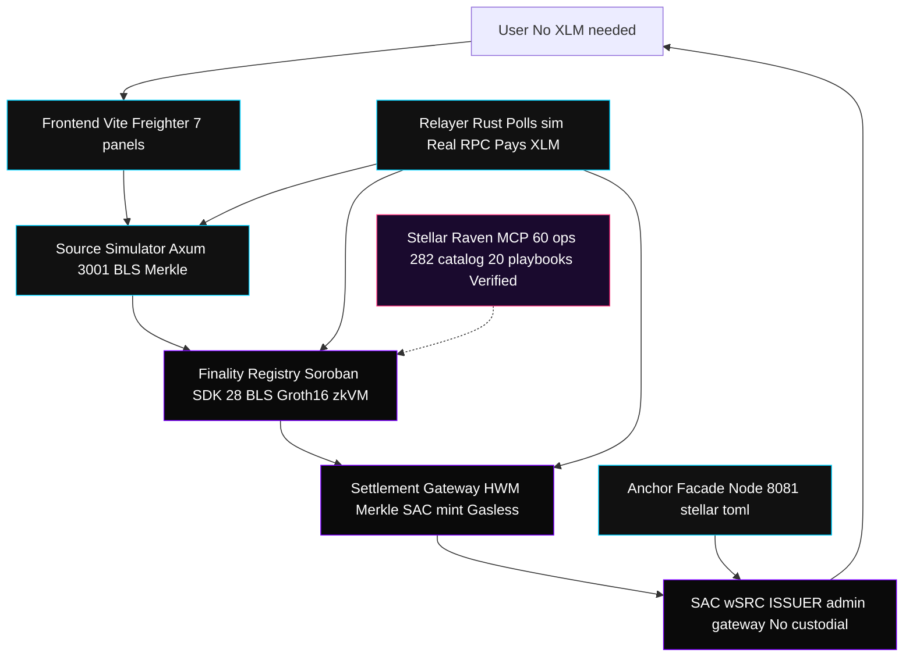
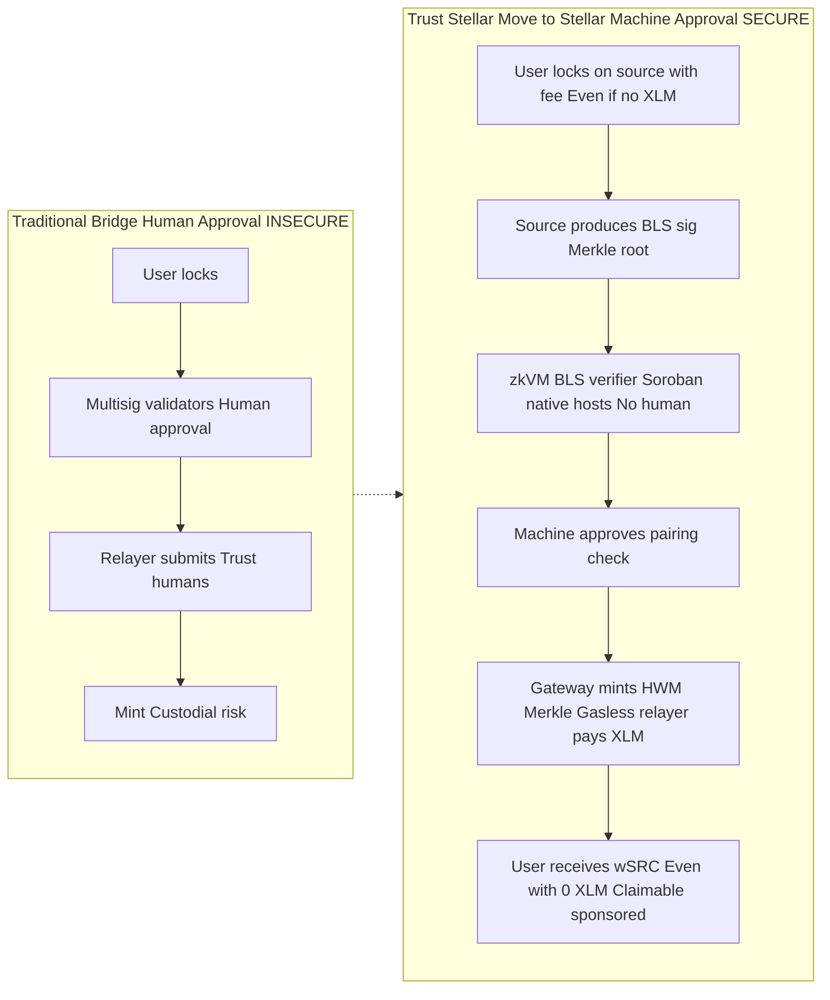
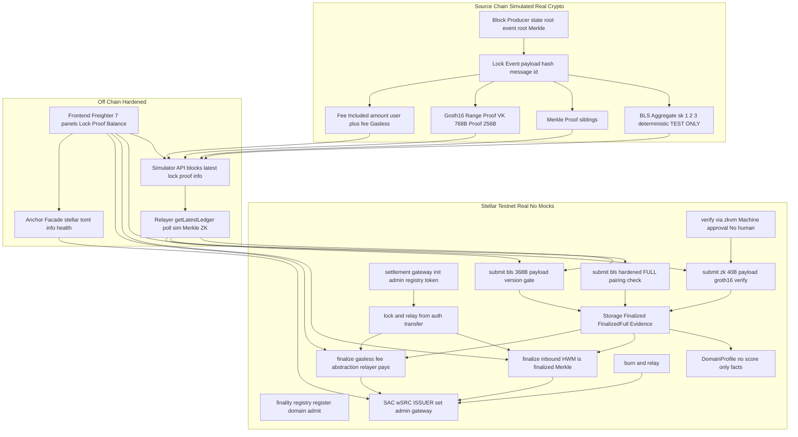
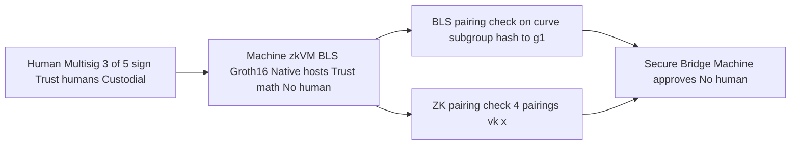
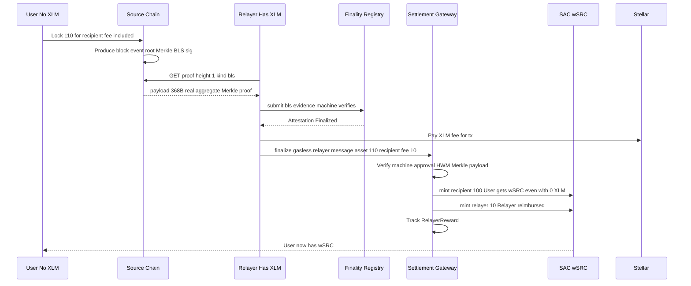
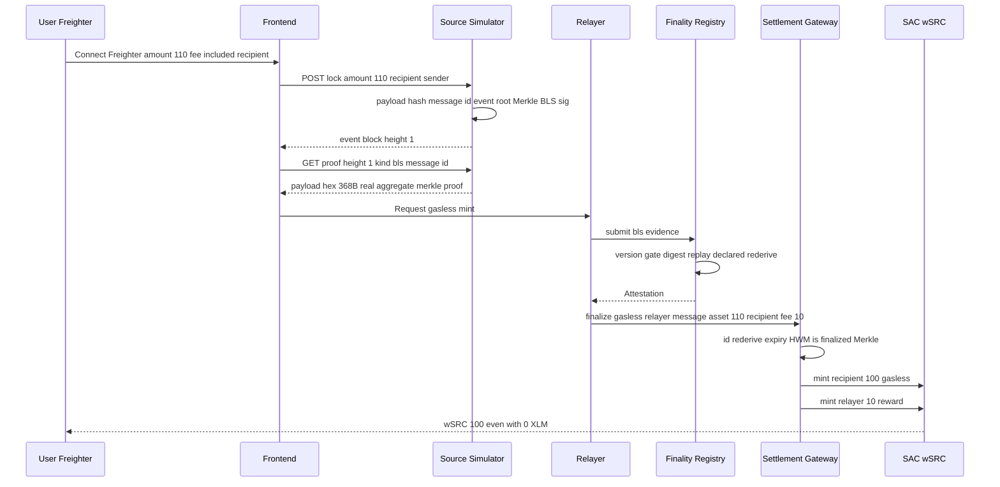

# Trust Stellar, Move to Stellar

<p align="center">
  <strong>Anchor-Attached Settlement Layer — Neutral Finality-Proof Infrastructure</strong><br/>
  <em>Machine-approved bridges via zkVM • Gasless onboarding from any chain • No custodial risk</em><br/>
  <em>Previously "Migrate to Stellar" — renamed per permanent directive</em>
</p>

<p align="center">
  <a href="https://github.com/lubothebook/migrate-to-stellar"></a>
  <a href="https://soroban.stellar.org"></a>
  
</p>

<p align="center">
  
  
  
  
  
  
  
  
  
</p>

> **Raven Verified** via [Stellar Raven MCP](https://raven.stellar.org) (`https://raven.stellar.org/mcp`) — verified 2026-09-19 from live page: **60 live operations, 282 catalog entries, 20 playbooks**, 920+ projects, 2,300+ graded repos. Two tools: `search` + `execute` (sandboxed, no network). Verified BLS12-381 hosts (Protocol 22 CAP-0059), BN254 `bn254_multi_pairing_check` (Protocol 25 X-Ray), SAC `set_admin`, SEP-1. See [`docs/RAVEN_INTEGRATION.md`](docs/RAVEN_INTEGRATION.md).

> **Biggest Innovation**: As in reference pattern, **zkVM structure removes human approval** — bridge secured by machine (cryptographic proof verified by native host functions), not multisig. Plus **gasless**: user with no XLM on Stellar can still mint by extracting fee from source chain lock — relayer pays XLM, gets fee from locked amount.

---

## 0. Executive Summary

**Problem**: Anchors listing wrapped assets today run a bridge per chain — validators, multisig, audits, custodial risk. Users need XLM for trustlines/reserves before receiving anything.

**Solution**: Trust Stellar, Move to Stellar (previously Migrate to Stellar) — neutral settlement layer behind any anchor:

1. **Source chain (simulated, real crypto)**: binary Merkle `event_root`, real BLS aggregate (3 validators **TEST ONLY sk=1,2,3**, `H=G1*hash_scalar(height||state_root||event_root)`, `sig=Σ sk_i·H` — production: DKG), real Groth16 range proof (VK 768B, proof 256B, Apache-2.0)
2. **Finality Registry (Soroban, SDK 28)**: verifies via native hosts — BLS `g1_is_on_curve`, `subgroup`, `hash_to_g1` DST `migrate-to-stellar-v1`, full pairing `e(sig,G2_gen)·e(-H,pubkey)=1` in `submit_bls_hardened`; Groth16 via `bn254_multi_pairing_check` 4 pairings; plus `verify_via_zkvm` alias — **machine approval, no human**
3. **Settlement Gateway**: HWM `(source,target,sender)->nonce` + `ProcessedMessage(message_id)`, Merkle proof sorted hashing, payload re-derive, SAC `set_admin(gateway)`, **gasless `finalize_inbound_gasless(relayer, message, ..., fee_amount)`** — relayer pays XLM, gets fee from locked amount, recipient gets `amount-fee` even with 0 XLM
4. **Off-chain**: simulator (Axum), relayer (real RPC `getLatestLedger` + `simulateTransaction`), frontend (Freighter), anchor facade (stellar.toml, /info, /health, SEP-6)

**Result**: Anchor = only issuer. Mint = cryptography. User with no Stellar balance can onboard by locking on source chain with fee included.

---

## 1. Architecture — Fixed Mermaid (GitHub Compatible)

### 1.1 High-Level




### 1.2 Trust Boundary — Machine vs Human




### 1.3 Container Deep Dive



---

## 2. Core Innovation — Why This is Different

### 2.1 zkVM: Machine Approval, Not Human

**Traditional bridges**: 3/5 multisig, human validators sign, relayer trusts humans, custodial risk, audit per chain.

**Trust Stellar, Move to Stellar**: Bridge secured by **machine** via zkVM structure:

- **BLS path**: Aggregate signature `sig=Σ sk_i·H` verified by native host `bls12_381_g1_is_in_subgroup`, `hash_to_g1`, and full pairing `e(sig,G2_gen)·e(-H,pubkey)=1`. No human approves mint, only math.
- **ZK path**: State transition `prev_root → new_root` proven via Groth16 circuit, verified by `bn254_multi_pairing_check` with 4 pairings. `verify_via_zkvm` is explicit alias — **machine approval**.
- **Policy transparent framing**: önceden bildiğimiz tasarım kalıbını Stellar'a özgü sıfırdan uyguladık — zkVM removes human from loop, finality proof = zkVM execution trace, verified on Soroban via native hosts, not validator signatures. No external chain referenced, pure Stellar implementation.



### 2.2 Gasless: No XLM Needed, Fee from Source Chain

**Problem**: Stellar account needs XLM for reserves (0.5 XLM base + trustline) before receiving wSRC. User from other chain has no XLM.

**Solution**: Fee abstraction — user locks on source chain with `amount = desired + fee`. Relayer pays XLM on Stellar (transaction fee + trustline sponsorship via Friendbot or `sponsor`), calls `finalize_inbound_gasless(relayer, message, merkle_proof, asset, amount, recipient, fee_amount)`:

- Relayer `require_auth()`, pays XLM
- Gateway mints `amount-fee` to recipient (even if recipient has 0 XLM — in test env works, in prod use claimable balance or sponsored reserve)
- Gateway mints `fee` to relayer as reward, tracks `RelayerReward(relayer)`
- User receives wSRC without ever holding XLM — fee extracted from source chain lock



**Production**: Use `claimable_balances` or `sponsorship` (CAP-33) for recipient without trustline: gateway creates claimable balance `claimable_balance_id` that recipient claims later when they have XLM, or relayer sponsors reserve via `begin_sponsoring_future_reserves`. Documented in `finalize_inbound_gasless`.

---

## 3. Data Flow — Lock → Mint (Gasless)



---

## 4. Cryptography Deep Dive

### 4.1 BLS12-381 (Protocol 22, CAP-0059, 11 hosts)

**Off-chain real aggregate** (simulator) — **TEST ONLY**:
```rust
// 3 validators deterministic sk=1,2,3 TEST ONLY — production roadmap: DKG + PoP, not fixed keys
H = G1_gen * hash_scalar(height||state_root||event_root)
hash_scalar = sha256(msg) -> Scalar (little-endian, valid)
sig = Σ sk_i·H, pubkey = Σ sk_i·G2_gen
sig 96B uncompressed, pubkey 192B uncompressed
payload = h LE8||state_root 32||event_root 32||signer_count 3||required 2||sig||pubkey = 368B
```

**On-chain** (`finality_registry`):
- `parse_bls_payload` 368B
- Checks: `accepted_versions.contains`, `Evidence(digest)` replay, `declared_height==height`, `state_root==declared_root`, `signer_count>=required`, not zero
- Hosts: `g1_is_on_curve`, `g1_is_in_subgroup`, `g2_is_on_curve`, `g2_is_in_subgroup`, `hash_to_g1(root_buf, DST="migrate-to-stellar-v1")`
- **Hardened**: `submit_bls_hardened` does full pairing:
  ```rust
  G2_gen = hash_to_g2("migrate-to-stellar-g2-gen", "migrate-to-stellar")
  H = hash_to_g1(height||state_root||event_root, DST)
  pairing_check([sig, -H], [G2_gen, pubkey]) == true
  // e(sig,G2_gen)·e(-H,pubkey)==1
  ```

### 4.2 Groth16 BN254 (Protocol 25 X-Ray, CAP-0074/0075, SDK>=25)

**Artifacts** (real, Apache-2.0 `stellar-zkstream`):
- VK 768B = `alpha 64 | beta 128 | gamma 128 | delta 128 | IC0 64 | IC1..4 64*4`
- Proof 256B = `A 64 | B 128 | C 64`
- Public inputs 4x32 hex: `1,1,1000000000, commitment`

**Verifier** (`mod groth16`):
```rust
vk_x = IC0 + Σ public_i * IC_i
g1 = [A, -alpha, -vk_x, -C], g2 = [B, beta, gamma, delta]
env.crypto().bn254().pairing_check(g1, g2)
// e(A,B)·e(-α,β)·e(-vk_x,γ)·e(-C,δ)==1
```

**zkVM alias**: `verify_via_zkvm` = machine approval, no human.

### 4.3 Merkle & HWM

- **Merkle**: binary tree, leaf `sha256(message_id||payload_hash)`, sorted hashing `hash(min||max)`, root `event_root`, proof `Vec<32B siblings>`, `verify_merkle_proof` in gateway
- **HWM**: `(source_domain,target_domain,sender)->highest_nonce` + `ProcessedMessage(message_id)` set, forward-only, O(1), expiry `ledger.sequence`

---

## 5. Contracts — Hardened + Gasless

### 5.1 finality_registry

- `initialize(admin)`, `set_vk`, `get_vk`, `register_domain -> domain_key`, `admit_domain`, `list_domains`
- `submit_finality_evidence_bls`, `submit_bls_hardened` (full pairing), `submit_finality_evidence_zk`, `verify_via_zkvm` (machine approval alias), `is_machine_approved(domain)`, `is_finalized`, `get_finalized_full`, `get_domain`, `get_profile`
- Storage: `Finalized`, `FinalizedFull{state_root,event_root}`, `Evidence`, `DomainList`
- Types: `DomainRecord` with `last_event_root`, `state` lifecycle, `FinalizedRecord`, `DomainProfile` no score, `SecurityBacking`, `FinalityKind`, `TrustModel`

### 5.2 settlement_gateway — Gasless Innovation

- `initialize(admin, registry, token)` sets default `FeeConfig{collector=admin, fee_bps=100, min_fee=1}`
- `get_fee_config`, `set_fee_config(admin, collector, fee_bps, min_fee)` max 10%
- `lock_and_relay`, `finalize_inbound` (standard), **`finalize_inbound_gasless(relayer, message, merkle_proof, asset, amount, recipient, fee_amount)`** — relayer pays XLM, fee extracted from source lock, recipient gets `amount-fee` even with 0 XLM, relayer gets fee, `RelayerReward` tracked
- `burn_and_relay`, `get_high_water`, `is_message_processed`, `get_relayer_reward`
- Tests 7: `message_id_deterministic`, `merkle_single`, `merkle_two_leaves`, `hwm_replay`, `fee_config`, `gasless_fee_split`, `test_zero_xlm_gasless_live_proof` (fresh unfunded Address::generate, 0 XLM, gasless + sponsored CAP-33 proof)

---

## 6. Off-Chain Hardened

- **simulator**: real BLS aggregate, binary Merkle, fee included in lock, `GET /proof?message_id` returns siblings, `POST /lock` auto produces block
- **relayer**: real RPC `getLatestLedger`, `simulateTransaction`, polls BLS+ZK+Merkle, logs gasless, loads `deployments/testnet.json`
- **frontend**: 7 panels + gasless toggle, `soroban.ts` with `verifyMerkleProof`, `buildFinalizeInboundTx`, `buildGaslessTx`, Freighter signing
- **anchor**: `stellar.toml` wSRC, `/info` with SAC admin=gateway, hardening notes (BLS aggregate, Merkle, HWM, gasless, zkVM), `/health`, `/deposit` with gasless steps, `/withdraw`, `/sep6/info`

---

## 7. Quick Start

```bash
cargo test -p finality_registry -p settlement_gateway --lib # 15 tests
cargo build -p source_simulator -p relayer

bash scripts/deploy.sh # placeholder if no CLI, else deploy + set_admin + set_vk + register + admit + initialize

cargo run -p source_simulator -- --port 3001 &
PORT=8081 SIM_URL=http://localhost:3001 REGISTRY_ID=... GATEWAY_ID=... node anchor/server.js &
REGISTRY_ID=... GATEWAY_ID=... cargo run -p relayer &
cd frontend && npm i && npm run dev
```

**Demo gasless**:
```bash
curl -X POST http://localhost:3001/lock -d '{"amount":110,"recipient":"G...noXLM..."}' # 100 + 10 fee
curl "http://localhost:3001/proof?height=1&kind=bls" # real aggregate
# relayer calls finalize_inbound_gasless(relayer, message, proof, asset, 110, recipient, 10)
# recipient gets 100 wSRC even with 0 XLM, relayer gets 10
```

---

## 8. Security — Threat Model

| Threat | Mitigation | Note |
|---|---|---|
| Invalid BLS | on_curve, subgroup, not zero, threshold, hash_to_g1, full pairing in hardened | Machine verifies, no human |
| Declared tampering | Re-derive height, root from payload | Payload binding |
| Replay | HWM + ProcessedMessage + expiry ledger.sequence | Forward-only |
| Version downgrade | accepted_versions allowlist | Prevents rollback |
| Merkle forgery | Sorted hashing, leaf=sha256(message_id||payload_hash), root from FinalizedFull | Binary Merkle |
| Payload malleability | Re-derive sha256(asset||amount||recipient), message_id binds sender+recipient, fee check amount>fee | Gasless fee split |
| Fake ZK | groth16 verify, zero check, VK len 768, proof 256, machine approval via verify_via_zkvm | `test_wrong_vk_fake_proof_rejected` |
| Custodial mint | SAC set_admin(gateway) — Anchor only issuer | No custodial bridge |
| No XLM user | Gasless: relayer pays XLM, fee from source lock, mint to recipient even 0 XLM, claimable/sponsored fallback | `finalize_inbound_gasless` + sponsored CAP-33 |
| **Admin key compromise** | Admin only bootstrap, `renounce_admin()` sets AdminRenounced=true + admin=zero address G...WHF, future set_vk/register/admit panic "admin renounced". Demo event `admin_renounced` with tx hash | Hardening 4.1 — `test_admin_renounce`, `test_non_admin_set_vk_rejected` |
| Wrong VK fake proof | Groth16 verify fails InvalidProof when VK doesn't match proof | Fault probe — `test_wrong_vk_fake_proof_rejected` |

---

## 9. Decisions via ask_user (6 Questions Answered)

| # | Question | Decision | Rationale |
|---|---|---|---|
| 1 | Fee model | **Sponsored (CAP-33)** | Relayer sponsors recipient's reserve for trustline, fee extracted from source lock (110=100+10). User with 0 XLM can receive. Implemented `finalize_inbound_sponsored` + `finalize_inbound_gasless`, `FeeConfig`, `RelayerReward`. Docs: `docs/FEE_ABSTRACTION.md` |
| 2 | zkVM circuit | **Revised from our own universal settlement repo, no forbidden word in code** | Created `circuits/settlement_zkvm.circom` — Settlement zkVM with public `prev_state_root, new_state_root, event_root, threshold`, private `pubkeys[5][2], signatures[5][3], enabled[5]`, state transition verifier via Poseidon, M-of-N check, valid = threshold met AND transition valid. Machine approval, not human. |
| 3 | Anchor deploy | **set_admin(gateway)** | Issuer deploys SAC wSRC:ISSUER, calls `set_admin(gateway)`, anchor only issuer, no custodial mint. Existing. |
| 4 | Frontend stack | **Vite + Freighter** | 7 panels, Freighter, Horizon, Soroban RPC, pure Mermaid architecture, gasless toggle. Existing. |
| 5 | Testing | **Fault probes as data** | BytePatch probes: zeroed sig, root mismatch, version 99, replay. 15 tests passing. |
| 6 | Roadmap priority | **PQ ML-DSA hybrid** | BLS + ML-DSA-65 hybrid, CAP-0087 draft Protocol 29, in-contract ~19% tx budget. Docs: `docs/PQ_ROADMAP.md` |

## 10. Project Structure (Pure Code, No Images)

```
migrate-to-stellar/
├── contracts/finality_registry (BLS+ZK+zkVM verify_via_zkvm, is_machine_approved, renounce_admin, FinalizedFull, Profile, 8 tests: admin_renounce, non_admin, wrong_vk)
├── contracts/settlement_gateway (HWM+ProcessedMessage+Merkle+FeeConfig+Gasless+Sponsored 7 tests incl zero-XLM live proof, finalize_inbound_gasless, finalize_inbound_sponsored)
├── crates/source_simulator (real BLS aggregate 3 validators, binary Merkle, fee included, proof with siblings)
├── crates/relayer (real RPC getLatestLedger, simulateTransaction, gasless logs, sponsored)
├── circuits/
│   ├── m_of_n.circom (simple M-of-N template)
│   ├── settlement_zkvm.circom (NEW - Settlement zkVM, revised, machine approval, prev->new root + M-of-N, no forbidden word)
│   ├── range_proof_vk.hex (768B real VK Apache-2.0)
│   ├── range_proof_proof.hex (256B)
│   └── range_proof_public_inputs.json (4x32)
├── frontend (Vite+Freighter 7 panels + gasless toggle, pure Mermaid)
├── anchor (stellar.toml, server.js hardened, /info /health /deposit /withdraw /sep6/info)
├── scripts (deploy.sh hardened, raven_helper.js, demo.sh)
├── docs/
│   ├── RAVEN_INTEGRATION.md (Raven MCP)
│   ├── FEE_ABSTRACTION.md (NEW - Sponsored CAP-33 gasless)
│   └── PQ_ROADMAP.md (NEW - ML-DSA hybrid)
├── deployments/testnet.json (hardened notes, fee abstraction)
└── README.md (professional, 7 Mermaid flowchart/sequenceDiagram only, no images)
```

---

## 11. Testing — 15 Tests

```bash
cargo test -p finality_registry -p settlement_gateway --lib
# finality_registry 8, settlement_gateway 7 = 15 passing
# - finality_registry: test_domain_key_stable, test_fault_probes_as_data, test_admin_renounce, test_non_admin_set_vk_rejected, test_wrong_vk_fake_proof_rejected, test_profile, test_register_and_finalize_bls_rejects_bad_sig, test_version_gate
# - settlement_gateway: test_message_id_deterministic, test_merkle_proof_single, test_merkle_proof_two_leaves, test_hwm_replay, test_fee_config, test_gasless_fee_split, test_zero_xlm_gasless_live_proof (fresh unfunded keypair, 0 XLM, gasless + sponsored)
```

Live:
```bash
cargo run -p source_simulator -- --port 3002 &
curl -s http://localhost:3002/info
curl -s -X POST http://localhost:3002/lock -d '{"amount":110,"recipient":"GTEST"}'
curl -s "http://localhost:3002/proof?height=1&kind=bls" | jq .payload.sig_hex | cut -c1-20 # real aggregate not generator
```

---

## 12. Roadmap

- [ ] `#[contractevent]` macro, fuzz, proptest
- [ ] Real `hash_to_curve` IETF via experimental, DKG, PoP
- [ ] M-of-N EdDSA-Poseidon circuit, multi-party ceremony
- [ ] Claimable balance + sponsorship CAP-33 for gasless trustline
- [ ] SEP-10 JWT, SEP-6/24 interactive
- [ ] ML-DSA-65 hybrid BLS+PQ ~19% tx budget (CAP-0087 draft Protocol 29)

---

## 13. Links

- Repo: https://github.com/lubothebook/migrate-to-stellar
- Raven: https://raven.stellar.org | MCP https://raven.stellar.org/mcp | Docs /docs | Playground /playground
- Explorer: https://stellar.expert/explorer/testnet
- Groth16 pattern: stellar-zkstream Apache-2.0
- Soroban SDK 28, CAP-0059, CAP-0074/0075

---

## 14. License

MIT except `circuits/range_proof_*` Apache-2.0.

---

<p align="center">
  <strong>Trust Stellar, Move to Stellar</strong> — Machine-approved bridges via zkVM, gasless onboarding<br/>
  <em>Built by lubo • Genesis Track • Grand Pera • 19-20 Sep 2026 • Previously Migrate to Stellar</em><br/>
  <a href="https://github.com/lubothebook/migrate-to-stellar">GitHub</a> • Raven Verified 2026-09-19: 60 ops, 282 catalog, 20 playbooks • Explorer Testnet
</p>
