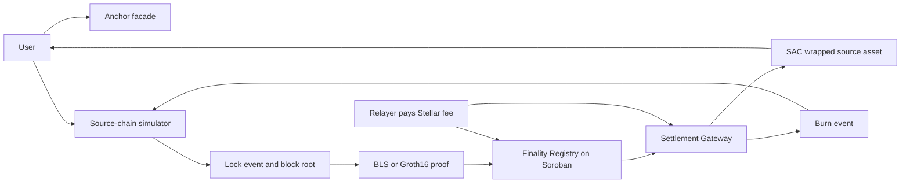

# Lumen Gate

> **Trust should not be an off-chain callback.**
>
> **Lumen Gate is the neutral finality layer that lets Stellar anchors settle value from other domains without becoming the source chain's validator, bridge operator, or single point of truth.**

[](https://developers.stellar.org/docs/build/smart-contracts/overview) [](#honest-status) [](https://www.risein.com/programs/stellar-pro-hackathon)

<p align="center"></p>

Stellar already has the payment rails, the anchor model and a smart-contract platform built for financial applications. The missing product layer is not another wrapped token UI: it is a **credible settlement boundary** between an anchor and a source domain. Lumen Gate puts that boundary in Soroban, where a Registry checks finality evidence, a Gateway controls the asset, and every accepted or rejected path can be inspected as a receipt.

This is the proposal for the [Rise In x Stellar Pro Hackathon](https://www.risein.com/programs/stellar-pro-hackathon), Genesis track. It is deliberately ambitious and deliberately honest: the source chain may remain a deterministic simulator for the hackathon, but Stellar-side contracts, Soroban RPC calls, event ingestion and transaction receipts are designed for real Testnet execution. No green button is allowed to turn an unverified fixture into a production claim.

## The 30-second pitch

**Lumen Gate turns source-chain finality into an on-chain Stellar settlement decision.** An anchor can keep its issuer, reserve, compliance and customer relationship while delegating neither trust nor mint authority to a private bridge database. The flow is:

```text
source lock → BLS or Groth16 evidence → Soroban verification → Stellar mint
Stellar burn → canonical contract event → relayer → source unlock
```

The result is a reusable settlement primitive for anchors, wallets, exchanges and payment applications: one integration surface, two proof lanes, explicit replay protection, a reversible asset path, and a failure mode that is safer than “the relayer said it was fine.”

## Why Stellar, why now

Lumen Gate is shaped around capabilities that make Stellar unusually relevant to this problem:

- **Anchors are a first-class distribution model.** Stellar’s Anchor Platform standardizes the service surface around SEP-1, SEP-6, SEP-10, SEP-12, SEP-24, SEP-31 and SEP-38. Lumen Gate complements that surface rather than replacing the issuer or compliance layer.
- **Soroban can make the settlement decision executable.** The Gateway does not ask an API to mint; it asks a Registry contract to accept evidence and then enforces the result through the SAC asset authority.
- **Cryptography is close to the ledger.** Soroban’s documented BLS12-381 and BN254 primitives make aggregate signatures and Groth16-style verification a native design target instead of a promise hidden in a server.
- **Events make the reverse path indexable.** A canonical `burn` event can be ingested through Soroban RPC, decoded by a relayer and consumed exactly once by the source side.
- **The output is composable value.** Once settled, a wrapped source asset can use Stellar wallets, liquidity and payment rails instead of living inside a bridge-specific silo.

### What we are not building

Lumen Gate is not an issuer, not a reserve manager, not a source-chain validator set and not a claim that every chain can be made trustless by adding a signature. It is an adapter and finality-verification boundary. The anchor remains responsible for its real-world obligations; the Registry is responsible for refusing evidence that does not satisfy the registered policy.

> **The pitch to judges:** this is infrastructure an anchor can actually integrate, a cryptography surface Soroban can actually enforce, and a demo where the negative path is part of the product—not a slide hidden after the happy path.

## How approval works, from the ground up

In a normal bridge, "approval" means a person decides. A group of validators each hold a private key, they sign a message saying "yes, this happened," and a relayer collects enough of those signatures and submits them. The destination chain trusts that those signatures came from honest people who checked things correctly. If those people are wrong, asleep, or compromised, the bridge is wrong too.

Lumen Gate replaces that decision with a mathematical check that Stellar itself can run.

**The BLS path.** Each validator signature is a point on an elliptic curve. Multiple signatures over the same message can be combined into one aggregate signature, a single mathematical object. Soroban has a built-in operation called a pairing check: given the aggregate signature, the message, and the combined public key, it confirms in one step whether that exact signature could only have come from validators who control the matching private keys, for that exact message. Change one byte of the message and the check fails. There is no step where a person looks at the signature and decides whether it looks right; the equation either balances or it doesn't.

Concretely, the Registry computes `H = hash_to_curve(height || state_root || event_root)` and asks the host to confirm `e(sig, G2_gen) · e(-H, pubkey) == 1`. That is the entire trust decision. You can watch it happen in the accepted transaction linked above.

**The ZK path.** Instead of signatures, the source chain can hand over a Groth16 proof: a short piece of math that says "a specific computation was carried out correctly," without showing the computation itself. Soroban verifies this the same way, with a native pairing check. The proof is a fixed size no matter how large the underlying computation was, and checking it takes the same small, constant amount of work every time.

**Why this counts as "no human approval."** Both checks run inside the Soroban contract itself, using cryptographic operations built directly into the Stellar protocol, not a script on someone's laptop or a company server. The contract's only decision is whether the pairing equation holds. To make sure nobody can quietly change what "valid" means later, the verifying key and the BLS policy are set once through an admin-gated bootstrap, and `renounce_admin` exists to give that ability up permanently. After that point, there is no key left that could override what the math already decided.

**Where a human still sits, honestly.** Admin-gated bootstrap is a real trust point during setup: whoever holds the admin key decides the initial verifying key and the initial BLS policy. That is why renounce is part of the product and not a footnote. **Both live contracts have now given the capability up on-chain**, with receipts below, and the audit loop probes for it every round instead of taking this paragraph's word for it.

What the human *could* have done before the renounce, and no longer can: change the verifying key, add or admit a domain, lower the BLS policy, re-point the gateway's target domain, or change the relayer fee configuration. After the renounce there is no call that reaches any of it. The verification key is frozen in storage, the settlement rule is the pairing equation, and there is no owner left to ask.

## The same flow, driven from the console

The receipts elsewhere in this file were produced from a terminal. This one was not: the browser console read live status through `/api/status`, created three lock events in one source block through `POST /api/source?path=/lock`, and asked the operator facade for a single relayer pass through `POST /api/relay`. That one pass anchored the block (`f92bfa11…`) and minted all three messages:

| step | transaction |
| --- | --- |
| BLS evidence accepted for source height 1 | `f92bfa119ca091fdfc9564c85f429969250b78c60993e92117a53dcb4d7ec30a` |
| gasless mint 1 of 3 | `2091566f2d36c12132109e60508933e2966dba0d40dda380be10fbb554106769` |
| gasless mint 2 of 3 | `179d0ee59d15bcdea47569b254fc848c823a1992e557242373abbf54e5351b85` |
| gasless mint 3 of 3 | `2d5845626e59f9f49912422e11aeddea5a0ab73c24b6425b65906408f165cb40` |

The block held three events, so the Merkle proof was a real tree walk at depth 2 rather than the degenerate single-leaf case. The recipient's XLM balance is **identical before and after** (`1.5000000`): the inbound direction is gasless for the user. The relayer collected `0.3 wSRC` in fees and spent `0.0746712 XLM` on the three transactions plus a trustline, and the arithmetic reconciles exactly — `(13.7 + 13.7000001 + 13.7000002) − 3 × 0.1 = 40.8000003 wSRC` received. Full record: `deployments/testnet.json` → `console_round_trip`.

**This run also found a defect, which is the point of driving the product instead of the CLI.** A lock with a plain-string source sender was accepted by the simulator, hashed into the message id, signed into BLS evidence and *anchored* by the registry — and only then failed at the CLI, because the gateway carries that field in an `Address`-typed argument. The result was a half-settled block: a permanent on-chain finality record for a message nobody could ever mint, with the fee already paid. The simulator now validates sender and recipient as Stellar strkeys before creating an event, so the failure lands where the operator can still act on it.

## The system keeps proving it, not just proved it once

A test suite proves the contract behaved correctly at the moment someone ran it. That is a one-time claim. The self-audit loop turns it into a standing one.

[`anchor/self-audit.js`](anchor/self-audit.js) runs against the **live deployed registry** on an interval. Every round it:

1. advances the source chain so the round has genuinely new evidence,
2. submits an honest proof and requires it to be **accepted**,
3. resubmits the identical evidence and requires `#9 EvidenceAlreadyProcessed`,
4. submits a proof with one byte of the signature tampered and requires `#7 InvalidSignature`,
5. asks whether the registry's admin capability has actually been given up,
6. asks the same of the gateway,
7. simulates `set_vk` with a well-formed 768-byte key after the renounce and requires the **contract** to refuse it, with a prior read proving the registry was reached and a follow-up read proving the stored key unchanged — a transport error or a typo'd contract id must never read as a refusal, because a check that passes on unreachability is worse than no check,
8. reads the gasless recipient's account from Horizon and re-derives the reserve arithmetic itself, because the strongest claim in this file is about an account balance,
9. confirms the recorded gasless mint receipt is really on a ledger,
10. resolves every element the console looks up against the markup, because a typo in a selector produces an interface that loads, looks finished and silently does nothing,
11. runs the SEP conformance probe against a running anchor facade and takes its verdict,
12. drives the SEP-10 verification library against a stubbed signer record, so a
    below-threshold signature must be refused at the library level too, and
13. re-derives the gate-vm lane's live acceptance from Horizon (the transaction
    still on a ledger, still successful) and reads that lane's registry for its
    verification key, requiring the committed 896 bytes back intact — the
    "frozen after renounce" claim expressed as bytes on the network, not as a
    line in this file.

Results are timestamped and appended to [`deployments/self-audit.json`](deployments/self-audit.json), and served read-only at `/self-audit` on the anchor facade. Run it with:

```bash
REGISTRY_ID=CCXJDQMTJUGXKNFOQPC25IYVOAVWDMLJBNQYX75MAREHV7MZMU5OSEN4 \
  node anchor/self-audit.js
```

**It holds no mint authority.** It cannot approve anything, it cannot change the verifying key, and it is not a new trusted party in the settlement path — it only asks the contract questions and writes down the answers. If it stops running, nothing about settlement changes; you just stop getting fresh evidence.

The latest recorded round is **13/13** (`deployments/self-audit.json`, round 18), and the checks that need no party's cooperation are the load-bearing ones: the gasless recipient's live balance (`1.5000000 XLM` held, `1.5000000 XLM` reserve, **`0.0000000 XLM` spendable**), the recorded gasless mint sitting on ledger `4,763,378` with a fee of 137,293 stroops, the post-renounce `set_vk` refusal attributed to the contract itself with the stored key read back unchanged, and the gate-vm lane's acceptance — transaction `6d67f5f4…` on ledger `4,765,859` for 177,143 stroops, its registry still serving the committed key byte for byte. The facade probe reported **26/26**. Both admin checks work by simulating the admin action and requiring the host to trap — a probe with no verdict is recorded as a failure, because a check that reports success on an empty output is worse than no check at all. The registry's admin capability was given up permanently with `renounce_admin`, which is the last setup step — after that nobody, including the deployer, can change the verifying key or add a domain.

### What this round of work broke, and what that found

The audit loop found its own operator mistake first. Round 8 reported `honest_evidence_accepted` as failed, and the cause was not the contract: the source simulator is deterministic and restarts at height 1, while the registry keeps its records forever, so the loop proposed evidence for a height the chain already held. The registry answered `#9 EvidenceAlreadyProcessed`, which is exactly the right answer to a replayed height, and the round then presented it as a valid proof being refused. Any rebuild of the demo source chain reaches that state. The loop now reads `get_last_finalized` for the source domain and waits for the simulator to pass the recorded height before it locks a probe block, so in round 9 the honest probe lands on a genuinely new height and the replay probe still gets its `#9` — the guard was never weakened to make a check green.

### What the expanded loop found the first time it ran

The loop asks twelve questions now, not seven, and its first two rounds against the live contracts found defects in the tools rather than in the contracts — which is what a loop that is not decoration is for.

- **Round 13:** `gateway_admin_renounced` reported *no gateway id: set GATEWAY_ID or record contracts.settlement_gateway in the manifest*, while the gateway id was in the manifest. The helper read `contracts.settlement_gateway` as a bare string and called `.trim()` on the object that is actually recorded there; the type error was swallowed by the helper's own `catch`, so a capability that really is renounced was reported as unproven. It now accepts both shapes, and round 14 proved the check on evidence — a second `renounce_admin` trapping inside the host.
- **Round 14:** `facade_sep_conformance` came back 3/14 with HTTP 429 on its opening requests. Nothing was wrong with the facade: the probe's own last check bursts the rate limit deliberately, and the previous round had run inside the same window. The probe now waits out a window that a previous burst closed — bounded at 90 seconds, using the `Retry-After` the facade sends — and round 15 is **11/11** with the facade at **20/20**. Round 16 repeats it with the lattice's frame behaviour folded into the console-surface record.

Both are in `findings`, and neither was fixed by relaxing a check.

### The console's dialog, hardened

Clearing the operator token used to leave the dialog open on an empty field, and closing the dialog by mouse or Escape dropped focus to the browser's default. Clear now closes the dialog, Save closes it, and every close path returns focus to the button that opened it; opening the dialog puts the caret in the token field and selects it. That is a small thing, but a console that loses a keyboard user's place on every dialog is not a console a professional would ship.

### The defects this build recorded

The audit loop is only worth running if the failures are written down. This build has produced seventeen, all recorded in `deployments/testnet.json` under `findings`. The first four:

1. **The first live gasless attempt failed**: the Stellar Asset Contract rejects minting the token to the account that issues it, so the relayer-reward mint trapped and the whole transaction rolled back. The relayer now runs from a separate account that holds the wrapped asset's trustline — which is also the honest topology, because the fee payer should not be the issuer.
2. **The relayer reported the wrong transaction hash.** It took the first 64-hex-character run out of the CLI output; the CLI echoes its arguments, and the evidence contains a 64-hex adapter id, so the adapter id was printed as the receipt. It now confirms a candidate through `getTransaction` before calling it a receipt — a hash the network has not seen is never reported.
3. **The relayer would not resume.** If the evidence for a height was already anchored (registry `#9`), it treated that as failure and skipped the mint, stranding every message anchored before a restart. `#9` from the registry and `#4` from the gateway are now what they are: the desired end state.
4. **Two unit tests were passing for the wrong reason.** They asserted only that a call failed; they never admitted the domain, so the call failed with `NotAdmitted` before any signature or pairing check ran. Both now admit the domain and assert the specific error variant.

## Honest status

This checkout is a **Testnet engineering snapshot**, not a completed production bridge. Everything claimed below was executed against Stellar Testnet (protocol 28) and can be checked on-chain; everything not executed is listed under [What is not claimed yet](#what-is-not-claimed-yet).

### Live on Testnet

| Contract | Address | Note |
| --- | --- | --- |
| `finality_registry` | `CCXJDQMTJUGXKNFOQPC25IYVOAVWDMLJBNQYX75MAREHV7MZMU5OSEN4` | admin **renounced on-chain**; verifier key set; one domain admitted |
| `settlement_gateway` | `CBUKVNCPF5XRYJVAH2SRLTLUMZT6T677T5KAJADXZIQOQTCTSBITQVPA` | current build, 18,303 bytes, admin **renounced on-chain** |
| `wSRC` (Stellar Asset Contract) | `CBPBDVLP7K436KEXOAJMPFFHEF5OXNN4KJIB2HDFDBRWOABQ6WBTURRV` | admin handed to the gateway, so mint and burn ride the gateway's own authorisation |
| `finality_registry` (chained lane) | `CCR3NZD5ASZAC3RPHDJOVSHWZBIF46ELP3JGWFC37ZL65YZ443ULZLMM` | a second registry, deployed to carry the **N-step chained proof** lane; admin **renounced on-chain**; 12/12 live probes in [`deployments/step-chain.json`](deployments/step-chain.json) |

The second registry exists because the first one's admin was renounced before the chained lane was written: a verification key that was never set cannot be set afterwards, and that is the renounce doing its job. Rather than weaken the earlier deployment to accommodate new work, the chained lane got its own registry. It is additive by construction — it records accepted chains in its own storage slot and never touches the roots the settlement path anchors on — and the live record proves that boundary rather than asserting it (see the rows below).

Three earlier gateway deployments and one earlier asset contract are listed under `superseded` in [`deployments/testnet.json`](deployments/testnet.json) rather than deleted. They were replaced for concrete reasons, and the reasons are the interesting part: one could not be driven from the command line, one could not be re-pointed at a fixed gateway, and one predated a real footgun fix. Keeping them visible is cheaper than pretending the first attempt worked.

### Receipts

| Step | Result | Transaction |
| --- | --- | --- |
| Registry initialise | success | `6fa09843673fe15624967f9b05f2cd186061e68d85f3b119d7037a00657e2f0b` |
| `register_domain` (`source-testnet`) | success | `ad80fe5a7f058aab7521d6aa5f1141be17d54feba578ea7ad7ce546007d7339f` |
| `set_bls_policy` (3 signers, 2 required) | success | `e37cc48ceb175b36d2d6c8d13fa8b22c6e8efa1cd7f9179484c17de7eda8d5f0` |
| `admit_domain` | success | `a7d9cce11a863e962bfa11f0873b5e2997ca9ee3fb3bcf2ca764ebac54519090` |
| **BLS finality accepted** | **success** | **`b181956b9a9c3fc4f18faeea3938bdf2ea19b96edc9bd4414ddeb243e02008a4`** |
| Replay the same evidence | rejected `#9 EvidenceAlreadyProcessed` | simulated, no fee burned |
| Tamper one byte of the BLS signature | rejected `#7 InvalidSignature` | simulated, no fee burned |
| Set the verifier key | success | `76e6c3978af3c32aecce89578085d2b8a6bddcf167a2e386e1760450a3314c3b` |
| **Groth16 proof accepted** (heights 19, 39, 18, 91, 32) | **success** | `12be652f…`, `15e2143f…`, `1c2179bb…`, `4f612bfc…`, `f3bb88d1…` |
| Tamper one byte of a Groth16 proof | rejected `#8 InvalidProof` | simulated, no fee burned |
| **`renounce_admin`** | **success** | `8ca278c88a6ee375c21c09870b48320b953eea3ed3e7c35f55a03b87e03639b4` |
| `set_vk` **after** renounce | rejected, VM call trapped | the capability is gone for everyone, including the deployer |
| **Gateway `renounce_admin`** | **success**, event `machine_settlement_only` | `f3396d449411843489ae3f209efe74af823633e20e45a9d86b70ec324c2bbf0b` |
| A second gateway `renounce_admin` | rejected, VM call trapped | there is no admin key left to authorise it |
| **Two gasless mints after the renounce** | **success**, XLM unchanged, +17.2000001 wSRC | `c1f02301…`, `2c4eedac…` |
| **Forward: lock → Merkle proof → mint** | **success**, balance 0 → 400,000,002 wSRC | `3d5d9936bf514b10423fe4ed4f39009899f02ae1f5cdb8b5fd16517258f57997` |
| **Reverse: burn → source-chain unlock** | **success**, 150,000,000 released | `ca0a16605acb41c1dcb1e4db2dedaf4b45e98347b013e37d8e9906a559b83340` |
| Replay the burn message on the source chain | rejected, HTTP 409 | — |
| **Gasless mint to a zero-XLM account** | **success**, recipient XLM unchanged, +19.9 wSRC | `8b4e9bd59f405b8d3ecd11dcf1dee1e906ffcf16100cbcb1899cae7b42da88b4` |
| The relayer's own reward for paying that fee | paid, +0.1 wSRC to the relayer | same transaction |
| **Chained lane: 896-byte key set** | **success** on the second registry | `90558af44e68654ea4efae73a9d83bfec93e55d43fddcfe126bf8e8c797289e2` |
| **Chained lane: a 3-step chain accepted** | **success**, event `step_chain_verified`, `chain_length 3` | `2269641ad8895d61004d550b6cb4d09ba2cc500236dcbcb23db341c959cc3649` |
| Chained lane: start and end roots swapped | rejected `#5 DeclaredMismatch` | simulated, no fee burned |
| Chained lane: quorum lowered to 1 | rejected `#5 DeclaredMismatch` | simulated, no fee burned |
| Chained lane: proof one byte short | rejected `#8 InvalidProof` | simulated, no fee burned |
| Chained lane: replayed evidence | rejected `#9 EvidenceAlreadyProcessed` | simulated, no fee burned |
| Chained lane: 895-byte key | rejected, stored key unchanged | simulated, no fee burned |
| Chained lane: `renounce_admin`, then replace the key | rejected, key unchanged | `0e9d5a49470d783a475dc4bbcfecaa5878bcc017f9ed0696eab63d6dee4b6409` |
| **Execution lane: 1920-byte key set** | **success** on a third, freshly deployed registry | `490df73b93649785360957aff1c3fdab78d4bc23541f2675b1c6feb27339513f` |
| **Execution lane: a 16-step run of a committed program accepted** | **success**, event `execution_verified`, 16 steps / 25 gas, final pc 12 | `70cb914ad86535ed9a9ba6eefd57f7bade0011f45fe3fa5f2b1b3a26aadc0601` |
| Execution lane: a different program under the same proof | rejected `#5 DeclaredMismatch` | simulated, no fee burned |
| Execution lane: a rewritten step count | rejected `#5 DeclaredMismatch` | simulated, no fee burned |
| Execution lane: an instruction hidden past the end of the code | rejected `#6 InvalidPayload` | simulated, no fee burned |
| Execution lane: proof one byte short | rejected `#8 InvalidProof` | simulated, no fee burned |
| Execution lane: proof with its group elements moved | rejected `#8 InvalidProof` | simulated, no fee burned |
| Execution lane: payload one byte short | rejected `#11 BadPayloadLength` | simulated, no fee burned |
| Execution lane: replayed evidence | rejected `#9 EvidenceAlreadyProcessed` | simulated, no fee burned |
| Execution lane: `renounce_admin`, then replace the key | rejected, key unchanged | `28d1589066ac5f38df26aad3dfb0f2128bfd5773c148ac1560b845d048834dbc` |

The gasless row is the strongest single receipt in this file. The recipient account `GCN65ER7…` held **15,000,000 stroops of XLM — exactly its minimum reserve, zero spendable** — before and after the mint, byte for byte. It could not have paid the **137,293 stroops** the transaction cost, because any fee would have dropped it below the reserve. The relayer `GBDJAEDH…` signed and paid, and the gateway minted it `0.1 wSRC` out of the transferred amount as the fee. The whole run was one command: `target/debug/relayer --height 156 --once` with `RELAYER_FEE=1000000`, reading its addresses from `deployments/testnet.json`.

The first accepted transaction is ledger **4,762,103**, fee **168,960 stroops**, and it emitted `finality_verified` carrying the domain key, height and state root. The aggregate BLS12-381 signature was verified inside Soroban using the native pairing host functions — no off-chain check, no oracle, no signature-size shortcut.

The Groth16 proof was generated from a circuit compiled in this repository, against a Powers-of-Tau ceremony run locally, and was checked by the contract's own BN254 pairing verifier. The proof for the settlement block is not the one that anchors that block — see below for why.

### Test status

`cargo test --workspace` → **120 passed, 0 failed** (41 in `finality_registry`, 28 in `execution_vm`, 20 in `domain_adapter`, 14 in `gate_vm`, 11 in `settlement_gateway`, 3 in `source_simulator`, 3 in the circomlib Poseidon cross-check). Run it yourself; the count in this file is not aspirational. Three of the registry tests replay the exact 256-byte proof and 768-byte key that a testnet transaction accepted, and twelve more cover the chained lane's own key, proof and public inputs, so a regression in either verifier or in either byte encoding fails the suite instead of only failing in production. `-- --nocapture` prints the measured CPU cost of both pairing checks.

The circuit suites are separate and do not need a network. `node tools/step-chain-tests.mjs` runs **18 checks** against the chained circuit's compiled witness generator — one per constraint family, each breaking a specific thing and requiring that specific refusal. `node tools/execution-trace-tests.mjs` runs **34 checks** against the execution lane's witness generator: two honest runs (the demonstration program and a control-flow fixture), twenty-seven mutations, one per constraint family, and five runs the machine itself refuses. A mutation counts only if it is refused **at the constraint it targets** — the harness matches the refusal against the pinned source line, because a mutation that trips some other constraint would otherwise read as coverage for a family nobody tested, and a mutation that is silently *accepted* means the constraint behind it does not exist. `node tools/step-chain-live.js` and `node tools/execution-lane-live.js` run the lanes against real deployed registries and write [`deployments/step-chain.json`](deployments/step-chain.json) and [`deployments/execution-lane.json`](deployments/execution-lane.json) with every transaction hash.

### What is not claimed yet

- **The Groth16 lane proves a quorum and binds the three roots; it is not a signature verifier.** The circuit header says so in its own words. It establishes that enough approvals exist over a bitmap and that `prev_state_root`, `state_root` and `event_root` participate in one Poseidon relation, so none of them is decorative metadata. It does **not** establish that any particular validator signed anything. A production ZK lane replaces the bitmap with a real signature gadget.
- **Because of that, the registry does not persist an event root from the ZK lane.** Storing a root that no signature covers would let an unconstrained value become the anchor for a Merkle settlement proof, and minting reads that anchor. The settlement receipt above is anchored by the **BLS** lane, whose aggregate signature does cover the event root. This is a deliberate refusal, not an oversight, and it is the reason the two lanes are not interchangeable yet.
- **The source side is a local deterministic simulator**, not a live external network. Its BLS signatures are real (RFC 9380 hash-to-curve, DST `lumen-gate-finality-v1`) but its validator secret keys are the fixed demo values 1, 2, 3. Production requires a DKG. See [Known simplifications](#known-simplifications).
- **The gasless path is live for inbound mints, and only for inbound mints.** The receipt above is real, but "gasless" here means *zero spendable XLM*, not zero setup: the recipient still needs an existing Stellar account holding a trustline for the wrapped asset, because a Stellar asset cannot be held without one. The outbound direction is not gasless — a user who wants to burn and unlock signs and pays for their own burn transaction. The fee the relayer charges is a fixed amount chosen at submission time, not a market.
- **The console is wired to the live contracts and is capability-gated.** Addresses come from the deployment manifest through `/api/status`, finality comes from a live contract simulation, balances come from Horizon, and the audit table comes from the record the loop writes. Controls that this particular deployment cannot honour are disabled with the reason shown — the relay button when no operator is configured, the lock button when no source adapter exists. The honest limits: the hosted console is a verification and operator surface, not a customer-facing anchor; the source chain is reachable only if someone exposes the simulator; and the outbound burn still needs the user's own Freighter signature and fee.
- **No bond, fee or slashing economics.** A validator that signs a wrong root loses nothing.

The source side is intentionally local. The Stellar side is not mocked: the acceptance bar was real deployments, real transaction hashes, real events, and negative probes against the live contracts — and that bar is now met for both directions.

### Is this a zkVM?

**It is a bounded step VM, and the bound is written down where it applies.** Until this round the answer here was no, and the reason was specific: the circuits proved fixed statements, and a VM proof needs four things a fixed statement does not have. All four exist now, they are exercised by a real proof on testnet, and the limits are in this section rather than in a footnote.

| what a VM proof needs | what is in this repository |
| --- | --- |
| an instruction set with defined semantics | eleven opcodes -- halt, add, sub, mul, eq, lt, jmp, jnz, load (immediate or memory form), store, assert -- on 64-bit words with wrapping arithmetic, implemented twice from one description: as an interpreter in [`crates/execution_vm`](crates/execution_vm), and as constraints in [`circuits/execution_trace.circom`](circuits/execution_trace.circom). The interpreter's own test names the constraint it is checked by |
| a commitment to the guest program | the sixteen packed instruction words are public inputs, and every row's opcode, register indices and immediate are one linear equation against the word its program counter selects. The registry binds the same words to a **sha256 program digest** in the evidence payload and names the program by that digest in the record |
| a memory model | sixteen memory words carried row by row -- `mem[i+1] = mem[i] + store_gate · (written value − mem[i])` from `mem[0] = 0`, read and written through one-hot selections gated by the row's own instruction. A read returns the word the state carried in, so no trace can read a word it never wrote |
| a witness that replays an execution | the interpreter runs the program, pads the trace to the circuit's twenty rows, and `check_trace` re-checks every row against the semantics -- 28 tests in the crate -- before [`tools/execution-lane-input.mjs`](tools/execution-lane-input.mjs) turns the trace into witness data |

The statement the circuit proves, in the words of its own header:

> there exists a run of the committed program, from the register file whose Poseidon root is published and from zeroed memory, ending halted at the published program counter after exactly the published number of steps at exactly the published cost, with the ending register file hashing to the published end root, and with every row following from the previous one by one legal instruction.

**It runs, and it is on the network.** `ExecutionTrace(20,16,16,8)` compiles to **9996 non-linear and 2694 linear constraints**, **22 public inputs**, a **1920-byte** verification key and a 256-byte proof. The program in the live receipt is twelve instructions -- it splits eight into installments of four by repeated subtraction, accumulates the total, stores it in memory at address zero, reads it back, checks the read-back against the accumulator, checks the remainder is zero, multiplies the two checks and asserts the product before halting. The proof was generated off-chain from the interpreter's own trace, and the registry accepted it in transaction `70cb914a…`: **16 steps of 20 rows, 25 gas, final program counter 12, program digest `725aa389…`**, at a cost of **206,052 stroops** on testnet. Every value in that sentence is in [`deployments/execution-lane.json`](deployments/execution-lane.json), including the 22 public inputs the contract bound one by one.

**Where the word stops.** This is a VM with a budget, not a general-purpose one. Twenty rows per proof; sixteen instructions per program; sixteen memory words; eight registers with `r0` pinned to zero; no syscalls, no heap, no unbounded execution -- a program that needs a twenty-first step has no proof in this circuit, and the registry refuses a payload that claims more. The arithmetic wraps modulo 2^64 instead of living in the field, so every addition carries its carry bit and every multiplication carries a 64-bit quotient that is range-checked: that is what makes the machine's `wrapping_add` and the circuit's addition the same function rather than two functions with one name. The program is assembled from a text listing by a small assembler in this repository, not compiled from a high-level language, and the trusted setup is still one local ceremony.

Four Groth16 circuits exist today, all compiled ahead of time and all verified on-chain through Stellar's native BN254 host functions:

| circuit | constraints | proves |
| --- | --- | --- |
| [`circuits/finality_statement.circom`](circuits/finality_statement.circom) | **628** | one fixed statement: a quorum of approval bits is set and three roots participate in one Poseidon relation |
| [`circuits/step_chain_statement.circom`](circuits/step_chain_statement.circom) | **2259 non-linear / 2784 linear** | a chain of up to four steps: `state_root_0 → state_root_1 → … → state_root_3`, each root derived from the previous root and that step's own evidence, and the last root equal to the published commitment |
| [`circuits/execution_trace.circom`](circuits/execution_trace.circom) | **9996 non-linear / 2694 linear** | a run of a committed program on the machine described above: fetch, decode, arithmetic, memory event, register and memory carry, next program counter, costing |
| [`circuits/gate_vm.circom`](circuits/gate_vm.circom) | **5109 non-linear / 5075 linear** | a second, register-only machine: eight field-element registers, an eight-row window, a Poseidon-folded program commitment (the cells are witness, not statement), and — the differentiator — **Poseidon as an instruction**, so a program can hash chains as data. Wired to the registry as its own lane and live: a run proof of the committed demo program (`H⁴` from the start and event roots, hash steps counted in-circuit) was accepted at ledger 4,765,859 for **177,143 stroops**, with fourteen probes — eight refusal classes among them — all passing: [`deployments/gate-vm-lane.json`](deployments/gate-vm-lane.json) |

The registry keeps each lane's key in its own slot with its own hard length limit (768, 896, 1920 and — because a fourth length would be vanity — another 896) bytes, and each lane's evidence carries its own domain-separation tag, so no lane's proof can be presented as another lane's. The two 896-byte lanes are the honest test of that design: length cannot tell them apart, and tests pin that slots plus the pairing equation do.

The second circuit is the machine-shaped one. It is a **genuine N-step chained state transition**: the step relation is a real transition relation, each step's evidence is hashed into the state it produces, the step order is enforced by the chaining itself rather than by convention, execution length is a public input with padding isolated twice (witness *and* constraint level), and its statement carries its own domain-separation tag, `lumen-gate-step-chain-v1`, distinct from the label the single-statement lane and the BLS hash-to-curve path use. Every public input is bound by at least one constraint, and every fixed or derived signal is locked with `===` rather than merely computed — a witness-only computation is not a proof, because a malicious prover can write anything into it. The per-constraint test matrix is [`tools/step-chain-tests.mjs`](tools/step-chain-tests.mjs): 18 checks, one per constraint family, each breaking one specific thing and requiring that specific refusal.

**How the four statements relate, in one paragraph.** The single-statement circuit answers *did finality evidence exist for this exact event*. The chained circuit answers *does a sequence of quorum-bearing steps carry the state from the root I last accepted to the root being claimed* — a transition relation with a defined order, and no instruction set. The execution circuit answers *did this program run*, with the trace, the decode and the memory of a machine behind it. The gate-vm circuit answers the same question on a smaller, field-native machine whose program is a commitment rather than a statement and whose instructions can hash: *did this committed program fold these roots, in this many counted hash steps, inside the window*. The one-line version for a reviewer: **a quorum proof, not a signature proof; a transition proof, not a VM proof — and, beside those two, two honest execution proofs of machines this repository also implements, each with its budget stated: one a word processor with published program words, the other a hashing register machine with a committed fold.** A signature gadget inside a circuit is still the next piece of work, not a relabelling of this one.

**What the chain does and does not cover.** The circuit proves the internal consistency of the chain: given the published start root, the published length and the published event root, the steps link to exactly the published end root, and each active step carries a quorum. It does **not** verify approval signatures — a production chain replaces the approval bitmap with a signature gadget, and the circuit header says so. It does not yet bind the start root to a previously finalized root on-chain; today the start root is a public input that the registry binds to the evidence payload, so continuity across accepted chains is the registry's monotonic height rule rather than a proof. Both limits are listed in [What is still genuinely missing](#what-is-still-genuinely-missing).

## Product thesis

An anchor that does not want to operate a separate bridge per source chain should be able to:

1. register a source domain and its finality policy;
2. accept a BLS or Groth16 proof through a relayer;
3. have Soroban verify the proof with native cryptographic host functions;
4. mint or release the anchor's wrapped asset only after verification;
5. burn the asset and emit a reverse message without keeping validator keys in the anchor.

The codebase implements this boundary with a local source simulator and a live-Soroban-shaped Stellar side. The simulator makes the demo deterministic; it does not make a live Testnet claim on our behalf.

## Judge's 90-second path

1. Open [`frontend/index.html`](frontend/index.html) or the deployed preview and read the banner: the thesis is settlement, not a token gimmick.
2. Connect Freighter on Testnet and inspect the registry, gateway and SAC IDs. Placeholder IDs are intentionally obvious until deployment evidence exists.
3. Create a source lock, fetch both BLS and Groth16 evidence, then run the fault probes for bad signatures, roots, versions, malformed proof roots and replayed nonces.
4. Follow the reverse path: `burn_and_relay` emits canonical Bytes, the relayer polls Soroban RPC, and the source simulator consumes `/burn-unlock` once.
5. Replace the manifest with real receipts and repeat the exact flow against Testnet. The README and [`DIRECTIVE.md`](DIRECTIVE.md) define what counts as evidence.

## Research notes and ecosystem fit

The product direction follows the current Stellar developer surface rather than treating Stellar as a generic chain:

- [Anchors](https://developers.stellar.org/docs/learn/fundamentals/anchors) defines anchors as the on/off-ramp layer connecting Stellar to financial rails and points builders toward SEP-6, SEP-24, SEP-31, SEP-10, SEP-12 and SEP-38.
- [Anchor Platform](https://developers.stellar.org/docs/platforms/anchor-platform) provides standardized asset, authentication, transaction and callback surfaces. Lumen Gate’s facade is intentionally shaped to sit beside that platform.
- [Soroban `getEvents`](https://developers.stellar.org/network/soroban-rpc/methods/getEvents) supports contract/topic filtering and cursor-based pagination. The relayer uses this surface for reverse burn ingestion, while the deployment plan treats event retention as an operational constraint.
- [Contract event ingestion guidance](https://developers.stellar.org/docs/build/guides/events/ingest) recommends maintaining an own record because RPC event retention is limited. That is why Lumen Gate’s relayer keeps a cursor and why a production deployment must persist event IDs rather than poll blindly.
- [Stellar privacy and ZK primitives](https://developers.stellar.org/docs/build/apps/privacy) documents BLS12-381 and BN254 as Soroban cryptographic building blocks. Lumen Gate exposes both lanes so an anchor can compare an aggregate-signature finality policy with a proof-carrying policy.
- [Soroban BLS signature example](https://developers.stellar.org/docs/build/smart-contracts/example-contracts/bls-signature) demonstrates the native pairing pattern that informs the Registry’s BLS path.

These are product inputs, not endorsements. The repository still requires deployment receipts and negative Testnet evidence before making a live security claim.

## Demo story



The live demonstration must show:

- source lock with the relayer fee included;
- a BLS proof and a Groth16 proof as two security backings for the same envelope;
- on-chain finality verification before mint;
- HWM replay rejection;
- burn and source-side unlock in the reverse direction;
- a fresh recipient with no XLM, if and only if the testnet flow proves it.

## Repository architecture

| Component | Role | Location |
| --- | --- | --- |
| Finality Registry | Domain registry, evidence parsing, BLS and Groth16 verification, finalized roots | `contracts/finality_registry` |
| Settlement Gateway | Lock, mint, burn, message IDs, Merkle checks, fee abstraction and nonce HWM | `contracts/settlement_gateway` |
| Source simulator | Deterministic blocks, lock events, Merkle roots and proof fixtures | `crates/source_simulator` |
| Relayer | Source event polling and real Soroban transaction submission | `crates/relayer` |
| Frontend | Freighter-facing demo and fault probes | `frontend` |
| Anchor facade | SEP-1 discovery, SEP-10 authentication, a real SEP-6 surface, the audit view and the operator controls | `anchor` |
| Domain adapter | Raw-evidence-in, attestation-out boundary, message envelope and the nonce high-water mark | `crates/domain_adapter` |
| Circuits and fixtures | Two Groth16 circuits (single statement + N-step chain), their build/setup/prove tooling and their artifacts | `circuits` |

### Anchor positioning

Lumen Gate is not the anchor's issuer and does not replace the anchor's reserve or compliance operations. The anchor remains the issuer and publishes asset metadata. The gateway receives SAC authority so that the anchor's operational key is not the mint decision-maker. The mint decision comes from the registry's cryptographic result.

The current demo asset code is the neutral `wSRC`. It describes a wrapped source asset and is not the name of an external chain.

### Domain adapter model

Each source domain is identified by:

```text
 domain_key = sha256(adapter_id || network)
```

Evidence carries an adapter ID, version, network, opaque payload, declared height, declared root and submitter. The contract re-derives height and root from the payload. There is no `assume valid` branch: malformed payloads, version failures, root mismatches, invalid curve points, bad proofs, duplicate evidence and replayed messages must return an error.

### Message envelope and replay protection

A cross-domain message contains the source and target domains, source height, event index, nonce, sender, recipient, payload hash, message kind and expiry. Its ID is derived from those fields. Expiry is checked in the source height space; Stellar's unrelated ledger sequence is not used for source-domain expiry. The gateway pins its Stellar target domain at initialization as `sha256("lumen-gate-stellar-testnet")`; the source simulator and relayer use the same 32-byte value.

Inbound processing uses one high-water mark per `(source_domain, target_domain, sender)`:

```text
highest_processed_nonce
```

A nonce at or below the mark is rejected and only a higher nonce advances the mark. A separate message-ID record is retained as an additional idempotency guard.

## The interface

The console is built on one rule: **every value on screen comes from somewhere that can be checked.** Addresses come from the deployment manifest through the API layer, the last finalized block comes from a live simulation of the deployed registry, balances come from Horizon, and the audit table comes from the record the loop writes. Nothing is typed in by hand.

The visual language comes from the project's own assets. The page background is the **source chain**: one cube per block, drawn from the project tile, running the full height of the document and interrupted exactly once. Three details are deliberate:

- **The cubes are the submitted file, byte for byte.** `frontend/public/grid-tile.png` is the artwork as it was handed over (60x60, sha256 in the manifest's interface state), and it is embedded in the page as a data URI so there is no build step between the file and the pixels. Three earlier rounds had quietly brightened and re-stroked it to make the grid read better; that is what "the cubes are bigger than my pixels" turned out to be, and the page now paints the file unfiltered — no scrim, no blend, no brightening. `tools/check-console.js` hashes the embedded copy against the file, so a future round cannot silently redraw the artwork again.
- **One asset pixel is one screen pixel.** The tile is 60x60 and the page paints **one asset pixel per screen pixel** (`--cell: 60px / devicePixelRatio`, `image-rendering: pixelated`), so a 1x display shows a 60px cell and a 2x display shows a 30px cell that still lands on 60 physical pixels. Nothing is ever enlarged: a 60x60 window of the rendered page is byte-identical to `frontend/public/grid-tile.png`, which is what the footer readout reports on the machine you are actually using. The footer also carries a three-way switch (`1:1 px`, `60px`, `30px`) for the case where a reader wants the grid denser or coarser than their display density implies.
- **The grid reacts to the pointer.** Moving across it snaps a cell-sized frame to the cube under the cursor, with a **4 screen pixel** inner border (`--ring: 4px / devicePixelRatio`), aligned to the same lattice, so what lights up is exactly one block. It is painting only, never a control, and it disappears where there is nothing to point at — over the black band, the cards, the header and the footer.
- **The grid stops on a line you can read.** The wallet band opens with the boundary strip: *source chain stops here / settlement boundary / Stellar testnet below*. Above that line is the source chain and read-only evidence; below it is the only surface on the page that can move value.

The header and favicon use the project wordmark and mark.

The wallet has three tabs — receive, send back, and **cash out to a bank account** — and the third one drives the flow in [Cashing out to a local currency](#cashing-out-to-a-local-currency) from the browser: read the anchor, quote the amount, sign the SEP-10 challenge with Freighter, open the withdrawal, pay the anchor's treasury with the memo attached through Freighter, and poll until the anchor reports the payout. Two other actions moved behind the *user's* own session this round, so a visitor can start something without holding a shared operator secret: `POST /v1/user/lock` opens a source-chain lock whose recipient is forced to the session account, and `POST /v1/user/relay` asks for one relayer pass under a per-account cooldown. Neither grants mint authority: the relayer still signs and pays, and the registry still decides what is final.

The wallet sits below the overview and the explanation of how settlement works, on purpose: a reader should arrive at a wallet already knowing what it is about to do. It has the two directions as tabs, an account panel that reads real balances, and a live step readout (`Lock`, `Finality`, `Mint`) whose state comes from the responses, not from a hard-coded sequence. Amounts are entered in base units because that is what the contracts take, so each amount field carries its own translation under it (`137000000` → `= 13.7 wSRC minted, minus the relayer fee`) and refuses a fraction or a zero with a reason instead of a silent failure. The card header states whether this tab may write, and setting the operator token repaints that state immediately rather than waiting for the next status poll.

**What it refuses to do.** A control this deployment cannot honour is disabled with the reason printed under it, never offered and then failed:

| Situation | What the interface does |
| --- | --- |
| No operator token | the lock and settle buttons stay off, with the reason shown; the Operator dialog sets one for the tab |
| No source adapter configured | the lock button is disabled and says so, instead of pretending to work |
| No API layer at all (a static build) | the page says it is offline and falls back to the addresses in the generated module |
| Relay pass takes tens of seconds | the button reports that it is running, because the pass signs, submits and waits for confirmation |

All of that is checked mechanically: [`tools/check-console.js`](tools/check-console.js) resolves every element the module looks up against the markup, verifies the module parses, and confirms the images embedded in the page are still the images in `frontend/public`; [`tools/check-grid-fx.js`](tools/check-grid-fx.js) extracts `watchGrid()` from the module, drives synthetic pointer events through it against a stub DOM, and insists the frame snaps to the cube under the pointer, compensates for the scrolled lattice, paints at most once per animation frame, keeps off interactive surfaces, and hides on leave, scroll and blur — plus the pixel contract itself: the tile is 60x60 on disk and its sha256 is the one the manifest records, the cell and the frame are divided by the device pixel ratio so one asset pixel stays one screen pixel (60/4 at dpr 1, 30/2 at dpr 2), and a reader's 60px override is honoured. Both run in the self-audit loop as one console-surface record, so a selector typo — or a lattice that has quietly gone silent — is a failed audit round rather than an interface that loads and does nothing.

## The anchor facade: what it is for

The facade is the **integration surface**, not the trust anchor. It is the only part of this system another team is expected to talk to, so it is also the part most worth attacking, and it is hardened accordingly.

What it does:

| Surface | Why it exists |
| --- | --- |
| `GET /.well-known/stellar.toml` | SEP-1 discovery. Other people's software reads this, so every value in it has to be a fact: the real issuer, the real asset, and an explicit note that this is a testnet demonstration asset |
| `GET /v1/deployment` | serves `deployments/testnet.json`, the manifest the receipts were written against. The console and the next developer both read addresses from here instead of from a hard-coded list |
| `GET /capabilities` | says out loud what this instance may do: reads, relay, source adapter. The UI gates its controls on this, so a button that would fail is never shown as if it worked |
| `GET /v1/self-audit`, `GET /v1/self-audit/history` | read-only view of the record the audit loop writes. It reports; it does not approve |
| `POST /v1/relay?height=H`, `POST /v1/reconcile` | one relayer pass, and a reconciliation pass that advances SEP-6 records against live ledgers. Operator token only |
| `GET /v1/sep10/auth`, `POST /v1/sep10/auth` | SEP-10 authentication: the anchor signs a challenge transaction, the client proves key control by signing it back, and the anchor issues a short-lived JWT. Unfunded accounts are the normal case, not an error |
| `GET /v1/sep6/info`, `GET /v1/deposit`, `GET /v1/withdraw`, `GET /v1/transactions` | a real SEP-6 surface: official field names, records that advance only on evidence read from a ledger, and an explicit list of what is not implemented. Opening a record and reading history require a SEP-10 session, and the account is the token subject - never a caller-chosen one |
| `POST /v1/user/lock`, `POST /v1/user/relay` | the user's own SEP-10 session instead of the operator token. Lock forces the recipient to the session account; relay is opt-in (`LUMEN_ALLOW_USER_RELAY=1`) with a per-account cooldown. Neither grants mint authority |
| `GET /v1/cashout/anchor`, `/bridge`, `/challenge`, `POST /v1/cashout/token`, `/start`, `GET /v1/cashout/status` | the exit path in [Cashing out to a local currency](#cashing-out-to-a-local-currency): a transparent proxy to an external SEP-6 anchor. The anchor's token travels in `X-Anchor-Token` and is never stored, and the operator token is not accepted here |
| `GET /v1/logo.png` | the asset `ORG_LOGO` names in the served `stellar.toml`, so discovery does not point at a 404 |
| `GET /v1/sep12/customer` | answers `501 not_implemented`. No KYC is collected and the file says so instead of implying otherwise |

Full detail, including which ledger event advances which record and what is
deliberately absent, is in [`docs/SEP_SURFACE.md`](docs/SEP_SURFACE.md).

What it does **not** do, and this is the important half: it holds no custody, no mint authority and no verification keys. If the facade disappeared, settlement would keep working — you would lose the window, not the rule. The mint authority is the gateway contract, and the verification key lives in a registry whose admin has been renounced.

**How it is hardened.** Three rules, enforced in `anchor/server.js`:

1. **Reading is public, writing never is.** Every mutating endpoint requires an operator token compared in constant time, and the service refuses to run writes at all when no token is configured. A capability that can be switched on by accident is worse than one that is switched off.
2. **CORS is an allowlist, not a wildcard.** The previous revision answered every request with `Access-Control-Allow-Origin: *`, which meant any page a visitor opened could have triggered a relay that signs and spends the operator's XLM. Origins are now reflected only when they are on the allowlist.
3. **Every input is validated before it is used.** Heights must be bounded positive integers, transaction ids must be 32-byte lower-case hex, and the one endpoint that spends money runs a single pass at a time with a cooldown, so it cannot be used to drain an account.
4. **A session acts for its own account only.** SEP-6 record creation and history reads are bound to the subject of the SEP-10 token; an anonymous caller cannot plant pending records against somebody else's address, and no one can read another account's history by swapping a query parameter.
5. **Refusals all look alike, and public reads are capped.** Every non-200 answer from the facade and the hosted layer is `{ "error": { "code", "message" } }`, and a fixed-window per-address rate limit with `Retry-After` keeps a single misbehaving client from taking the audit surface down for everyone else. `tools/sep-conformance.js` drives a running facade as a SEP client would and fails if any of these sentences stops being true.

## Deploying the console

The console runs in two places from one codebase: locally with two small processes, and hosted on Vercel with no long-running process at all.

### On Vercel

`frontend/` builds to a static site and `api/` becomes serverless functions. Nothing needs a wallet key, and nothing shells out to a binary.

Two packaging details decide whether this works at all. The handlers read `deployments/*.json` and `anchor/stellar.toml` through paths they build at runtime, so a bundler cannot trace them: `vercel.json` declares `includeFiles` for both, otherwise the deployed function answers `manifest not found` on its first real request. The build also copies those files into the static output, so the deployed site serves the same manifest it was built from and a reviewer can fetch it and compare.

```bash
vercel                        # from the repository root
# optional, for the operator controls:
vercel env add OPERATOR_URL    # e.g. https://your-facade-host (running anchor/server.js)
vercel env add OPERATOR_TOKEN  # the same token the facade was started with
vercel env add SOURCE_URL      # the source-chain adapter, if you have one exposed
```

| Function | What it serves | Authority |
| --- | --- | --- |
| `GET /api/status` | the manifest, a live `getLatestLedger`, issuer balances, the audit summary and the capability flags | none, read-only |
| `GET /api/audit` | the self-audit record from the repository | none, read-only |
| `GET /api/finality?height=N` | a **live simulation** of `get_last_finalized` / `get_finalized_full` against the deployed registry | none, read-only |
| `GET/POST /api/source` | reads of the source adapter; `POST /lock` needs the operator token | operator |
| `POST /api/relay` | forwards one relayer pass to `OPERATOR_URL` | operator |

The design decision that matters: **the signing key never leaves the operator's machine.** The hosted console cannot spend anything, because it does not hold the ability to. When no operator is configured, `/api/relay` answers with `writes_disabled` and the console disables the button and explains why, instead of offering a control that quietly fails.

`GET /api/finality` is worth opening by hand. It is a simulation of the deployed contract, so the answer it returns is the answer a verifier would get, not a value copied into the page from a file:

```bash
curl -s https://<deployment>/api/finality | jq '.record'
# { "last_height": "306", "state": 2, "last_security": ["SignatureSet", 3, 2, false], ... }
```

### Locally

Three processes, one machine. The API functions run through a small stand-in so the console exercises the same code path it will use on Vercel:

```bash
# 1. source chain (the simulator that plays the source network)
#    SOURCE_ASSET_ID must be the SAC this deployment mints (the relayer refuses
#    to run otherwise); SOURCE_SENDER is the source account the lock event
#    carries. The gateway's nonce high-water mark is keyed on
#    (source domain, target domain, sender), so a fresh sender is how a demo is
#    replayed against a live gateway.
SOURCE_ASSET_ID=<the SAC contract id from deployments/testnet.json> \
  SOURCE_SENDER=<any funded source-chain G address> \
  ./target/debug/source_simulator --port 8080

# 2. the serverless layer, locally
SOURCE_URL=http://127.0.0.1:8080 \
  OPERATOR_TOKEN=<pick-one> \
  OPERATOR_URL=http://127.0.0.1:8081 \
  node tools/api-dev-server.js          # listens on 3001

# 3. the anchor facade (discovery, manifest, audit surface, relayer trigger)
LUMEN_ALLOW_RELAY=1 OPERATOR_TOKEN=<pick-one> SIM_URL=http://127.0.0.1:8080 \
  STELLAR_SOURCE_ACCOUNT=<stellar-cli key name the relayer signs with> \
  STELLAR_RELAYER_ADDRESS=<that key's G address> RELAYER_FEE=1000000 \
  node anchor/server.js                 # listens on 8081
# the facade hands the relayer the SAC id from its own constants, so the
# asset-id check in step 1 is the only place that id has to be typed

# 4. the console
cd frontend && npm install
VITE_API_ORIGIN=http://127.0.0.1:3001 VITE_FACADE_ORIGIN=http://127.0.0.1:8081 npm run dev
```

The browser never talks to `localhost` directly: Vite proxies `/api`, `/source-api` and `/facade`, so the same page works on a development machine and behind whatever proxy serves it. That is the classic failure mode of a browser app that calls its own `localhost` in a hosted demo, and it does not apply here.

## Cryptographic paths

### BLS12-381

The intended live path is a real aggregate BLS verification using Soroban native curve, subgroup and pairing hosts. The demo validator set is a deterministic 2-of-3 test fixture, and its keys are not a production validator set.

The domain record must bind the expected aggregate public key and quorum. The payload must not be allowed to choose its own trusted key. The canonical domain separation string for a new deployment is:

```text
lumen-gate-finality-v1
```

The full pairing path, not an on-curve-only shortcut, is the security claim shown to judges.

### Groth16 / BN254

The ZK path uses purpose-built circuits rather than porting a large source-chain VM: two of them prove statements about roots, and one of them proves the step-by-step execution of a program on a small machine this repository also implements. That last one is the bounded VM described in [Is this a zkVM?](#is-this-a-zkvm); the full account, including what is still missing, is in [`docs/PROVING_SYSTEM.md`](docs/PROVING_SYSTEM.md). Soroban's native BN254 pairing check is the on-chain verifier, and it verifies real proofs: [`circuits/finality_statement.circom`](circuits/finality_statement.circom) compiled with circom 2.2.3 into 628 constraints, proved with snarkjs 0.7.6 against a Powers-of-Tau ceremony generated locally, serialised by [`circuits/convert_to_soroban.py`](circuits/convert_to_soroban.py), and accepted by the live registry on testnet (receipts above). On-chain, that verification costs about **29.1M cpu instructions** in the Soroban host model and was charged **158,961 stroops** on testnet — both measured, both re-runnable with `cargo test -p finality_registry --lib -- --nocapture`.

A second circuit adds the chained lane. [`circuits/step_chain_statement.circom`](circuits/step_chain_statement.circom) compiles to **2259 non-linear and 2784 linear constraints** and proves that a chain of up to four quorum-bearing steps carries `state_root_0` to the published end root, each link derived from the previous root and that step's own evidence. Its public signal order is its own (`chain_start_root`, `chain_end_root`, `event_root`, `threshold`, `chain_length`, `domain_tag`), which makes its verification key **896 bytes** rather than 768; the contract keeps the two keys in separate slots with separate hard length limits, so neither lane can borrow the other's. On-chain, the chained lane's call measures **31.7M cpu instructions** in the same host model. Its artifacts, the commands that regenerate them, and the 18-check constraint matrix are all in the repository, and the lane has its own live record: [`deployments/step-chain.json`](deployments/step-chain.json).

A third circuit is the execution lane. [`circuits/execution_trace.circom`](circuits/execution_trace.circom) compiles to **9996 non-linear and 2694 linear constraints** and proves a run of a *committed program* on the machine in [`crates/execution_vm`](crates/execution_vm): the statement is the program (sixteen packed words), the entry and exit register roots, the final program counter, the number of steps that ran and the gas they cost. Its public signal order puts the program first, which makes its verification key **1920 bytes** (64 + 3×128 + 23×64) and its payload 232 bytes; its own storage slot, its own domain tag (`00cf562c…`), and its own live record: [`deployments/execution-lane.json`](deployments/execution-lane.json). The 34-check constraint matrix behind it is [`tools/execution-trace-tests.mjs`](tools/execution-trace-tests.mjs).

The single-statement public signal order is fixed by the deployed verifier, which requires the last public input to equal the evidence's declared state root:

```
public_inputs[0] = prev_state_root
public_inputs[1] = event_root
public_inputs[2] = threshold
public_inputs[3] = state_root      <- the value the registry binds
```

Getter/setter shape: a 768-byte verification key (α, β, γ, δ and five IC points), a 256-byte proof, and four 32-byte big-endian field elements. The Fp2 encoding is the part that bites: snarkjs emits each G2 coordinate real-first, while Soroban's host functions want the imaginary component first, so the converter swaps them and asserts the result.

**What the circuit does and does not do.** It proves a quorum exists over an approval bitmap, and that the three roots participate in one Poseidon relation, so none of them is free metadata. It does **not** verify signatures. A production lane replaces the bitmap with a signature gadget. That is why the settlement anchor comes from the BLS lane, whose signature does cover the event root, and why the registry refuses to persist an event root from the ZK lane.

The older checked-in fixture — now named [`circuits/settlement_statement_fixture.circom`](circuits/settlement_statement_fixture.circom) so the filename stops implying a VM — is quarantined and is never submitted unless `ALLOW_DEVELOPMENT_ZK_FIXTURE=1` is set for a development demonstration. It exists so a developer can see the wire format without a ceremony; it is not part of any claim.

## Anchor integration

The facade exposes the minimum integration surface:

- `/.well-known/stellar.toml` for asset metadata;
- `/health` for service health and configured contract IDs;
- `/info` for the domain profile, proof paths and current deployment;
- `/transactions?id=...` for demo transaction lookup;
- explicit deposit/withdraw information only when the endpoint is actually
  implemented.

An anchor must not be described as operating source-chain validators. It only configures the asset and settlement relationship.

### What the facade charges, and who pays it first

The Stellar network fee is paid in XLM by the relayer, out of the relayer's own balance, at the moment it submits. The user whose transfer is being settled never touches XLM: the amount the user locked on the source chain already contains the fee, and the relayer is repaid **from that locked amount in the wrapped asset** when the gateway mints — `0.1 wSRC` per message today.

That `0.1 wSRC` is a **fixed** amount, chosen at submission time and written into the deployment, not a price. There is **no real-time pricing anywhere in this system**: no oracle feed, no exchange rate, no spread, no repricing when XLM moves. If XLM becomes expensive, this deployment pays the difference rather than charging more, and the README says so because a fee that silently floats is a fee nobody can audit. Market-priced fees are listed under [What is still genuinely missing](#what-is-still-genuinely-missing), and moving to them means adding a price source, not relabelling this constant.

## Cashing out to a local currency

A wrapped asset that can only go back where it came from is a receipt, not a currency. The step that makes it useful is the one that hands it to an institution that pays out in the local banking system — and that institution is a licensed anchor, not this project. Lumen Gate is the settlement layer in front of an anchor, so it integrates with one instead of pretending to be one.

The integration is [`anchor/cashout-client.js`](anchor/cashout-client.js), a client of a real SEP-6 anchor on Testnet. It is a client, not a mock: it reads the anchor's `stellar.toml`, authenticates over SEP-10, asks for a firm quote over SEP-38, opens a withdrawal, sends real Testnet USDC with the memo the anchor asked for, and polls the transaction until the anchor reports it is done. The anchor it talks to is a Testnet sandbox whose **bank and KYC are simulated by the anchor** — that part is the anchor's business and is labelled as such everywhere — but the Stellar leg is real USDC on the public Testnet ledger.

The flow, in the order it actually happens:

```text
SEP-1   GET  /.well-known/stellar.toml         -> WEB_AUTH_ENDPOINT, TRANSFER_SERVER, the asset
SEP-10  GET  /auth?account=G...                -> challenge XDR (never submitted to the ledger)
        sign the challenge with the user's key
        POST /auth {transaction}               -> JWT
SEP-38  GET  /sep38/price                      -> a firm quote, with the spread broken out
SEP-6   GET  /sep6/withdraw?asset_code=USDC&type=bank_account&amount=...
                                               -> treasury account + memo + rate lock
        send the asset on-chain to that treasury, with the memo
SEP-6   GET  /sep6/transaction?id=...          -> pending_user_transfer_start -> completed
```

**The live exit, with a receipt.** [`deployments/cashout-quote.json`](deployments/cashout-quote.json) is one run of `node anchor/cashout-client.js`, end to end:

| | |
| --- | --- |
| anchor | the sandbox anchor's home domain, discovered from its `stellar.toml` |
| authentication | SEP-10 JWT for the account that paid |
| quote | SEP-38 quoted a price for the exact amount, with the 50 bps spread itemised as a fee |
| withdrawal | treasury `GCLCZEQZ2THTEDAOFI66LACNPLY4OBKN7VKLEZFMBIHYKYQOW2W7T3Z6`, memo type `id` |
| payment | **0.5000000 USDC** to the treasury with that memo, transaction `4ed47692824fdbcf76ef098ada65b49fdb586f215bcd10df9204a12010c970c3` on ledger 4,764,945 |
| result | anchor reports **`completed`**, `amount_out` 24.27 in the anchor's payout currency, fee 0.12, reference `FAST-0UDDCJJKSY` |
| status history | `pending_user_transfer_start` → `completed`, both recorded with timestamps |

The payment is the user's own: their key signs it and their XLM pays for it. The exit direction is not gasless, and the README says so rather than borrowing the inbound direction's stronger claim.

**The same exit, driven through the deployment.** A client that works when run by hand and a deployment that works are two different claims, so the exit is also exercised **through the facade's own routes** — the path the console takes — by [`tools/cashout-live.js`](tools/cashout-live.js), and the result is recorded in [`deployments/cashout-live.json`](deployments/cashout-live.json). 8/8 checks:

| check | result |
| --- | --- |
| the facade discovers the anchor | the anchor's home domain, auth and transfer endpoints read from its `stellar.toml` |
| the bridge route is reported honestly | `"route": "none"`, naming the pair it looked up (`wSRC:<issuer>` → the anchor's USDC) instead of inventing a rate |
| a withdrawal without a session is refused | HTTP 401 with the error envelope |
| the operator token is not a substitute for the user | refused: the facade does not accept its own operator credential where the anchor's user session belongs |
| SEP-10 through the facade | the anchor issued a session for the paying account, and the facade passed it back without storing it |
| the withdrawal opens | treasury `GCLCZEQZ…`, memo type `id`, 0.2 USDC |
| the payment lands | `0.2000000 USDC` with the memo, transaction `6fa9732d55bad6cb7f1dbc84c3b0c353817ed1ba7793af4c19c3738931ded4bc` on ledger 4,765,013 |
| the anchor reports the payout | **`completed`**, 9.70 payout-currency units out, reference `FAST-KHPOFIV58V` |

The third and fourth rows are the ones worth reading: they are refusals, and they are the reason the panel can be handed to a stranger. The facade holds no anchor token and cannot open a withdrawal on anyone's behalf, and its own operator token buys nothing on that path — an operator is not the user.

**The bridge from wSRC to the anchor's asset — and its simplification, stated plainly.** The exit asset at this anchor is USDC, so a wSRC holder needs a swap first. `bridgeToUsdc()` asks Horizon for a real `pathPaymentStrictSend` route: **on Testnet there is none, in either direction**, and that is a fact anyone can re-check with one call (`GET /v1/cashout/bridge` reports it). With no order book to trade against, the code falls back to a **counterparty exchange at a configured rate**, and only when an operator configures one — the wSRC goes to the counterparty, the counterparty pays USDC back at `CASHOUT_SWAP_RATE`, and both legs carry a `lg-swap` memo so they can be matched on the ledger. That is a swap with an operator standing behind it, not a market trade, and calling it a DEX would be a lie. So: **the swap step is simplified, deliberately, and the reason is that no market exists to trade against on this network.** On a network where a wSRC/USDC market exists, the same function takes the order-book branch and no configuration is involved.

**Nothing here needs the operator.** The console's cash-out panel authenticates the *user* to the anchor, forwards the signed challenge, and hands the resulting token to the anchor through the facade. The facade stores no token, mints no token and cannot open a withdrawal on anyone's behalf: the anchor's session token belongs to the user, and the facade's own operator token is explicitly not accepted on that path.

## Implementation status

### Built in this snapshot

- Soroban Registry and Gateway contracts with explicit evidence parsing, domain profiles, Merkle checks and nonce HWM replay protection;
- BLS12-381 aggregate-signature verification and Groth16/BN254 verification paths with malformed-point, scalar, root and signature rejection branches;
- payload-derived height/root checks—there is no `assume valid` branch;
- source simulator with deterministic lock/proof fixtures and idempotent `/burn-unlock` accounting;
- Rust relayer with real Soroban RPC `getEvents` polling, strict SCVal Bytes decoding and reverse source delivery;
- Freighter-facing frontend checkout, burn submission path and positive/negative proof probes;
- Anchor facade with Stellar metadata, health, info, transaction and withdrawal integration surfaces;
- fixture quarantine and an evidence-first deployment directive in [`DIRECTIVE.md`](DIRECTIVE.md).

### What is still genuinely missing

The list this section used to carry was written before the deployment happened and had gone stale: it asked for the deployment, the receipts, the renounces, the gasless test and the two-way round trip, all of which are done and recorded in [`deployments/testnet.json`](deployments/testnet.json). What is actually outstanding is shorter, and none of it is a claim this file makes:

- **A production validator set.** The BLS lane runs a 3-key demo set with a threshold of 2, and the keys are deterministic test values. Production needs a real distributed key generation ceremony and a set that can be slashed. Until then the honest-majority assumption is over three unbonded parties, and the adapter descriptor says so.
- **Signatures inside the circuit.** Both Groth16 lanes prove a quorum of approval *bits*; neither verifies a signature. The chained lane carries that quorum step by step and binds each step's evidence into the state it produces, and it persists nothing that settlement anchors on. Putting a real signature gadget inside the circuit is the next step, not a relabeling of this one.
- **Continuity of the chain across accepted proofs.** A chained proof carries `chain_start_root` as a public input bound to the evidence payload. The registry enforces that the recorded trail only moves forward by height, but it does not yet prove that a new chain's start root is the previously accepted end root. Closing that gap means committing to the previous root inside the circuit.
- **The execution lane's end state is not anchored.** The registry records a run in its own slot — program digest, instruction count, step count, gas, final program counter, end register root — and deliberately sets `settlement_anchored: false`, because writing that root into the domain the settlement path anchors on would let a proof that establishes *a run happened* silently become an anchor for *value moved*. Wiring the two is a contract change with its own policy question (which programs may move the anchor, and who may submit them), and it has not been made.
- **The machine has a budget, not a machine model.** Twenty rows per proof, sixteen instructions per program, sixteen memory words, eight registers, no syscalls, no unbounded execution. A program that does not halt inside the budget has no proof in this circuit. Raising the budget is a parameter change plus a larger ceremony; it is not a rewrite. There is also no compiler: programs are assembled from a short text listing.
- **Market-priced fees.** The relayer fee is a fixed 0.1 wSRC per message chosen at submission time rather than derived from the live XLM fee and a rate. The mechanism is proven; the pricing is not built.
- **Bonds, slashing and validator rotation.** Absent, and stated as absent.
- **A hosted SEP-24 flow and SEP-12 KYC.** Not implemented; `/v1/sep12/customer` answers 501.
- **A production relayer.** One operator runs it. It is not a trusted party in the mint decision — the registry decides that — but it is a liveness dependency.

Everything else in this file is backed by a receipt in `deployments/testnet.json`, a file in this repository, or a command that can be re-run.

## Local development

### Requirements

- Rust toolchain and Cargo;
- Soroban CLI compatible with the selected SDK;
- Node.js and npm/pnpm;
- Circom and snarkjs for circuit work;
- Freighter for the browser demo;
- a funded Testnet relayer account for real submissions.

### Contracts and tests

```bash
cargo fmt --check
cargo test --workspace

cd contracts/finality_registry
stellar contract build
cd ../settlement_gateway
stellar contract build
```

### Source simulator

```bash
SOURCE_ASSET_ID=<real-sac-contract-id> cargo run -p source_simulator -- --port 3001
```

Useful endpoints:

```text
GET  /info
GET  /blocks/latest
POST /lock
POST /unlock                 # consume an inbound lock once
POST /burn-unlock            # consume a live Stellar burn event once
GET  /events?height=<height>
GET  /proof?height=<height>&kind=bls
GET  /proof?height=<height>&kind=zk
```

### Relayer

```bash
RPC_URL=https://soroban-testnet.stellar.org \
STELLAR_SOURCE_ACCOUNT=relayer \
STELLAR_RELAYER_ADDRESS=<funded-relayer-address> \
REGISTRY_ID=<real-contract-id> \
GATEWAY_ID=<real-contract-id> \
cargo run -p relayer -- --sim-url http://localhost:3001 --rpc "$RPC_URL"

# Local inspection only; this never submits a transaction.
cargo run -p relayer -- --dry-run --sim-url http://localhost:3001
```

The relayer must fail loudly when the deployment manifest still contains a placeholder. It submits BLS registry evidence and then the source lock Merkle proof to the live gateway. It also polls the real gateway `burn` event through Soroban RPC, decodes the documented Bytes payload, and posts the one-time `/burn-unlock` request to the local source simulator. The checked-in Groth16 fixture is quarantined as described in `circuits/DEVELOPMENT_FIXTURE.md` and is never submitted unless `ALLOW_DEVELOPMENT_ZK_FIXTURE=1` is explicitly set for a development demonstration; it is not source-root bound and cannot support a live trustless claim. A dry-run log is not a successful settlement transaction.

### Frontend and anchor facade

See [Deploying the console](#deploying-the-console) for the full picture: three processes locally, two Vercel functions plus a static build when hosted. The short version is that the console reads live state through `/api/*`, the facade owns discovery and the relayer trigger, and neither of them can move value on its own.

## Security and scope statement

This is a hackathon system, not an audit-grade bridge. The following are deliberate scope reductions:

- the source chain and its consensus are simulated;
- validator keys are deterministic test fixtures;
- trusted setup may be a short test ceremony;
- post-quantum signatures, slashing, bonds, validator rotation and fraud proofs
  are future work;
- the relayer may be operationally centralized, but it must not be the
  cryptographic authority for minting; its live gateway path currently uses
  the BLS finality record and is not a substitute for the ZK fixture work;
- anchor reserves and compliance remain off-chain;
- Testnet assets have no production value.

Admin bootstrap is a specific threat: before `renounce_admin`, a compromised
admin could change the verification configuration. Deployment must show the
setup transactions and the final renounce transaction. After renounce, changing
verification policy requires a new contract and an explicit migration.

## Genesis framing

The project applies a known domain-adapter/finality-attestation pattern to
Stellar-specific primitives, written as a new Soroban implementation for the
hackathon. That framing is intentional and transparent. The submission should
lead with the working Testnet evidence rather than with unverified ecosystem
badges or unsupported security adjectives.

## License

The repository code is MIT unless a file states otherwise. Imported circuit
artifacts must retain their upstream license and attribution.
